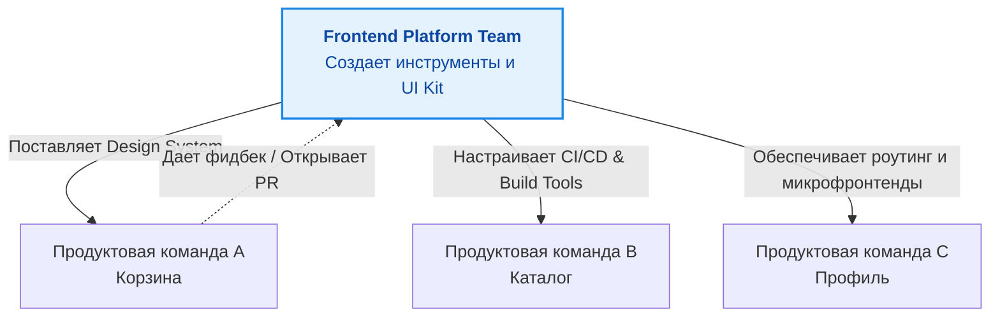

# Frontend Platform Team (Платформенная команда)

По мере роста продуктовых команд (Squads) в компании начинает дублироваться работа. Три разные команды могут параллельно настраивать Webpack, писать свои кнопки и изобретать велосипеды для авторизации. В этот момент возникает необходимость выделения **Frontend Platform Team** (Платформенной команды).

## 1. Суть концепции

Платформенная команда **не пишет продуктовые фичи для бизнеса** (не делает страницы оформления заказа или профиль пользователя). Их продукт — это инфраструктура, инструменты и Developer Experience (DX) для продуктовых разработчиков.

*Клиенты платформенной команды — это другие фронтенд-разработчики компании.*

## 2. Зоны ответственности платформенной команды

1. **Build System & Tooling (Сборка и инструменты):**
   * Настройка Webpack, Vite, Rspack.
   * Управление монорепозиторием (Nx, Lerna, Turborepo).
   * Оптимизация времени сборки локально и на CI.
2. **Design System & UI Kit (Дизайн-система):**
   * Разработка и поддержка базовых UI-компонентов (кнопки, инпуты, модалки).
   * Интеграция с дизайн-токенами из Figma.
3. **Architecture & Core (Архитектурное ядро):**
   * Настройка роутинга и платформы микрофронтендов (Module Federation).
   * Инфраструктура для A/B тестирования и аналитики.
   * Базовые сервисы (клиент авторизации, HTTP-клиент).
4. **Code Quality & DX:**
   * Настройка линтеров (ESLint, Stylelint, Prettier).
   * Инфраструктура для тестирования (Jest, Cypress, Playwright).

## 3. Взаимодействие с продуктовыми командами

Платформенная команда работает по модели "Платформа как услуга" (Platform as a Service).

* **Плохой подход (Диктатура):** Платформенная команда в изоляции пишет сложный инструмент, заставляет всех на него перейти, а инструмент не решает реальных проблем бизнеса. Продуктовые команды ненавидят платформу.
* **Хороший подход (InnerSource):** Платформа предоставляет API, но продуктовые команды могут сами приносить (контрибьютить) компоненты в ядро. Платформа выступает ревьюером и мэйнтейнером.

## 4. Границы применимости и трейдоффы

**Когда создавать платформенную команду?**
* Обычно это имеет смысл, когда фронтенд-разработчиков становится больше 15–20 человек (3-4 продуктовые команды). До этого размера выделять отдельную команду — непозволительная роскошь, инфраструктурой занимаются Tech Lead'ы или самые опытные разработчики в свободное время (или в рамках технических спринтов).

**Риски и Антипаттерны (Трейдоффы):**
* **Башня из слоновой кости (Ivory Tower):** Платформенная команда отрывается от реальности и делает сложные "идеальные" архитектуры (overengineering), которыми неудобно пользоваться продуктовым командам.
* *Решение:* Ротация кадров. Разработчики из платформы должны периодически ходить в продуктовые команды и пытаться использовать свои же инструменты.
* **Отсутствие метрик успеха:** Платформа не приносит прямых денег бизнесу. Как понять, что команда работает хорошо?
* *Метрики:* Сокращение времени сборки, улучшение Time-to-Market для продуктовых команд (скорость релиза фичи), рост числа переиспользуемых компонентов, опросы удовлетворенности разработчиков (DX Surveys).
