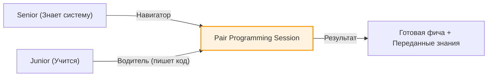

# Knowledge Sharing (Обмен знаниями)

Главный враг масштабирования команды — это "фактор автобуса" (Bus Factor). Если в команде есть один "ниндзя-архитектор", который знает, как работает аутентификация, кэширование и хитрая настройка сборщика, и этот человек увольняется (или попадает под автобус) — проект встает. 

**Knowledge Sharing (Обмен знаниями)** — это набор практик, направленных на децентрализацию знаний и равномерное распределение экспертизы среди всех членов команды.

## 1. Какую боль мы решаем?

* Зависимость от незаменимых сотрудников (узкие горлышки на код-ревью и при решении инцидентов).
* Изоляция продуктовых команд (команда А решила сложную проблему с производительностью, но команда Б об этом не знает и наступает на те же грабли).
* Медленный рост Junior/Middle разработчиков, которые варятся в собственном соку.

## 2. Форматы обмена знаниями

### 2.1. Frontend Sync / Guild Meetings (Гильдии)
Регулярная (например, раз в две недели) встреча всех фронтенд-разработчиков компании.
* **Что делают:** Демонстрируют крутые решения из своих продуктовых команд, обсуждают новые инструменты, утверждают технические стандарты и RFC.
* **Почему работает:** Выводит людей из изоляции их фиче-команд.

### 2.2. Tech Talks (Внутренние митапы)
Формат мини-конференции внутри компании.
* Разработчик готовит доклад на 30–40 минут на любую техническую тему (от "Как работает Event Loop" до "Как мы внедрили Server-Side Rendering").
* Записывается на видео и складывается во внутреннюю базу знаний. Это отличный материал для онбординга новичков.

### 2.3. Pair / Mob Programming (Парное программирование)
Два разработчика работают за одним компьютером (или шарят экран). Один "Водитель" (пишет код), второй "Штурман" (думает об архитектуре и замечает ошибки).
* **Супер-способность:** Максимально быстрая передача неявных знаний (недокументированных практик, горячих клавиш IDE, подходов к дебагу).

### 2.4. Cross-Review (Кросс-командное ревью)
Обычно Pull Request смотрят люди из своей же команды. Кросс-ревью означает, что в качестве одного из ревьюеров случайным образом назначается фронтендер из *другой* команды.
* **Плюсы:** Перекрестное опыление практиками. Приведение кодовой базы к единому стилю в рамках всей компании, а не одного отдела.

## 3. Неочевидные нюансы и трейдоффы

**Документация vs Общение**
Документация (Wiki, Notion, Docs-as-code) — это отличный инструмент хранения знаний. Но *создание* документации не гарантирует *обмен* знаниями. Люди не читают сотни страниц чужих спецификаций. Живые форматы (Tech Talks, Pair Programming) работают в разы лучше для передачи контекста и вовлечения. Документация нужна как справочник, куда человек пойдет после митапа.

**Время — деньги (Оверхед)**
Главный трейдофф обмена знаниями: он **съедает рабочее время**.
* Менеджеры часто сопротивляются проведению Tech Talks или Pair Programming, потому что "фичи не пилятся".
* *Решение:* Инженерная культура должна легализовать время на развитие. Например, правило "10% времени (полдня в пятницу) тратится на технические долги, рефакторинг и шаринг знаний".

**Проблема интровертов**
Многие сильные инженеры не любят публичные выступления. Не заставляйте всех делать Tech Talks. Для интровертов отлично работают форматы написания внутренних технических статей (Блог компании) или менторство 1-на-1 в формате Pair Programming.
