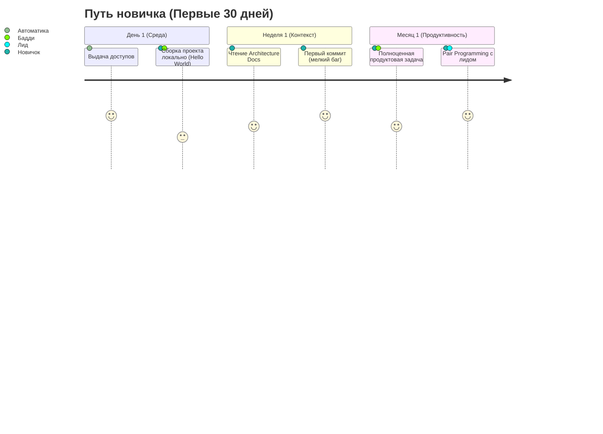

# Onboarding (Онбординг разработчиков)

Первые дни и недели нового разработчика в компании определяют, насколько быстро он начнет приносить реальную пользу (Time-to-Productivity) и останется ли он в команде после испытательного срока. В проектах со сложной архитектурой плохой онбординг приводит к тому, что новичок месяц не может локально запустить проект и боится нажать кнопку "Merge".

**Инженерный онбординг** — это структурированный процесс погружения нового сотрудника в архитектуру, кодовую базу, процессы и культуру компании.

## 1. Какую боль мы решаем?

* **Фрустрация новичков.** Устаревшие `README.md`, неработающие скрипты сборки, отсутствие доступов к NPM/GitLab.
* **Перегрузка старичков.** Лиды тратят часы, отвечая на одни и те же вопросы ("А как запустить моки?", "А где лежат токены для фигмы?") при найме каждого нового человека.
* **Ошибки по незнанию.** Новичок использует Redux, хотя команда полгода назад договорилась переходить на Zustand, потому что ему никто не рассказал про новые стандарты.

## 2. Из чего состоит хороший технический онбординг?

Идеальный процесс можно разбить на несколько этапов, которые идут от простого к сложному.

### 2.1. Автоматизация сетапа (Day 1)
Главное правило: **проект должен запускаться одной командой** (`npm run start` или `docker-compose up`). Если для старта нужно выполнить 20 консольных команд, прописать хитрые hosts и установить глобальные зависимости старых версий — это технический долг, который нужно чинить до написания любой документации.

### 2.2. Система Бадди (Buddy System)
За каждым новичком закрепляется "Бадди" (напарник/ментор) из числа разработчиков команды (не обязательно Senior, отлично подходят Middle).
* Бадди — это единая точка входа для глупых вопросов.
* Бадди проводит ревью первых PR новичка.
* Это разгружает техлида и прокачивает софт-скиллы у Middle-разработчиков.

### 2.3. Первичная архитектурная экскурсия
Сотрудник должен ознакомиться с ключевой документацией. Что ему нужно знать в первую очередь:
1. Как мы ходим в API и где храним данные (Domain / Infrastructure / Store).
2. Как устроена дизайн-система и UI Kit (компоненты).
3. Как устроены процессы CI/CD и как выкатить фичу в продакшен.

### 2.4. "First Good Issue" (Первая задача)
Худшее, что можно сделать — дать новичку в первый день проектировать сложную архитектурную фичу или читать код неделю без практики.
* **Как надо:** Подготовьте в бэклоге простые, изолированные задачи (смена цвета кнопки, фикс опечатки, добавление простого поля в форму). Цель первой задачи — не бизнес-ценность, а **прохождение всего пайплайна** (создать ветку -> написать код -> пройти CI -> получить аппрув -> задеплоить). Это дает дофамин и уверенность.

## 3. Неочевидные нюансы и трейдоффы

**Документация онбординга быстро протухает**
Самый большой враг `onboarding.md` — время. Ссылки ломаются, версии Node.js меняются.
* *Лайфхак:* Делайте документацию по онбордингу ответственностью **самих новичков**. Главное правило для нового разработчика: *"Если ты нашел ошибку в инструкции по локальному запуску или столкнулся с неявной проблемой, твой первый Pull Request должен исправлять эту инструкцию для следующего новичка"*.

**Оверхед для Бадди**
Менторство занимает время. Закладывайте снижение производительности Бадди на 20-30% в первый месяц работы новичка. Менеджмент должен это понимать при планировании спринтов.

**"Over-onboarding" (Перегруз информацией)**
Не заставляйте человека в первую неделю читать все ADR, написанные за 5 лет. Давайте информацию порциями (Just-in-time learning). Сначала локальный запуск, потом структура папок, и только когда он дойдет до работы со сложными формами — дайте почитать статью про внутренний Form Manager.
