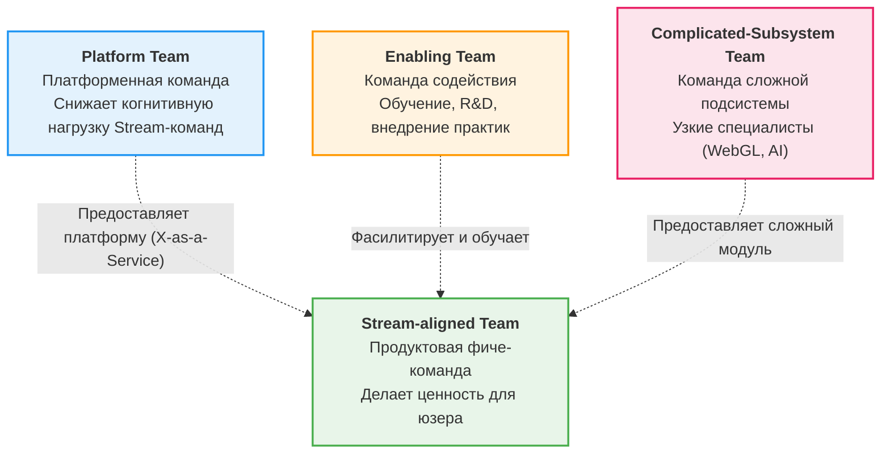

# Team Topologies (Топология команд)

Закон Конвея гласит: *"Организации проектируют системы, которые копируют структуру коммуникаций в этой организации"*. Если у вас есть команда фронтендеров, команда бэкендеров и команда DBA, ваша архитектура неизбежно станет монолитным трехзвенным приложением, где любое изменение требует синхронизации трех команд.

**Team Topologies** (Топология команд) — это фреймворк и подход к организации команд разработки, направленный на минимизацию когнитивной нагрузки и ускорение доставки (Fast Flow).

## 1. Зачем фронтендеру знать про топологию?

В современном вебе фронтенд стал настолько сложным, что его тоже нужно правильно делить между командами. Если 30 фронтендеров будут коммитить в один монолит без четких границ, скорость разработки упадет до нуля из-за merge-конфликтов и сломанных сборок.
Микрофронтенды, Feature-Sliced Design и монорепозитории — это лишь технические следствия того, как вы организовали людей.

## 2. Четыре фундаментальных типа команд

Мэтью Скелтон и Мануэль Пайс (авторы Team Topologies) выделяют 4 типа команд:

### 2.1. Stream-aligned Team (Продуктовая фиче-команда)
Основная боевая единица (в компаниях обычно их большинство, ~80%).
Кросс-функциональная команда (включает PM, Frontend, Backend, QA, Design). Работает над конкретным потоком создания ценности (например, "Оформление заказа" или "Привлечение пользователей").
* **Во фронтенде:** Они владеют своими микрофронтендами или фиче-слайсами в монорепе. Они должны иметь возможность задеплоить свой код независимо от других.

### 2.2. Platform Team (Платформенная команда)
Команда, которая создает внутренний продукт для других команд, скрывая от них сложность инфраструктуры.
* **Во фронтенде:** Frontend Platform Team делает дизайн-систему (UI Kit), настраивает пайплайны сборки (Vite/Webpack), создает ядро для микрофронтендов, настраивает observability.
* **Цель:** Сделать так, чтобы продуктовая команда не тратила время на настройку Webpack.

### 2.3. Enabling Team (Команда содействия/экспертов)
Состоит из глубоких экспертов, которые помогают Stream-командам преодолеть нехватку знаний, не забирая у них ответственность.
* **Во фронтенде:** Архитекторы по доступности (a11y), эксперты по веб-производительности или безопасности. Они приходят в продуктовую команду, обучают их, настраивают линтеры и уходят.

### 2.4. Complicated-Subsystem Team (Сложная подсистема)
Выделяется только тогда, когда для работы над частью системы нужны уникальные математические или технические навыки, которых нет у обычных разработчиков.
* **Во фронтенде:** Команда, разрабатывающая сложный 3D-движок на WebGL внутри браузера, или команда сложного видеоплеера с DRM. Обычной фиче-команде не нужно в это лезть.

## 3. Режимы взаимодействия (Interaction Modes)

Мало поделить команды, нужно определить, как они общаются:

1. **Collaboration (Сотрудничество):** Две команды тесно работают вместе над новым решением. Высокий уровень коммуникации. Применять редко и временно (например, интеграция нового UI-кита платформы в первый продукт).
2. **X-as-a-Service (Как услуга):** Основной режим. Платформа предоставляет API/Документацию. Продуктовая команда использует платформу, не дергая людей. Низкий оверхед на общение.
3. **Facilitating (Фасилитация):** Enabling-команда помогает продуктовой, передавая знания (менторство).

## 4. Границы применимости и трейдоффы

**Избегайте Frontend/Backend силосов**
Формирование отдельной команды "Фронтендеров" и отдельной "Бэкендеров" (функциональная топология) — это классический антипаттерн, приводящий к медленной разработке фич (каждая фича требует синхронизации двух бэклогов). Фронтендеры должны быть частью кросс-функциональных продуктовых команд (Stream-aligned).

**Когнитивная нагрузка (Cognitive Load)**
Это главное мерило правильной топологии. Если фронтендеру в продуктовой команде приходится разбираться в AWS, Kubernetes, тонкостях настройки Babel и особенностях реализации Design System — его когнитивная нагрузка превышена. В этот момент нужно выносить часть ответственности в Platform Team.
