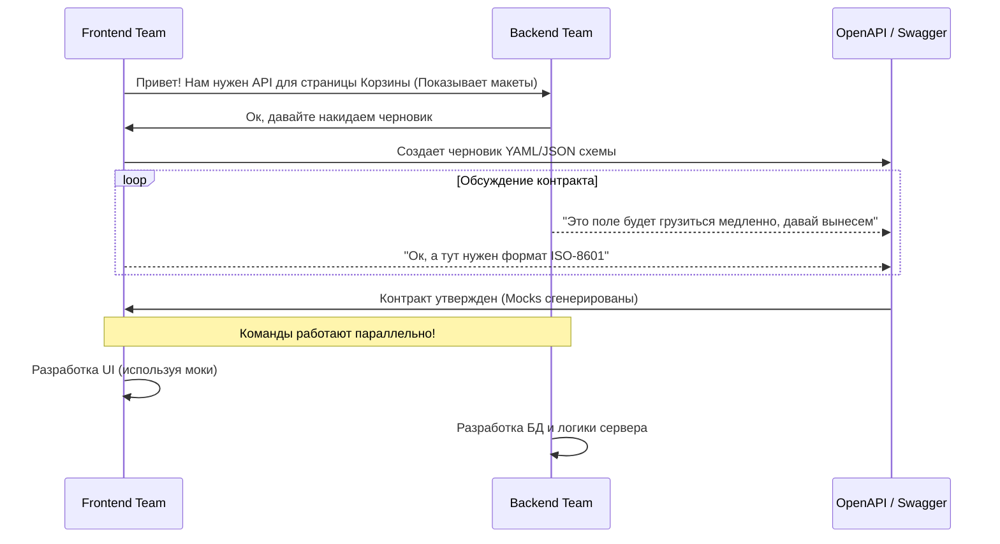

# API Review (Ревью контрактов)

Самая дорогая ошибка в веб-разработке — это реализовать сложный UI, а потом обнаружить, что бэкенд отдает данные в несовместимом формате или требует 15 последовательных запросов для отрисовки одного экрана.
**API Review** — это процесс совместного проектирования и утверждения контрактов (API) между Frontend и Backend *до* того, как будет написана первая строчка серверного или клиентского кода.

## 1. Какую боль мы решаем?

* **Водопадная разработка (Waterfall):** Бэкенд пишет API как ему удобно (исходя из структуры БД). Фронтенд ждет 2 недели. API готово, но на клиенте выясняется, что не хватает сортировки, а даты приходят в странном формате. Бэкенд ушел на другие задачи. Фронтенд пишет костыли и мапперы.
* **Over-fetching / Under-fetching:** API возвращает мегабайт данных там, где нужно два поля, или наоборот — заставляет делать каскадные запросы (N+1 проблема на клиенте).

## 2. Процесс API Review (Как надо)

Вместо того чтобы ждать бэкенд, фронтенд выступает **заказчиком** API (концепция Consumer-Driven Contracts).

## 3. Что проверяют на API Review?

Во время ревью (в комментариях к PR с OpenAPI спецификацией) фронтенд-разработчик должен задать следующие вопросы:

1. **Производительность (Chattiness):** Сможем ли мы отрисовать первый экран одним запросом? Если нет, можем ли мы использовать паттерн Backend-for-Frontend (BFF) или GraphQL?
2. **Типизация и форматы:** В каком формате приходят деньги (в копейках или float)? В каком формате даты (строго ISO-8601: `2024-03-15T12:00:00Z`)?
3. **Пагинация:** Если мы запрашиваем список, есть ли там пагинация (offset/limit или курсорная)? Как мы узнаем, что это последняя страница?
4. **Обработка ошибок:** Как API сообщает об ошибках валидации полей? (Идеально: стандартизированный формат вроде [RFC 7807 Problem Details](https://datatracker.ietf.org/doc/html/rfc7807)).
5. **Идемпотентность:** Что будет, если юзер дважды нажмет на кнопку "Оплатить" (например, из-за медленного интернета)? Требует ли API `Idempotency-Key`?

## 4. Неочевидные нюансы и трейдоффы

**Генерация кода (Code Generation)**
Главный профит API Review: утвержденный OpenAPI (Swagger) контракт позволяет фронтендерам вообще не писать типы руками. Инструменты вроде `openapi-typescript` или `Orval` автоматически сгенерируют TypeScript-типы и React Query хуки прямо из схемы.
Если API меняется без ведома фронтенда — сборка упадет на этапе тайпчека.

**Когда это оверхед?**
Если вы стартап из двух человек, где один и тот же фулстек-разработчик пишет и API на Next.js (Server Actions), и UI — формальный процесс ревью контрактов только замедлит работу. tRPC или Server Actions в монорепе закрывают потребность в синхронизации типов "из коробки" без всякого Swagger.
