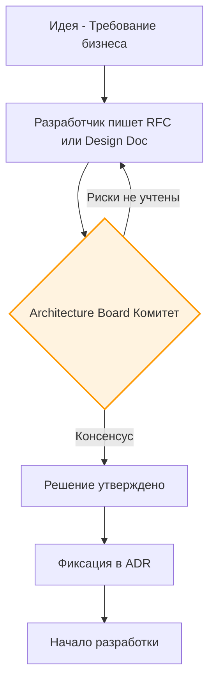

# Architecture Review (Архитектурное ревью)

**Архитектурное ревью** — это процесс оценки технических решений и структуры системы *до* начала их реализации. В отличие от Code Review, где проверяют синтаксис и локальную логику, Architecture Review смотрит на систему "с высоты птичьего полета".

## 1. Какую боль мы решаем?

* **Запоздалая обратная связь.** Разработчик потратил 3 недели на рефакторинг, присылает Pull Request на 5000 строк. На ревью выясняется, что он выбрал в корне неверный паттерн, и код нужно выбросить.
* **Изобретение велосипедов.** Команда пишет свой стейт-менеджер, не зная, что в соседней команде уже есть готовый.
* **Нарушение стандартов.** Внедрение библиотек, которые не соответствуют требованиям безопасности или производительности.

## 2. Как устроен процесс

Архитектурное ревью плотно связано с процессом написания **RFC (Request for Comments)**.

### Кто участвует?
В зависимости от размера компании это может быть:
* **Tech Lead** команды (для локальных решений).
* **Architecture Board (Комитет)** — группа из опытных разработчиков (Staff/Principal) из разных команд, которые собираются раз в неделю для обсуждения крупных межкомандных изменений.

## 3. На что смотрят при Архитектурном ревью?

Главная задача ревьюера — не сказать "как надо", а задать правильные вопросы:
1. **Масштабируемость:** Что будет, если объем данных увеличится в 10 раз?
2. **Изоляция:** Если мы захотим заменить эту библиотеку через год, насколько больно это будет? (Скрыта ли она за адаптерами/интерфейсами?)
3. **Модульность:** Не приведет ли это решение к циклическим зависимостям?
4. **Соответствие стратегии:** Мы договорились переходить на Server-Side Rendering (SSR). Помогает ли это решение нашей цели или уводит от неё?
5. **Цена поддержки:** Кто будет сопровождать это решение, когда автор уйдет в отпуск?

## 4. Трейдоффы и антипаттерны

**Антипаттерн: Ivory Tower Architecture (Башня из слоновой кости)**
Когда ревью проводят "Архитекторы", которые 5 лет не писали код. Они требуют идеальных абстракций, которые на практике невозможно реализовать в разумные сроки.
*Решение:* Ревьюеры должны быть "играющими тренерами", активно пишущими код в продукте.

**Антипаттерн: Бюрократия для мелких задач**
Архитектурное ревью нужно только для решений, имеющих долгосрочные последствия или высокую цену ошибки (One-way doors). Выбор библиотеки для красивых тултипов не требует сбора архитектурного комитета.

**Непрерывное ревью (Fitness Functions)**
Вместо того чтобы полагаться только на людей, продвинутые команды автоматизируют архитектурное ревью. Инструменты вроде `dependency-cruiser` или `eslint-plugin-boundaries` позволяют написать тесты на архитектуру. Если разработчик импортирует доменную логику в UI-слой — CI упадет автоматически, избавляя людей от споров.
