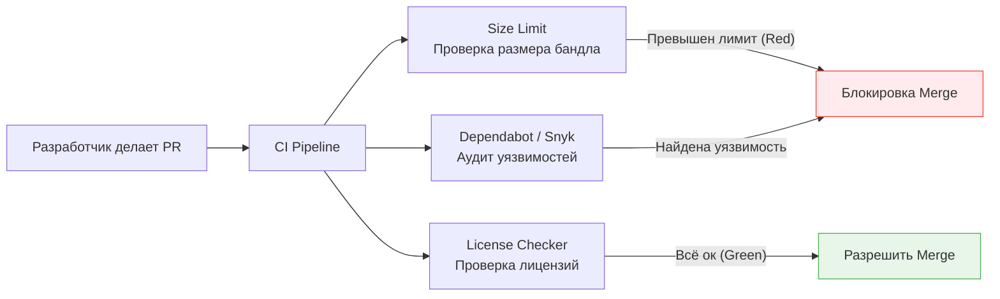

# Dependency Review (Ревью зависимостей)

Экосистема JavaScript (NPM) известна своей любовью к микро-пакетам (вспомним `left-pad`). Типичный фронтенд-проект тянет за собой тысячи транзитивных зависимостей. Добавление одного пакета `npm install X` может неявно принести мегабайты кода, уязвимости и лицензионные проблемы.
**Dependency Review** — это процесс осознанного контроля за тем, какие сторонние библиотеки попадают в проект.

## 1. Какую боль мы решаем?

* **Ожирение бандла (Bundle Bloat):** Разработчик добавил `moment.js` для форматирования одной даты, увеличив размер приложения на 300 КБ.
* **Supply Chain Attacks (Атаки на цепочку поставок):** Злоумышленник перехватил права на популярный пакет и встроил туда скрипт для кражи паролей (случай с `event-stream` или `ua-parser-js`).
* **Зоопарк технологий:** В проекте одновременно используются `axios`, `fetch`, `ky` и `superagent`, потому что разные люди привыкли к разным библиотекам.

## 2. Чек-лист проверки новой зависимости

Перед тем как принять PR с новой библиотекой, команда должна ответить на следующие вопросы:

1. **Нужна ли она вообще?** 
   Можно ли решить задачу нативным API браузера (Intl для дат, fetch для сети)? Напишем ли мы этот код сами за час?
2. **Здоровье пакета (Health):**
   - Когда был последний релиз? (Если больше года назад — пакет мертв).
   - Сколько открытых Issues и неразобранных PR?
   - Какой размер пакета? (Проверяется через bundlephobia.com).
3. **Лицензия:**
   Подходит ли лицензия (MIT, Apache 2.0) для коммерческого использования? (GPL может заставить вас открыть исходный код всего вашего продукта).
4. **Транзитивные зависимости:**
   Сколько пакетов этот пакет тянет за собой?

## 3. Автоматизация процесса

Люди ленивы, поэтому Dependency Review нужно максимально автоматизировать в CI/CD пайплайне:

* **Size Limit:** Утилита (например, `size-limit`), которая роняет сборку, если размер бандла превысил установленный лимит (например, 500 КБ).
* **NPM Audit / Snyk:** Автоматический поиск известных уязвимостей в зависимостях.

## 4. Стратегии обновления (Renovate / Dependabot)

Зависимости имеют свойство протухать. Игнорирование обновлений приводит к тому, что через 2 года обновить React с версии 16 до 19 будет стоить компании полгода работы всей команды.

* **Практика:** Инструменты вроде RenovateBot или Dependabot автоматически создают Pull Requests с обновлениями зависимостей (например, раз в неделю).
* **Секрет успеха:** Этот подход работает *только* если у вас хорошее покрытие автотестами. Если тесты зеленые, PR с минорным обновлением библиотеки мержится автоматически (Auto-merge). Если тестов нет, процесс превращается в адский ручной труд регрессионного тестирования.
