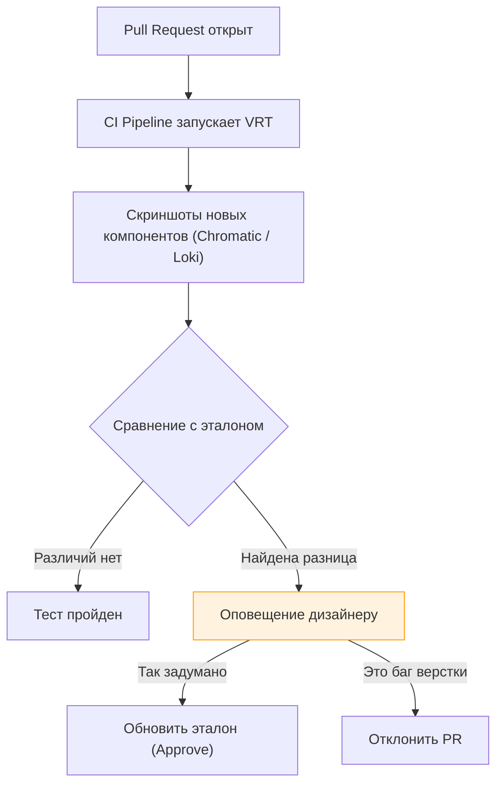

# Design Review (Дизайн-ревью)

Во фронтенде качество продукта определяется не только чистым кодом, но и тем, насколько точно реализован пользовательский интерфейс (UI) и пользовательский опыт (UX).
**Design Review (или Visual QA)** — это процесс проверки реализованного интерфейса дизайнером (или лидом) перед тем, как фича попадет к реальным пользователям.

## 1. Какую боль мы решаем?

* **Сломанные компоненты:** Разработчик сверстал форму, но забыл состояния ошибки (Error states) или загрузки (Skeletons).
* **"Глазомер" разработчика:** Отступы съехали, используются hex-цвета вместо переменных из дизайн-системы, шрифты не загрузились.
* **Не учтены краевые случаи (Edge Cases):** Дизайнер нарисовал карточку с именем "Иван", а в проде пришел юзер "Абдурахманхаджи", и верстка развалилась, потому что текст не переносится.

## 2. Эволюция процесса Design Review

### Уровень 1: Ручной пинг-понг (Антипаттерн)
Разработчик делает фичу -> деплоит на тестовый стенд -> зовет дизайнера -> дизайнер находит 20 несовпадений с фигмой -> пишет баги в Jira -> разработчик правит. Цикл повторяется 3-4 раза.
*Проблема:* Медленно, дорого, раздражает обе стороны.

### Уровень 2: Design Tokens & Storybook
Команда внедряет дизайн-систему.
Цвета, отступы и шрифты зашиты в переменные (Tokens). Разработчик физически не может сделать неправильный отступ, если он использует компоненты системы. Дизайнер не проверяет каждый пиксель, он проверяет только логику работы. Компоненты ревьювятся изолированно в Storybook.

### Уровень 3: Visual Regression Testing (VRT)
Автоматизация визуального ревью.

Инструменты (например, Chromatic для Storybook) автоматически делают скриншоты каждого компонента в разных состояниях и браузерах, подсвечивая разницу красным (Diffing).

## 3. Чек-лист разработчика (Self-Review)

Перед тем как звать дизайнера, фронтендер должен сам проверить свою работу по базовому чек-листу:

1. **Состояния:** Пустое состояние (Empty state), Загрузка (Loading), Ошибка, Hover/Active на кнопках.
2. **Адаптив (Responsive):** Как это выглядит на мобилке, планшете, и на ультра-широком мониторе?
3. **Объем данных:** Что если текста будет очень много (оборвется ли он через `text-overflow: ellipsis`)? Что если картинка не загрузится?
4. **Доступность (A11y):** Можно ли пройти форму кнопкой `Tab`? Виден ли фокус? (См. раздел [Доступность](../21.%20Доступность%20и%20интернационализация)).

## 4. Сдвиг влево (Shift-Left)

Самый дешевый способ решить проблему дизайна — решить её *до написания кода*. 
Практика **"Amigo Session" (Встреча трех амиго)**: перед стартом спринта Разработчик, Дизайнер и QA собираются на 15 минут у макета. 
Разработчик задает вопросы: "А что будет, если сервер отдаст 500 ошибку?", "Какая здесь анимация?". Дизайнер дорисовывает недостающие состояния в Figma. В итоге на этапе Design Review проблем практически не возникает.
