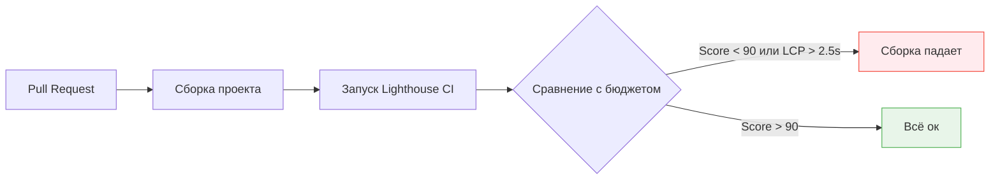

# Performance Review (Ревью производительности)

Производительность фронтенда — это не разовая задача, которую можно решить и забыть. Это процесс. Приложение с отличным Time-to-Interactive (TTI) может превратиться в тормозящего монстра всего за несколько месяцев активной разработки, если не внедрить механизмы защиты производительности.

**Performance Review** — это набор процессов, метрик и автоматизаций, гарантирующих, что код не ухудшает пользовательский опыт работы с приложением.

## 1. Какую боль мы решаем?

* **Смерть от тысячи порезов:** Ни один разработчик не пишет код, который замедляет приложение на 5 секунд. Но 10 разработчиков добавляют по 50 КБ JavaScript, чуть-чуть утяжеляют рендеринг, и в сумме приложение начинает загружаться мучительно долго.
* **Ошибка выжившего (Разработчика):** Разработчик тестирует фичу на MacBook M-серии с гигабитным офисным интернетом. У него всё летает. В проде пользователь открывает сайт на бюджетном Android в метро (3G), и телефон зависает из-за парсинга тяжелого бандла.

## 2. Метрики (На что мы смотрим?)

Во фронтенде мы ориентируемся на **Core Web Vitals (CWV)** — метрики, признанные Google стандартами индустрии:

1. **LCP (Largest Contentful Paint):** Время отрисовки самого большого элемента (картинки, блока текста). Хорошо: < 2.5 сек. (Измеряет скорость загрузки).
2. **INP (Interaction to Next Paint):** Задержка реакции интерфейса на действие пользователя (клик, тап). Хорошо: < 200 мс. (Измеряет отзывчивость и загруженность Main Thread).
3. **CLS (Cumulative Layout Shift):** Насколько интерфейс "прыгает" во время загрузки (например, загрузился баннер и сдвинул текст вниз). Хорошо: < 0.1. (Измеряет визуальную стабильность).

## 3. ПроцессPerformance Review (Три уровня)

Защита производительности должна работать на разных этапах жизненного цикла кода.

### Уровень 1: Локальная разработка (Linting)
Запрет на написание очевидно медленного кода.
- Использование `eslint-plugin-react-hooks/exhaustive-deps`, чтобы избежать лишних ререндеров в React.
- Настройка `size-limit` или Webpack Performance Hints для контроля размера файлов при сборке.

### Уровень 2: CI/CD (Performance Budgets)
Автоматическое предотвращение деградации.

**Performance Budgets (Бюджеты производительности):** Мы договариваемся, что бандл главной страницы не может весить больше 300 КБ. Если PR превышает этот лимит, CI его блокирует. Разработчику придется либо оптимизировать свой код, либо просить команду повысить бюджет (через RFC).

### Уровень 3: Real User Monitoring (RUM) в проде
Lighthouse в CI — это "лабораторные" (Lab) данные. Реальная производительность измеряется на устройствах пользователей.
- Внедрение инструментов (Sentry, Datadog, Google Analytics) для сбора Web Vitals с реальных пользователей.
- Если p75 (75-й перцентиль) пользователей начинает страдать (LCP > 3s), генерируется алерт, и команда берет задачу на оптимизацию в ближайший спринт.

## 4. Границы применимости и трейдоффы

**Преждевременная оптимизация**
Один из главных антипаттернов. Оборачивать каждый компонент в `React.memo` или использовать сложные веб-воркеры (Web Workers) для простых вычислений — это увеличение сложности поддержки кода ради сомнительной выгоды. 
Оптимизировать нужно только то, что *доказанно* тормозит (после профилирования).

**Бизнес vs Перфоманс**
Часто маркетинговый отдел требует внедрить 10 разных трекеров (Google Tag Manager, Яндекс Метрика, Facebook Pixel). Это гарантированно убьет метрику INP (Main thread блокируется скриптами).
Задача фронтенд-архитектора — находить компромисс (например, загружать трекеры с задержкой, использовать Partytown для выноса скриптов в Web Worker) или честно сказать бизнесу: "Эта кнопка шера в соцсети будет стоить нам 15% конверсии из-за замедления сайта".
