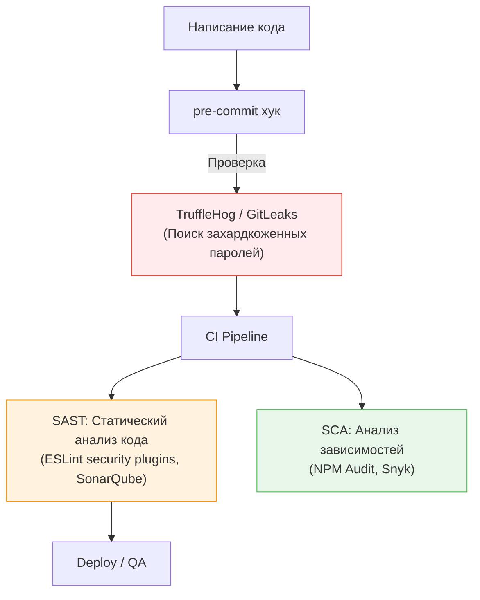

# Security Review (Ревью безопасности)

Фронтенд долгое время считался "безопасной" зоной. Распространенный миф: "Вся важная логика на сервере, фронтенд взламывать бессмысленно". В реальности уязвимости на клиенте (XSS, утечки токенов) — это прямой путь к компрометации сессий пользователей и краже данных.

**Security Review** — это процесс выявления и устранения потенциальных уязвимостей в архитектуре и коде до релиза.

## 1. Какую боль мы решаем?

* **Утечка PII (Personal Identifiable Information):** Случайная отправка номеров кредитных карт или паролей в сторонние сервисы аналитики (Google Analytics, Sentry).
* **XSS (Cross-Site Scripting):** Злоумышленник вставляет вредоносный скрипт в профиль пользователя, и этот скрипт выполняется в браузерах всех, кто заходит на его страницу.
* **Перехват сессии:** Неправильное хранение JWT токенов (например, в LocalStorage без должной защиты).

## 2. Что проверяется на Security Review?

При проектировании новой фичи или внедрении стороннего сервиса необходимо оценить следующие векторы атак:

### 2.1. Инъекции (XSS)
Использует ли разработчик опасные конструкции?
* В React: `dangerouslySetInnerHTML`.
* В Vue: директива `v-html`.
* Прямые манипуляции с DOM: `innerHTML`.
* **Правило:** Если мы рендерим HTML, полученный от пользователя, он должен быть предварительно санирован (очищен) с помощью библиотек вроде `DOMPurify`.

### 2.2. Хранение секретов и токенов
* **Антипаттерн:** Хранить ключи доступа к платным API (например, Stripe или AWS) в JS бандле. Клиентский код полностью открыт.
* **Антипаттерн:** Хранение Refresh токенов или сессионных идентификаторов в `LocalStorage`. Туда имеет доступ любой XSS скрипт.
* **Как надо:** Использование HttpOnly, Secure cookie для сессий. Реализация паттерна Backend-for-Frontend (BFF), где токены не доходят до браузера вообще, а хранятся на промежуточном сервере.

### 2.3. Внешние скрипты (Third-Party)
Если мы подключаем скрипт из внешней CDN (например, виджет чата), мы доверяем этому скрипту полностью.
* Подключен ли Content Security Policy (CSP)?
* Используется ли атрибут `integrity` (Subresource Integrity) для проверки хэша внешнего скрипта?

## 3. Автоматизация (DevSecOps)

Полагаться только на внимательность разработчиков нельзя. Безопасность должна быть встроена в пайплайн (Shift-Left Security).

## 4. Границы применимости и трейдоффы

**Безопасность vs Удобство разработки**
Строгий Content Security Policy (CSP) может сломать работу горячей перезагрузки (Hot Module Replacement, HMR) при локальной разработке. Командам приходится настраивать разные политики для development и production сред.

**Слепая вера в фреймворк**
Современные фреймворки (React, Angular) автоматически экранируют текст от XSS атак. Это расслабляет разработчиков. Но фреймворки не спасают от логических ошибок (например, когда вы берете URL из `window.location.search` и подставляете его в атрибут `href` ссылки, открывая дверь для `javascript:` инъекций).

*Безопасность фронтенда работает только в тандеме с бэкендом.* Никакая клиентская валидация форм не заменит строгую валидацию на сервере!
