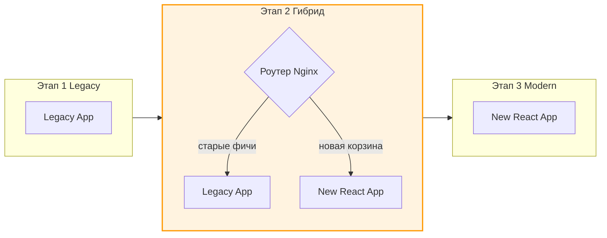

# Incremental Migration (Инкрементальная миграция)

Переписывание большого проекта с нуля (Big Bang Rewrite) — это одна из самых опасных инженерных затей. В 80% случаев она заканчивается тем, что компания год не выпускает новые фичи, старый продукт обрастает костылями, а новый так и не выходит в свет, потому что догнать функционал старого невозможно.
**Incremental Migration (Инкрементальная или пошаговая миграция)** — это стратегия замены старой системы новой по частям, не останавливая доставку бизнес-ценности.

## 1. Какую боль мы решаем?

* **Заморозка фич (Feature Freeze):** Бизнес не может ждать год, пока вы перепишете Angular.js на React. Ему нужно продавать прямо сейчас.
* **Потеря знаний:** При переписывании с нуля часто теряются неочевидные бизнес-правила (edge cases), которые были "захардкожены" в старой системе.
* **Стресс релиза:** Когда вы выкатываете весь новый проект разом, количество багов будет катастрофическим. Откатиться назад почти невозможно.

## 2. Суть концепции

Вместо одного огромного релиза мы разбиваем миграцию на сотни маленьких шагов. Старая и новая системы работают **одновременно** в одном продакшене.

## 3. Как это работает во фронтенде?

Во фронтенде инкрементальная миграция сложнее, чем на бэкенде, потому что нам нужно шарить состояние (например, токен авторизации или товары в корзине) между двумя разными приложениями.

### Паттерн 1: Миграция по страницам (Роутинг на уровне балансировщика)
Самый надежный способ.
1. Мы поднимаем новое приложение на другом порту или сервере.
2. Nginx (или AWS CloudFront, или Next.js Rewrites) смотрит на URL.
3. Если пользователь идет на `/profile`, сервер отдает старый бандл. Если на `/checkout` — отдает новый бандл.
* *Плюс:* Полная изоляция, нет конфликтов CSS и JS.
* *Минус:* При переходе между старой и новой страницей происходит полная перезагрузка (Full Page Reload), состояние SPA сбрасывается. Данные (токены, корзина) приходится синхронизировать через LocalStorage или куки.

### Паттерн 2: Микрофронтенды (Module Federation)
В старое приложение встраивается "контейнер", который умеет загружать микрофронтенды из нового стека.
* *Плюс:* Бесшовный опыт (без перезагрузки страницы). Легко шарить состояние через глобальный Event Bus или Window.
* *Минус:* Архитектурная сложность. Риск конфликта стилей и глобальных переменных. Увеличение бандла (грузится два фреймворка).

### Паттерн 3: Фреймворк внутри фреймворка
Например, использование `react2angular` или Vue-компонентов внутри React-приложения через веб-компоненты (Custom Elements).
* Применяется для миграции отдельных мелких компонентов (например, новой сложной формы) без изменения роутинга.

## 4. Неочевидные нюансы и трейдоффы

**Парадокс удвоенной работы (The Hybrid Tax)**
Во время гибридного этапа (который может длиться годами) команде приходится поддерживать две дизайн-системы, два процесса сборки и иногда писать одни и те же фичи дважды (например, шапку сайта). Это налог на безопасность, который нужно закладывать в оценки.

**"Хвост" миграции**
Легко переписать 80% приложения (обычно это новые и активные страницы). Последние 20% (старые админские формы, сложная legacy-логика) мигрировать скучно и больно. Часто миграция застревает на 90% навсегда, превращая гибридную архитектуру в постоянную, что является худшим из возможных сценариев (Technical Debt Bankruptcy).
*Решение:* Жесткий таймбокс на удаление старого кода и приоритет от бизнеса на завершение миграции. Сработает правило: "Пока не удалим старое, новые фичи не начинаем".
