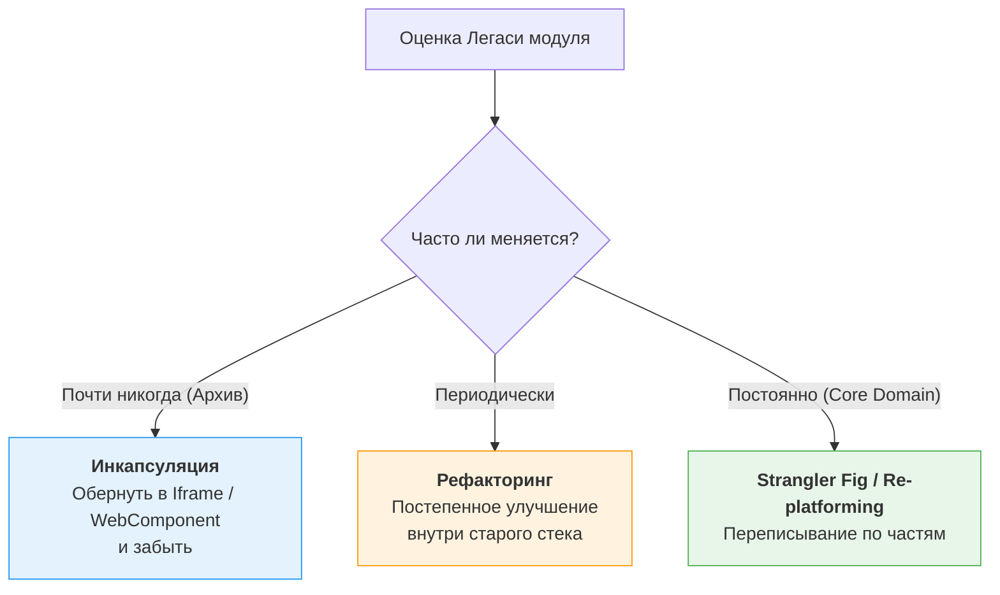

# Legacy Modernization (Модернизация легаси)

Термин "Legacy" (Наследие) часто используется разработчиками как ругательство для обозначения кода, который им не нравится. Однако настоящее определение Legacy-кода (по Майклу Фезерсу) — это **код без тестов**. В более широком смысле — это код, который приносит деньги бизнесу, но который страшно изменять, потому что никто до конца не понимает, как он работает.

**Legacy Modernization** — это процесс возвращения контроля над кодовой базой без её полного переписывания.

## 1. Какую боль мы решаем?

* Страх перед релизом (любое изменение в одном месте ломает три других).
* Невозможность нанять новых разработчиков (никто не хочет писать на Backbone.js или jQuery в 2024 году).
* Медленный Time-to-Market (то, что в новом стеке делается за день, в легаси занимает две недели из-за отсутствия типизации и компонентного подхода).

## 2. Стратегии модернизации

Модернизация — это не всегда переписывание. Это спектр решений в зависимости от бюджета и состояния кода.

### 2.1. Инкапсуляция (Запереть в ящике)
Если у вас есть старый сложный калькулятор на AngularJS, который приносит прибыль, но фичи в нем не менялись 3 года — не переписывайте его!
Оберните его в Web Component (Custom Element) или просто в `<iframe>`. Новый React-проект будет общаться с ним через `postMessage` или `CustomEvents`. Вы изолируете старый код от нового, не тратя бюджет на переписывание.

### 2.2. Рефакторинг на месте (Boy Scout Rule)
Если вы решили остаться в старом стеке (например, большой монолит на Vue 2), вы модернизируете его постепенно:
1. Добавляете типизацию (переход с JS на TS через `allowJs: true`).
2. Внедряете жесткий Linter.
3. Покрываете тестами (обычно E2E-тестами через Playwright/Cypress, так как юнит-тесты на запутанный код писать невозможно).
4. Правило бойскаута: "Оставь код чище, чем он был до тебя". Разработчик делает новую фичу и заодно причесывает 20 строк легаси вокруг.

### 2.3. Re-platforming (Смена платформы)
Переезд на новый фреймворк или архитектуру (например, с Create React App на Next.js или Vite). При этом бизнес-логика сохраняется, меняется только инфраструктура.

## 3. Как начать работать с жутким легаси?

**Шаг 1: Сборка и Запуск.**
Легаси часто невозможно даже запустить локально. Первое, что нужно сделать — написать `Dockerfile` или обновить `package.json` так, чтобы проект собирался у любого новичка одной командой.

**Шаг 2: Внедрение E2E тестов (Test-Driven Refactoring).**
Вы не можете менять код, в котором не уверены. Выберите 5-10 самых критичных бизнес-сценариев (Happy Paths) и напишите на них тесты (Cypress/Playwright). Они будут работать как черный ящик (Black-box testing).
Теперь вы можете спокойно рефакторить внутренности компонентов — если тесты зеленые, вы ничего не сломали.

**Шаг 3: Развязывание узлов (Decoupling).**
В легаси UI часто намертво привязан к сети (запросы к API прямо в компонентах). Прежде чем менять UI-фреймворк, вынесите запросы в отдельные файлы (API-клиенты или сервисы). Тогда при переезде на новый фреймворк вам нужно будет переписать только отображение, а логика запросов останется.

## 4. Трейдоффы

**Технический долг — это нормально.**
Легаси — это признак успешного продукта. Если код прожил 5 лет, значит, бизнес выжил. Относитесь к легаси не как к мусору, а как к артефакту, приносящему деньги. Ваша задача — не уничтожить его ради хайповых технологий, а снизить стоимость его обслуживания (Total Cost of Ownership).
