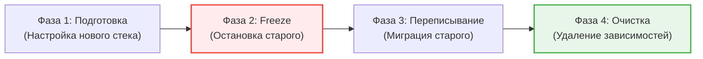

# Migration Playbook (План миграции)

Миграция с одной технологии на другую (например, с Redux на Zustand, с CSS Modules на Tailwind, или с Axios на Fetch) часто превращается в хаотичный процесс. Кто-то начинает писать по-новому, кто-то продолжает по-старому. В итоге в кодовой базе живут два стандарта одновременно, что увеличивает бандл и взрывает мозг новым разработчикам.

**Migration Playbook (Сценарий миграции)** — это документ, который формализует процесс перехода, делая его прозрачным, измеримым и, самое главное, завершимым.

## 1. Зачем нужен Playbook?

* **Синхронизация команды:** Чтобы все 50 разработчиков знали, с какого дня мы перестаем писать новые компоненты на старом стеке.
* **Трекинг прогресса:** Чтобы видеть, мы мигрировали 10% или 90%.
* **Защита от регрессии:** Чтобы старый код случайно не просочился обратно.

## 2. Структура Playbook

Хороший Playbook отвечает на четыре вопроса: Зачем? Как? Когда? Кто?

# План миграции: Styled Components -> Tailwind CSS

## 1. Мотивация (Зачем?)
Styled Components занимают 30 КБ в рантайме, замедляют рендеринг (CSS-in-JS overhead) и усложняют миграцию на React Server Components (RSC). Tailwind работает на этапе сборки и совместим с RSC.

## 2. Freeze Date (Точка невозврата)
**С 1 Октября 2024 года** создание новых файлов со Styled Components строго запрещено (будет настроен линтер).
Новые фичи пишутся *только* на Tailwind.

## 3. Инструкция по переписыванию (Как?)
1. Удалите импорт `styled`.
2. Перенесите стили из шаблонной строки в проп `className` с использованием Tailwind utility classes.
3. Если стиль зависит от пропсов (динамический), используйте `clsx` или `tailwind-merge`.
*(Здесь должны быть примеры До/После)*

## 4. Трекинг и Метрики
Мы оцениваем миграцию в 150 компонентов.
Прогресс отслеживается в Jira (эпик: `MIG-TAILWIND`).
Для автоматического подсчета используем скрипт, который считает количество файлов с импортом `styled-components`.

## 5. Ответственные
Tech Lead команды UI-кита (Иван Иванов).

## 3. Фазы миграции

Идеальная миграция проходит через 4 строгие фазы:

### Фаза 1: Подготовка (Coexistence)
Обе библиотеки живут в проекте. Инфраструктурная команда настраивает новый инструмент (Tailwind), чтобы он корректно собирался вместе со старым, не ломая стили (например, настраивает префиксы или приоритет CSS-правил).

### Фаза 2: Заморозка (Freeze)
Самый важный шаг! Мы внедряем ESLint правило (например, `no-restricted-imports`), которое роняет сборку, если кто-то попытается импортировать старую библиотеку в **новом** файле. Старые файлы добавляются в `.eslintignore` или получают warning вместо error.

### Фаза 3: Инкрементальное переписывание
Разработчики (по правилу бойскаута или выделяя 20% времени спринта) заходят в старые компоненты и переводят их на новый стек.
Можно использовать **Codemods** (AST-трансформации, jscodeshift), чтобы автоматически переписать 80% скучного кода скриптом.

### Фаза 4: Очистка (Clean-up)
Когда скрипт показывает `0` использований старой библиотеки, она удаляется из `package.json`, конфигурации сборщика очищаются, и команда устраивает вечеринку.

## 4. Трейдоффы и антипаттерны

**Антипаттерн: Миграция без заморозки (Leaky Migration)**
Если вы начали миграцию, но не запретили линтером использовать старый стек, миграция будет идти бесконечно. Вы переписали 10 компонентов, а продуктовая команда за это время создала 15 новых на старом стеке.

**Когда Playbook не нужен:**
Для минорных обновлений библиотек (например, React 17 -> 18) или замены мелких утилит (lodash.get -> optional chaining), если это можно сделать за один день автоматическим скриптом (Codemod). Playbook нужен только для длительных миграций, растянутых на недели или месяцы.
