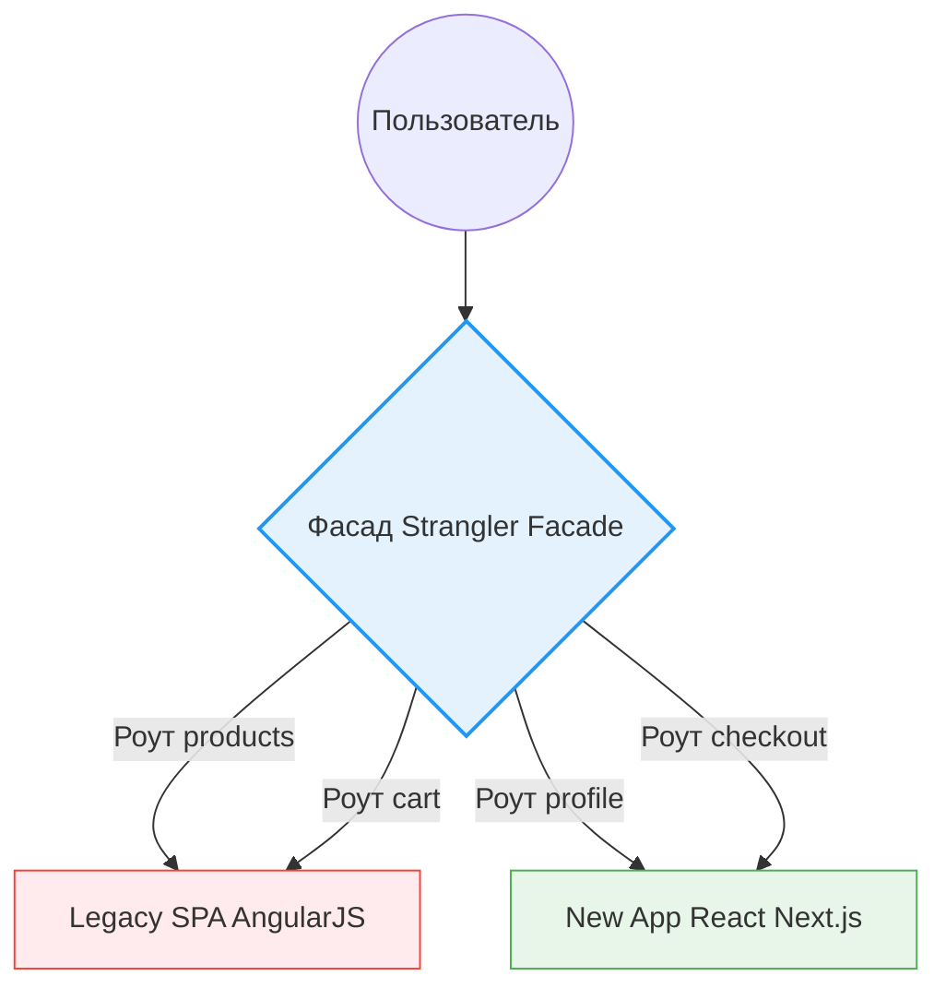

# Strangler Fig Pattern (Паттерн Фигового дерева)

Когда система становится слишком большой и устаревшей (Legacy Monolith), полностью переписать её за один раз (Big Bang Rewrite) невозможно без остановки бизнеса.
Паттерн **Strangler Fig (Фиговое дерево-душитель)**, придуманный Мартином Фаулером, предлагает стратегию, вдохновленную природой: новое дерево (приложение) растет вокруг старого, постепенно заменяя его функции, пока старое дерево не умрет и не будет удалено.

## 1. Какую боль мы решаем?

* Снижение рисков: Мы не выкатываем гигантский непротестированный релиз раз в год.
* Постоянная доставка ценности: Мы можем выпускать новые фичи на новом стеке сразу же, не дожидаясь окончания переписывания.
* Откат (Rollback): Если новая часть сломалась, мы можем мгновенно переключить трафик обратно на легаси.

## 2. Как это работает во фронтенде?

На бэкенде этот паттерн реализуется через API Gateway (роутинг запросов). На фронтенде роль "маршрутизатора" (Strangler Facade) может играть балансировщик нагрузки (Nginx/CloudFront), микрофронтенд-контейнер или даже сам браузер.

### Процесс (Шаги)

1. **Создание фасада:** Ставится прокси (Nginx), который направляет 100% трафика на старое приложение. Пользователь ничего не замечает.
2. **Создание нового приложения:** Поднимается пустой проект на новом стеке.
3. **Миграция / Перехват (Strangulate):** Мы переписываем одну страницу (например, `/profile`). В Nginx настраиваем правило: если URL начинается с `/profile`, отдать запрос новому React-приложению. Остальное идет в легаси.
4. **Постепенный рост:** Шаг за шагом новые фичи и переписанные страницы добавляются в новый проект, а роуты забираются у легаси.
5. **Удаление (Eliminate):** Когда Nginx больше не шлет запросы на легаси, старый код физически удаляется с серверов.

## 3. Технические реализации на клиенте

Если прокси на уровне сервера недоступен (или вызывает раздражающие перезагрузки страницы при переходе), фасад можно сделать прямо в браузере.

### 3.1. Iframe-проксирование
Новое приложение выступает в роли "Shell" (Оболочки). Оно рендерит новую шапку и меню на React. В центральной области рендерится `<iframe src="/legacy/page">`.
По мере переписывания страниц, Iframe заменяется на нативные React-компоненты.
* *Плюс:* Полная изоляция стилей и JS.
* *Минус:* Сложность синхронизации URL (когда Iframe перешел по ссылке, нужно обновить URL в адресной строке родителя), проблемы с доступностью и высотой фрейма.

### 3.2. Микрофронтенды (Single-SPA / Module Federation)
В браузере запускается микро-оркестратор (например, Single-SPA).
Он смотрит на URL:
- Если `window.location.pathname === '/legacy'`, он маунтит (запускает) старый Angular-бандл в `div#root`.
- Если `=== '/modern'`, анмаунтит Angular и маунтит React-бандл.
* *Плюс:* Бесшовный SPA опыт.
* *Минус:* Сложен в настройке, конфликты глобальных CSS (старый код часто писался без инкапсуляции).

## 4. Неочевидные нюансы и трейдоффы

**Синхронизация состояния (State Syncing)**
Самая большая боль Strangler Fig во фронтенде. Если пользователь авторизовался в новом приложении, легаси должно об этом узнать.
*Решение:* Использовать общие хранилища (Куки, LocalStorage, SharedWorker) для токенов. Избегать хранения бизнес-стейта (например, списка товаров в корзине) в памяти (Redux/Zustand), так как память у двух приложений разная. Всегда читать стейт из API.

**Дублирование UI**
Пока идет миграция, вам придется поддерживать две версии "Шапки" сайта и "Подвала" (в старом и новом приложении). Если дизайнер решит поменять цвет кнопки, вам придется менять его в двух кодовых базах. Это цена, которую вы платите за безопасность.

**Риск "Вечного гибрида"**
(См. также [Incremental Migration](./Incremental%20Migration.md)). Самый частый провал паттерна — когда 80% переписали, а сложные 20% оставили "на потом", и миграция застряла навсегда. Компании приходится поддерживать два стека десятилетиями. Обязателен план вывода из эксплуатации (Decommissioning Plan).
