# Измерение качества архитектуры

"Хорошая архитектура" — понятие субъективное. Разработчик может считать архитектуру идеальной, потому что она использует самые современные паттерны и чистые функции. А бизнес может считать её ужасной, потому что добавление одной кнопки на форму занимает две недели.
Чтобы управлять архитектурой, нужно её измерять. **Измерение качества архитектуры** — это переход от интуитивных оценок ("код с душком") к объективным метрикам.

## 1. Какую боль мы решаем?

* **Слепые зоны.** Команда тратит месяц на рефакторинг, но не может доказать бизнесу, что стало "лучше" (отсутствие ROI — возврата инвестиций).
* **Невидимая деградация.** Без метрик кодовая база медленно превращается в "Большой комок грязи" (Big Ball of Mud), и никто не замечает момента, когда точка невозврата пройдена.
* **Бесконечные холивары.** Спор о том, хорош или плох Feature Sliced Design в вашем проекте, можно разрешить только цифрами.

## 2. Метрики (Что измерять?)

Качество архитектуры нельзя измерить одной линейкой. Метрики делятся на технические (для кода) и процессные (для бизнеса и команд).

### 2.1. Технические метрики (Code Metrics)

Автоматизируются через CI-линтеры, SonarQube или специальные скрипты.

1. **Цикломатическая сложность (Cyclomatic Complexity):** Количество ветвлений (`if`, `switch`, `for`) в функциях. Если функция компонента имеет сложность > 10, её невозможно протестировать и понять.
2. **Зацепление (Coupling):** Насколько модули связаны друг с другом. (Измеряется графами зависимостей через `dependency-cruiser`). Меньше связей = легче менять код.
3. **Размер бандла и Performance Budget:** Архитектура плохая, если она не позволяет отдать пользователю легкий UI.
4. **Покрытие тестами (Test Coverage):** Не просто процент (может быть обманчив), а покрытие критических бизнес-сценариев. Легкость написания тестов — прямой индикатор хорошей архитектуры.

```mermaid
xychart-beta
    title "Профиль здоровья фронтенд-архитектуры (1-10)"
    x-axis ["Понятность", "Тестируемость", "Изолированность", "Производительность", "Скорость поставки"]
    bar "Легаси" [3, 2, 1, 3, 2]
    bar "Целевая (Clean)" [8, 9, 8, 7, 8]
```



### 2.2. Процессные метрики (DORA Metrics и TTM)

Лучший показатель архитектуры — то, как она влияет на людей.

1. **Time to Market (Скорость поставки фичи):** Сколько времени проходит от идеи до кода в продакшене. Если архитектура "Чистая", но добавление фичи требует написания 5 интерфейсов и 3 мапперов (Overengineering), TTM будет высоким, что плохо для бизнеса.
2. **Lead Time for Changes:** Время от коммита до продакшена (насколько быстро собирается проект и проходятся тесты).
3. **Change Failure Rate:** Какой процент релизов вызывает баги (откаты/хотфиксы). Хрупкая архитектура (где все связано со всем) имеет высокий CFR.

### 2.3. Developer Experience (DX / Удовлетворенность)

Измеряется опросами (Surveys) внутри команды (например, eNPS — Employee Net Promoter Score).
* "Насколько легко вам было реализовать последнюю фичу?"
* "Как часто вы боитесь, что ваш код сломает соседнюю систему?"
Если скрипты сборки быстрые, а связи явные, DX высокий, разработчики реже выгорают.

## 3. Fitness Functions (Автоматизация измерения)

В эволюционной архитектуре используется концепция **Fitness Functions (Функции пригодности)**.
Вместо того чтобы люди раз в год проверяли код, вы пишете тесты на архитектуру, которые запускаются на каждый Pull Request.

*Пример (Тест на связи):*
```javascript
// Проверка с помощью dependency-cruiser
// Фичи (features) не должны импортировать другие фичи
{
  "name": "no-cross-feature-imports",
  "severity": "error",
  "from": { "path": "^src/features/([^/]+)/" },
  "to": { "path": "^src/features/([^/]+)/", "pathNot": "^src/features/$1/" }
}
```
Если разработчик нарушает этот принцип, сборка падает. Архитектура измеряется и защищается непрерывно.

## 4. Границы применимости и трейдоффы

**Закон Гудхарта:** *"Когда мера становится целью, она перестает быть хорошей мерой"*.
* **Покрытие тестами (100% Coverage):** Если установить жесткий KPI на 100% покрытия, разработчики начнут писать бесполезные тесты (проверяя геттеры/сеттеры или просто вызывая функции без `expect`), которые не ловят баги, но ломаются при любом рефакторинге.
* **Манипуляция сложностью:** Чтобы пройти линтер цикломатической сложности, разработчик может разбить один понятный компонент на 5 мелких связанных функций, которые в сумме понимать гораздо сложнее.

Метрики — это датчики на приборной панели. Они нужны для **диагностики и трендов** (стало хуже или лучше по сравнению с прошлым месяцем?), а не для наказания разработчиков.
