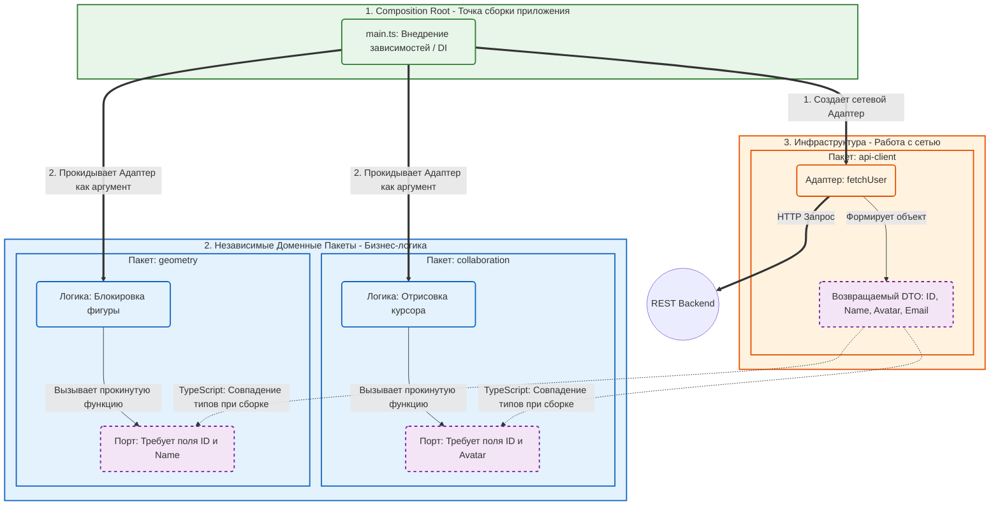

```mermaid
flowchart TD
    classDef app fill:#e8f5e9,stroke:#2e7d32,stroke-width:2px
    classDef domain fill:#e3f2fd,stroke:#1565c0,stroke-width:2px
    classDef infra fill:#fff3e0,stroke:#e65100,stroke-width:2px
    classDef types fill:#f3e5f5,stroke:#7b1fa2,stroke-width:2px,stroke-dasharray: 5 5

    subgraph Layer1 [1. Composition Root - Точка сборки приложения]
        Main(main.ts: Внедрение зависимостей / DI)
    end

    subgraph Layer2 [2. Независимые Доменные Пакеты - Бизнес-логика]
        subgraph PkgCollab [Пакет: collaboration]
            CollabLogic(Логика: Отрисовка курсора)
            CollabPort(Порт: Требует поля ID и Avatar)
            CollabLogic -->|Вызывает прокинутую функцию| CollabPort
        end

        subgraph PkgGeom [Пакет: geometry]
            GeomLogic(Логика: Блокировка фигуры)
            GeomPort(Порт: Требует поля ID и Name)
            GeomLogic -->|Вызывает прокинутую функцию| GeomPort
        end
    end

    subgraph Layer3 [3. Инфраструктура - Работа с сетью]
        subgraph PkgApi [Пакет: api-client]
            Adapter(Адаптер: fetchUser)
            DTO(Возвращаемый DTO: ID, Name, Avatar, Email)
            Adapter -->|Формирует объект| DTO
        end
    end

    Backend((REST Backend))

    Main ==>|1. Создает сетевой Адаптер| Adapter
    Main ==>|2. Прокидывает Адаптер как аргумент| CollabLogic
    Main ==>|2. Прокидывает Адаптер как аргумент| GeomLogic

    Adapter ==>|HTTP Запрос| Backend

    DTO -.->|TypeScript: Совпадение типов при сборке| CollabPort
    DTO -.->|TypeScript: Совпадение типов при сборке| GeomPort

    class Layer1,Main app
    class Layer2,PkgCollab,PkgGeom,CollabLogic,GeomLogic domain
    class Layer3,PkgApi,Adapter infra
    class CollabPort,GeomPort,DTO types
```

