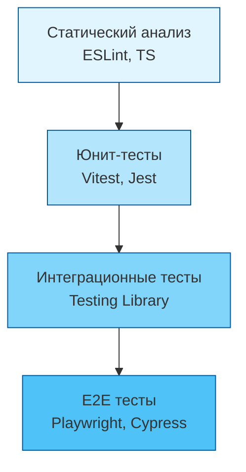

# Тестирование и качество

## Что это и зачем нужно?

Тестирование во фронтенде — это не просто проверка того, что "кнопка нажимается". Это система выстраивания доверия к коду. Когда проект разрастается, количество связей между компонентами, стейтом и API увеличивается экспоненциально. Без автоматизированного тестирования каждый деплой превращается в рулетку, а разработчики боятся рефакторить старый код. Качество (Quality Assurance) — это комплексный подход, включающий статический анализ, юнит/интеграционные/E2E тесты и метрики производительности.

Мы решаем главную боль: **регрессии** и **страх изменений**. Хорошая система тестирования позволяет разработчику сказать: "Я переписал половину стора, тесты зеленые — можно катить в прод".

## Как это работает на практике

На практике тестирование делится на слои, чтобы сбалансировать скорость выполнения тестов, стоимость их написания и уровень уверенности, который они дают. 



### Пример: Пирамида vs Трофей

**Антипаттерн (Мороженое):**
Много медленных E2E тестов, мало или нет юнит-тестов. Тесты идут часами, часто падают (flaky), разработчики их игнорируют.

**Правильное решение (Трофей тестирования от Kent C. Dodds):**
Фокус на интеграционных тестах (тестируем компоненты так, как с ними взаимодействует пользователь).

```typescript
// Антипаттерн: тестируем детали реализации (state)
test('sets isOpen to true', () => {
  const wrapper = mount(<Modal />);
  wrapper.instance().setState({ isOpen: true });
  expect(wrapper.state('isOpen')).toBe(true);
});

// Правильно: тестируем поведение (Testing Library)
test('opens modal on button click', async () => {
  render(<Modal />);
  await userEvent.click(screen.getByRole('button', { name: /open/i }));
  expect(screen.getByRole('dialog')).toBeVisible();
});
```

## Трейдоффы и границы применимости

1. **Оверхед на написание тестов**: На старте проекта написание тестов может замедлить разработку на 20-30%. Это инвестиция, которая окупается только на средних и длинных дистанциях.
2. **Flaky tests (Мигающие тесты)**: Особенно в E2E. Тест может упасть из-за задержки сети или анимации. Это убивает доверие к тестам. Нужно инвестировать время в стабильную тестовую инфраструктуру.
3. **Ложная уверенность**: 100% покрытие кода (Code Coverage) не гарантирует отсутствия багов. Можно покрыть все строки, но не проверить нужные бизнес-кейсы.
