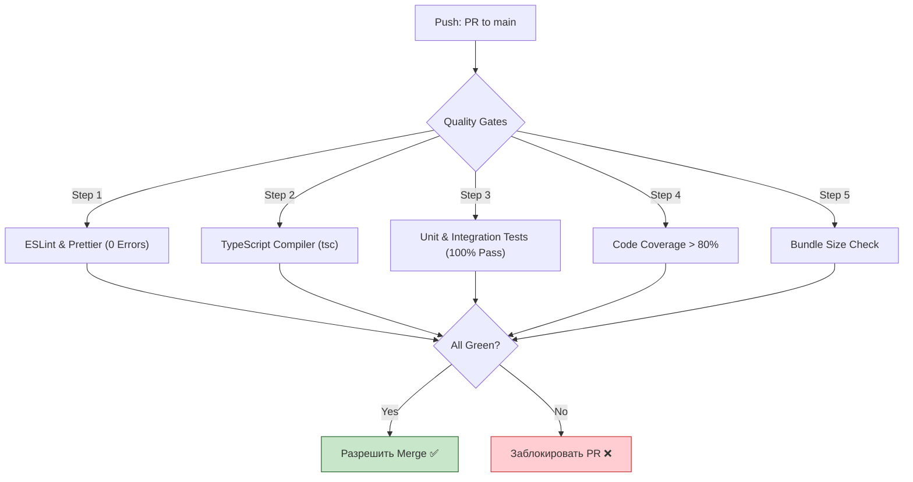

# Quality Gates (Врата качества)

## Что это и зачем нужно?

Quality Gates (Врата качества) — это набор автоматических проверок (правил) в CI/CD пайплайне, которые код должен успешно пройти, чтобы быть слитым (merged) в основную ветку или задеплоенным на сервер.

Мы решаем боль "человеческого фактора". Разработчик может забыть запустить тесты локально, проигнорировать предупреждения линтера или не заметить, что импортировал тяжелую библиотеку (увеличив bundle size на 1 МБ). Quality Gates делают процесс контроля качества безжалостным, автоматическим и неотвратимым.

## Как это работает на практике

Quality Gates настраиваются в системах контроля версий (GitHub Actions, GitLab CI/CD, SonarQube). Если шаг пайплайна падает, кнопка "Merge" блокируется.



### Пример использования

**Антипаттерн:** Мягкие врата. Тесты падают, линтер выдает варнинги, но пайплайн зеленый, и код мержится.

**Правильное решение:** Строгие проверки в GitHub Actions.
```yaml
# .github/workflows/quality-gate.yml
name: Quality Gate

on: [pull_request]

jobs:
  check-quality:
    runs-on: ubuntu-latest
    steps:
      - uses: actions/checkout@v3
      - uses: actions/setup-node@v3
      
      - name: Install dependencies
        run: npm ci
        
      - name: Linter Check
        run: npm run lint -- --max-warnings=0 # Любой варнинг = ошибка!
        
      - name: Type Check
        run: npm run typecheck # tsc --noEmit
        
      - name: Run Tests with Coverage
        run: npm run test -- --coverage
        
      # Проверка покрытия с помощью Jest/Vitest (падать, если ниже 80%)
      - name: Check Coverage Threshold
        run: npx nyc check-coverage --lines 80 --functions 80
```

## Трейдоффы и границы применимости

1. **Замедление разработки**: Если врата слишком строгие (например, требование 100% Code Coverage или падение на мигающих E2E тестах), разработка превращается в ад. Разработчики тратят 50% времени на "удовлетворение" CI, а не на фичи.
2. **"Покраска травы"**: Столкнувшись со строгими правилами по покрытию, разработчики могут начать писать бесполезные тесты без ассертов, лишь бы пройти Gate. Правила не заменят здравый смысл и Code Review.
3. **Оверхед на CI**: Много проверок означает долгий пайплайн. Ждать 20 минут, чтобы узнать о пропущенной запятой, раздражает. Выход — переносить быстрые проверки (линтер) на локальный `pre-commit` хук (Husky).
