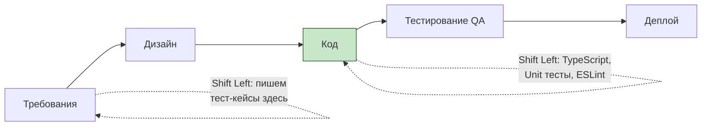

# Shift Left Testing (Сдвиг тестирования влево)

## Что это и зачем нужно?

Сдвиг влево (Shift Left) — это концепция в разработке ПО, призывающая начинать тестирование как можно раньше в жизненном цикле продукта (то есть "левее" на временной шкале проекта).

Мы решаем боль высокой стоимости исправления багов. Если баг находит разработчик в своей IDE (подчеркивание TypeScript), исправить его стоит 10 секунд. Если баг находит авто-тест в CI — 10 минут. Если баг находит QA на стейджинге — часы. Если юзер в проде — дни и репутационные потери.

## Как это работает на практике

Во фронтенде Shift Left проявляется в виде строгих линтеров, статической типизации, локальных pre-commit хуков и культуры TDD (Test-Driven Development). QA-инженеры перестают быть просто "тестировщиками после разработки" и начинают участвовать в планировании фичи, помогая разработчикам написать тесты еще до написания кода.



### Пример использования

**Антипаттерн:** Оставлять проверку типов и форматов на E2E тесты или ручное тестирование.

**Правильное решение:** Максимальный сдвиг влево с TypeScript и Zod.
```typescript
import { z } from 'zod';

// Ошибка будет поймана еще на этапе написания кода в IDE, 
// даже до запуска юнит-тестов!
const UserSchema = z.object({
  email: z.string().email(),
  age: z.number().min(18),
});

// Если API вернет кривые данные, приложение упадет контролируемо 
// на этапе парсинга, а не выдаст undefined is not a function в компоненте
const user = UserSchema.parse(await api.getUser());
```

## Трейдоффы и границы применимости

1. **Высокий порог входа**: Среда с максимальным Shift Left (строгий TS, 100% покрытие юнит-тестами, TDD, Husky) очень враждебна к новичкам (Junior). Им тяжело сделать даже простую таску из-за красного экрана с ошибками линтера и типов.
2. **Время на старте**: Первичная разработка фичи занимает дольше, так как разработчик обязан написать тесты и правильно продумать типы. Это окупается только на длинной дистанции.
3. **Не заменяет Shift Right**: Shift Left ловит технические ошибки и логику. Но он не заменит Shift Right (мониторинг продакшена, A/B тестирование, Canary деплои), который проверяет, ту ли фичу мы вообще сделали для бизнеса.
