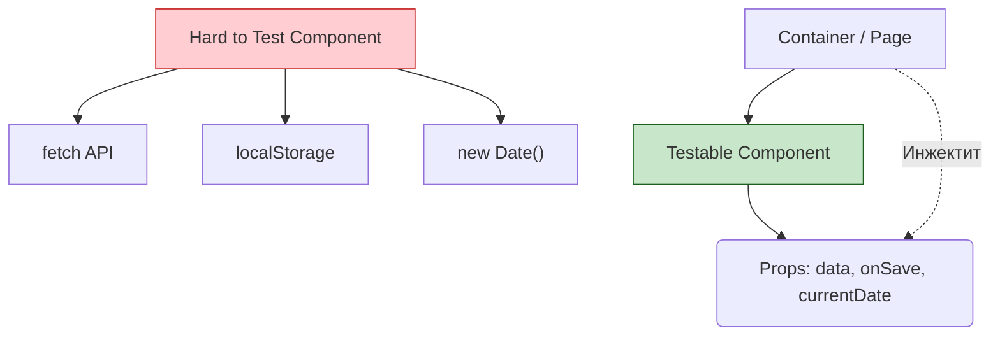

# Testability by Design (Тестируемость как часть архитектуры)

## Что это и зачем нужно?

Testability by Design — это принцип проектирования архитектуры, при котором легкость написания тестов закладывается в код изначально, а не прикручивается сбоку после завершения задачи.

Мы решаем боль "невозможности тестирования". Знакомая ситуация: вы открываете React-компонент на 500 строк, который внутри себя делает `fetch`, обращается к `localStorage`, зависит от глобального объекта `window` и использует `Math.random()`. Протестировать его — сущий кошмар, требующий десятков моков.

## Как это работает на практике

Код разделяется на "чистые функции" (бизнес-логика) и "грязные сайд-эффекты" (UI, сеть). Используется инверсия зависимостей (Dependency Injection): компоненты получают данные и коллбеки через пропсы, а не лезут за ними сами.



### Пример использования

**Антипаттерн:** Сильная связность (Tight Coupling).
```tsx
// Очень сложно протестировать: нужно мокать fetch и localStorage
const UserProfile = () => {
  const [user, setUser] = useState(null);
  
  useEffect(() => {
    fetch('/api/me', { headers: { token: localStorage.getItem('token') }})
      .then(r => r.json())
      .then(setUser);
  }, []);

  if (!user) return <Loading />;
  return <div>{user.name}</div>;
};
```

**Правильное решение:** Разделение на Container и Presentational (или использование кастомных хуков, которые легко замокать).
```tsx
// Глупая презентационная компонента. Тестируется элементарно без моков!
const UserProfileView = ({ isLoading, user, onReload }) => {
  if (isLoading) return <Loading />;
  return (
    <div>
      {user.name} <button onClick={onReload}>Reload</button>
    </div>
  );
};
```

## Трейдоффы и границы применимости

1. **Over-engineering (Переусложнение)**: В погоне за "идеальной тестируемостью" можно создать десятки интерфейсов и абстракций (как в Java Enterprise), что сделает код нечитаемым для фронтендера.
2. **Prop Drilling**: Вынос всех зависимостей в пропсы может привести к тому, что пропсы придется прокидывать через 5 уровней компонентов. Эту проблему решают Context API или стейт-менеджеры, но они усложняют моки.
3. **Не всегда нужно**: Скрипт-однодневка, лендинг на вечер или прототип не нуждаются в архитектуре Testability by Design.
