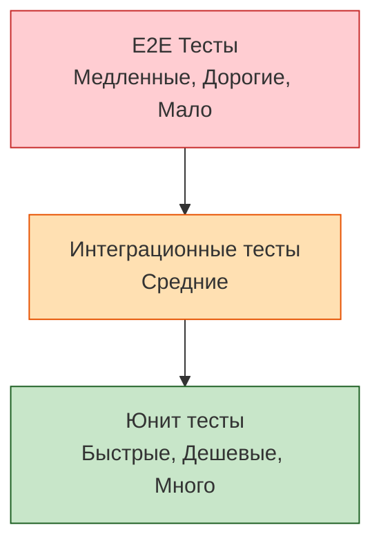

# Testing Pyramid (Пирамида тестирования)

## Что это и зачем нужно?

Пирамида тестирования (предложена Майком Коном) — это визуальная метафора того, как должны распределяться тесты в проекте по количеству, скорости и стоимости.

Она решает боль "Рожка с мороженым" (Ice Cream Cone Anti-pattern), когда в проекте есть 2 юнит-теста и 500 E2E тестов, которые прогоняются целую ночь, постоянно падают и требуют целого отдела автоматизаторов для поддержки.

## Как это работает на практике

Пирамида гласит:
1. База (широкая) — **Unit тесты**. Их должны быть тысячи, они дешевые, пишутся за минуту, выполняются за миллисекунды.
2. Середина — **Integration тесты**. Их сотни, они проверяют связки.
3. Вершина (узкая) — **E2E / UI тесты**. Их десятки, только на критические бизнес-пути (покупка, логин), так как они дорогие и хрупкие.

### Пример использования

**Антипаттерн:** Тестировать валидацию email-адреса в форме логина с помощью Cypress (E2E). Это поднимает браузер ради проверки регулярного выражения.

**Правильное решение:** 
- **Unit**: 50 тестов на функцию `validateEmail(str)`.
- **Integration**: 1 тест на компонент `<LoginForm />` с помощью `Testing Library`, чтобы проверить, что при вводе ошибки появляется красная плашка.
- **E2E**: 1 тест в Playwright на весь флоу авторизации.

## Трейдоффы и границы применимости

1. **Критика во фронтенде (Testing Trophy)**: Классическая пирамида плохо работает в современном React/Vue. Юнит-тесты компонентов (проверка стейта) очень хрупкие. Kent C. Dodds предложил форму "Трофея" (Testing Trophy), где **интеграционных тестов больше всего**, а юнит-тестов меньше (тестируем только чистую логику).
2. **Стоимость моков**: Если у вас много микросервисов, юнит и интеграционные тесты превращаются в "моко-фестиваль", где тесты проверяют моки, а не реальность. В таких системах (например, Serverless) пирамиду часто "срезают" снизу и смещают фокус на интеграцию.
