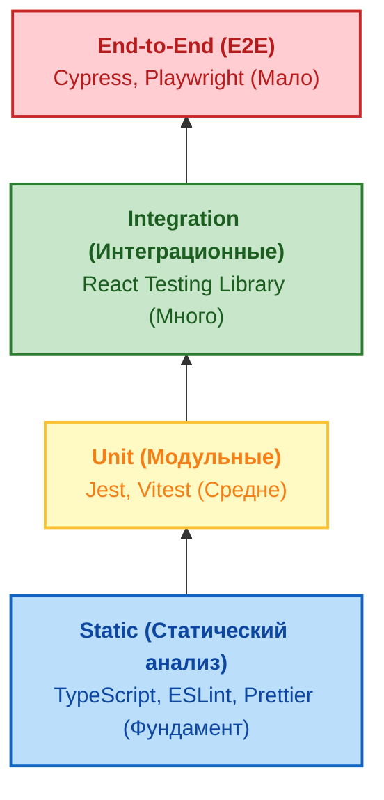

Тестирование фронтенда долгое время опиралось на классическую «Пирамиду тестирования», пришедшую из бэкенда: много юнит-тестов, немного интеграционных и совсем мало E2E. Но во фронтенде эта модель часто дает сбой. Пользователю не важно, как работает ваша чистая функция сортировки, если кнопка «Купить» перекрыта другим элементом или не отправляет запрос из-за ошибки в Redux-редьюсере.

Чтобы решить эту боль, Кент Си Доддс (Kent C. Dodds) предложил концепцию **Testing Trophy (Трофей тестирования)**. Главный девиз: *"Пишите тесты. Не слишком много. В основном интеграционные."*

## 1. Концепция Трофея

Трофей смещает фокус с изоляции мелких функций на проверку того, как компоненты работают вместе, имитируя поведение реального пользователя.



### Слои трофея:
1. **Статический анализ (Static):** Базовый уровень, ловящий опечатки и ошибки типов еще до запуска кода (TS, ESLint).
2. **Юнит-тесты (Unit):** Тестирование чистых функций, сложной бизнес-логики (редукторы, хелперы), где важны краевые случаи.
3. **Интеграционные тесты (Integration) — Самая толстая часть:** Тестирование взаимодействия нескольких компонентов. Рендерится страница или большой блок, мокается только API (сеть), а все остальное работает как в реальности.
4. **E2E (End-to-End):** Проверка критических путей (авторизация, оплата) в реальном браузере с реальным или тестовым бэкендом.

---

## 2. Какую боль мы решаем?

### Хрупкость тестов (Brittle Tests)
В классической пирамиде разработчики часто пишут юнит-тесты на каждый UI-компонент, проверяя его внутреннее состояние (`state`) или методы экземпляра. При любом рефакторинге (например, переходе с классов на хуки или замене локального стейта на Zustand) тесты ломаются, хотя для пользователя ничего не изменилось. Трофей тестирования заставляет нас тестировать **контракты** (что видит пользователь и как он взаимодействует), а не реализацию.

### Ложная уверенность
Если компонент `A` работает в изоляции, и компонент `B` работает в изоляции, это не значит, что `A` сможет передать правильные пропсы в `B`. Интеграционные тесты ловят ошибки на стыке модулей.

---

## 3. Практический пример: Авторизация

Рассмотрим форму авторизации. Как выглядит плохой и хороший подход к её тестированию?

### Антипаттерн: Избыточное юнит-тестирование (Тестирование реализации)
Мы проверяем внутреннее состояние компонента. При рефакторинге этот тест умрет.

```tsx
// ❌ ПЛОХО: Тестируем реализацию
import { shallow } from 'enzyme';
import LoginForm from './LoginForm';

test('updates username state on input change', () => {
  const wrapper = shallow(<LoginForm />);
  
  // Мы завязаны на то, что внутри есть инпут с конкретным селектором
  wrapper.find('input[name="username"]').simulate('change', { target: { value: 'john' } });
  
  // Мы завязаны на внутреннюю реализацию состояния
  expect(wrapper.state('username')).toBe('john'); 
});
```

### Как надо: Интеграционный тест по Трофею (Тестирование поведения)
Используем React Testing Library (RTL). Тест имитирует действия пользователя: найти поле по лейблу, ввести текст, нажать кнопку.

```tsx
// ✅ ХОРОШО: Тестируем как пользователь
import { render, screen } from '@testing-library/react';
import userEvent from '@testing-library/user-event';
import LoginForm from './LoginForm';

test('allows user to login successfully', async () => {
  render(<LoginForm />);
  
  // Пользователь ищет поля по тексту лейбла (доступность)
  await userEvent.type(screen.getByLabelText(/имя пользователя/i), 'john_doe');
  await userEvent.type(screen.getByLabelText(/пароль/i), 'secret123');
  
  // Пользователь кликает по кнопке
  await userEvent.click(screen.getByRole('button', { name: /войти/i }));
  
  // Проверяем результат, видимый пользователю
  expect(await screen.findByText(/добро пожаловать, john/i)).toBeInTheDocument();
});
```
*Этот тест переживет переход с Redux на React Context, замену хуков и изменение DOM-структуры, пока пользователь видит те же поля и кнопки.*

---

## 4. Скрытые трейдоффы и границы применимости

Несмотря на популярность Testing Trophy, у подхода есть свои "но":

1. **Оверхед по производительности:** Интеграционные тесты с рендерингом DOM (даже через jsdom) работают значительно медленнее чистых юнит-тестов. Если у вас тысячи интеграционных тестов в JSDOM, CI может начать выполняться десятки минут.
2. **Сложность мокирования:** Интеграционные тесты покрывают большие куски приложения. Вам придется оборачивать их в глобальные провайдеры (Redux Provider, Router, Theme Provider) и мокать все сетевые запросы, которые могут выстрелить в процессе рендера большого дерева компонентов (здесь спасает MSW).
3. **Отладка:** Если падает юнит-тест, вы точно знаете, какая из 5 строчек кода сломалась. Если падает толстый интеграционный тест на целую страницу, вам придется разбираться, кто именно виноват: дочерний компонент, редюсер, утилита форматирования или замоканный API.

### Когда использовать Пирамиду, а не Трофей?
Если вы пишете сложную библиотеку утилит (например, `lodash`), математический движок, парсер markdown или сложную доменную бизнес-логику (Clean Architecture), вам нужна классическая **Пирамида**. Трофей идеален именно для **UI-кода и продуктового фронтенда**.
