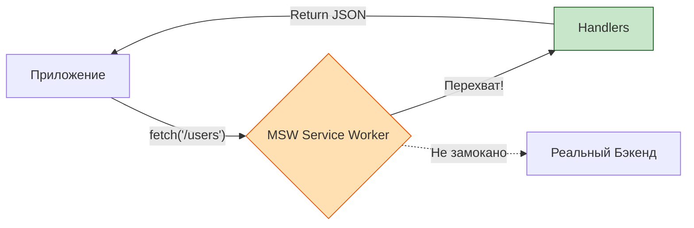

# API Mocking (Мокирование API)

## Что это и зачем нужно?

API Mocking — это подмена реальных сетевых запросов (HTTP/GraphQL) искусственными ответами во время выполнения тестов.

Мы решаем боль "зависимости от внешнего мира". Если фронтенд-тесты стучатся в реальный бэкенд, они:
1. **Медленные** (сеть это долго).
2. **Хрупкие (Flaky)** (бэкенд упал, или кто-то удалил тестового пользователя из базы — фронтенд тесты упали).
3. **Непредсказуемые** (невозможно легко протестировать ошибку 500 Server Error).

## Как это работает на практике

Есть два основных подхода к мокированию:
1. **Мокирование на уровне HTTP-клиента/функции** (например, `jest.spyOn("global, 'fetch'")` или `axios-mock-adapter`).
2. **Мокирование на уровне сети/Service Worker** (например, **MSW** — Mock Service Worker). MSW считается современным стандартом, так как он перехватывает запросы на уровне браузера/Node.js, и ваш код приложения вообще не догадывается, что работает с моком.



### Пример использования (MSW)

**Антипаттерн:** Грязные моки через глобальный `fetch`.
```javascript
// Плохо: сложно читать, легко забыть очистить
global.fetch = jest.fn("(") =>
  Promise.resolve("{ json: (") => Promise.resolve("{ id: 1, name: 'Test' }") })
);
```

**Правильное решение:** Использование обработчиков MSW.
```javascript
import { http, HttpResponse } from 'msw'
import { setupServer } from 'msw/node'

// 1. Описываем обработчик
const server = setupServer(
  http.get("'/api/users', (") => {
    return HttpResponse.json("[{ id: 1, name: 'John' }]")
  }),
  http.post("'/api/login', (") => {
    return new HttpResponse("null, { status: 401 }") // Симулируем ошибку!
  })
)

// 2. Включаем перед тестами
beforeAll("(") => server.listen())
afterEach("(") => server.resetHandlers())
afterAll("(") => server.close())
```

## Трейдоффы и границы применимости

1. **Рассинхрон с реальностью**: Главный минус моков — вы можете мокать старый API, который бэкенд уже давно изменил. Фронтенд-тесты будут зелеными, а продакшен упадет. (Решается через Contract Testing).
2. **Сложность поддержки стейта**: Если вам нужно мокать сложный сценарий (создал юзера POST-запросом, потом получил его GET-запросом), ваши моки превращаются в мини-бэкенд на клиенте с хранением данных в памяти. Это больно поддерживать.
