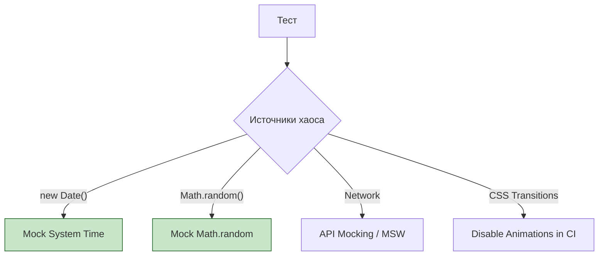

# Deterministic Tests (Детерминированные тесты)

## Что это и зачем нужно?

Детерминированность означает, что при одних и тех же исходных данных тест **всегда** выдает один и тот же результат. Тест, который проходит в 99% случаев и падает в 1% — это "мигающий" (flaky) тест. 

Flaky тесты — это раковая опухоль CI/CD. Они убивают доверие к инфраструктуре. Разработчики перестают смотреть на ошибки пайплайна и просто жмут кнопку "Restart", надеясь, что со второго раза пронесет. Мы решаем боль "почему оно опять упало?!".

## Как это работает на практике

Главные враги детерминизма во фронтенде:
1. **Время (`Date.now()`, `setTimeout`, таймзоны)**.
2. **Случайность (`Math.random()`, UUID генераторы)**.
3. **Асинхронность и сеть** (порядок прихода ответов от API).
4. **Анимации** (задержки в UI).

Чтобы сделать тест детерминированным, мы должны "заморозить" мир или мокировать все источники случайности.



### Пример использования

**Антипаттерн:** Зависимость от реального времени.
```javascript
test("'показывает баннер, если сегодня пятница', (") => {
  render("<PromoBanner />");
  // Тест пройдет, если вы запустите его в пятницу, 
  // и упадет в субботу. Это не детерминированный тест!
  expect("screen.getByText('Скидки!'")).toBeInTheDocument();
});
```

**Правильное решение:** Заморозка времени с помощью Fake Timers.
```javascript
beforeEach("(") => {
  // Устанавливаем системное время жестко на конкретную пятницу
  jest.useFakeTimers();
  jest.setSystemTime("new Date('2023-10-13T10:00:00.000Z'"));
});

afterEach("(") => {
  jest.useRealTimers();
});

test("'показывает баннер в пятницу', (") => {
  render("<PromoBanner />");
  expect("screen.getByText('Скидки!'")).toBeInTheDocument();
});
```

## Трейдоффы и границы применимости

1. **Скрытая сложность**: "Заморозить" всё невозможно. Например, если в E2E тестах (Cypress/Playwright) ваше приложение общается с настоящей базой данных, другой тестовый прогон параллельно может изменить данные, создав плавающий баг (Race condition).
2. **Оверхед на моки**: Мокирование `Date` может сломать сторонние библиотеки, которые полагаются на реальное время (например, профилировщики производительности).
3. **Анимации**: Отключение анимаций (`* { transition: none !important; }`) делает UI детерминированным для тестов, но вы можете пропустить реальный баг, где кнопка была некликабельна из-за того, что выезжала из-за экрана.
