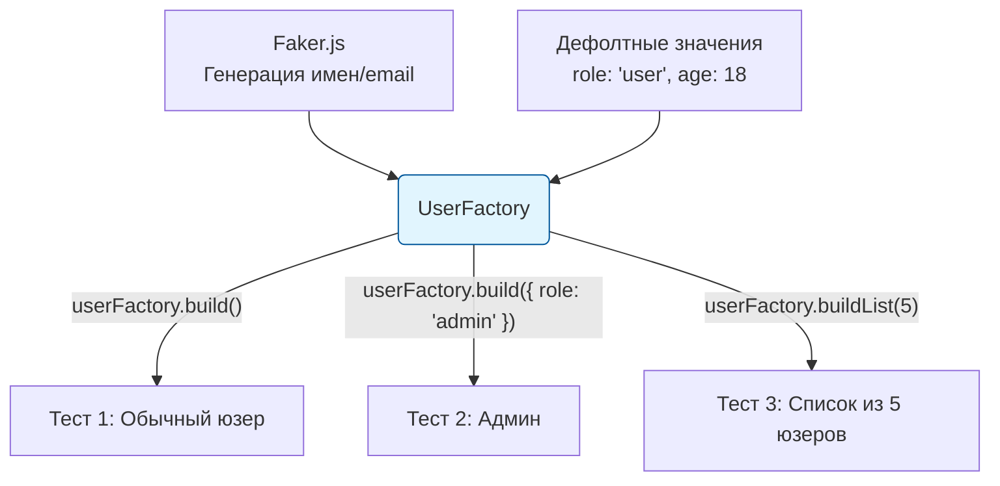

# Factories (Фабрики тестовых данных)

## Что это и зачем нужно?

Фабрики тестовых данных (Test Data Factories) — это паттерн для генерации объектов-заглушек (моков) для тестов. 

Мы решаем боль "Хардкода". Если объект User состоит из 20 полей, разработчики склонны копипастить этот огромный объект из теста в тест. 
Если бэкенд добавит обязательное поле `createdAt`, вам придется идти в 50 тест-файлов и обновлять хардкод. Фабрики позволяют определить дефолтное состояние объекта в одном месте и переопределять только те поля, которые важны для конкретного теста.

## Как это работает на практике

Вы используете библиотеки вроде **Fishery**, **Faker.js** или **Rosie** для создания генераторов. Фабрика генерирует объект с дефолтными или случайными (Faker) значениями, а в тесте вы просто вызываете `.build()`.



### Пример использования (Fishery)

**Антипаттерн:** Хардкод моков.
```typescript
const mockUser = {
  id: 1, name: 'Test', email: 'test@test.com', role: 'user', 
  avatar: 'url', createdAt: '2023-01-01', // ...еще 15 полей
};
```

**Правильное решение:** Фабрика с Fishery + Faker.
```typescript
import { Factory } from 'fishery';
import { faker } from '@faker-js/faker';
import type { User } from './types';

// Определяем фабрику ОДИН раз
export const userFactory = Factory.define<User>(({ sequence }) => ({
  id: sequence, // Уникальный ID для каждого объекта (1, 2, 3...)
  name: faker.person.fullName(),
  email: faker.internet.email(),
  role: 'user',
  createdAt: new Date().toISOString(),
}));

// В тестах:
test("'админ видит панель управления', (") => {
  // Нам важна только роль! Остальные 15 полей сгенерируются автоматически.
  const admin = userFactory.build("{ role: 'admin' }");
  
  render("<Dashboard user={admin} />");
  expect("screen.getByText('Admin Panel'")).toBeInTheDocument();
});
```

## Трейдоффы и границы применимости

1. **Производительность**: Использование Faker.js для генерации строк может быть ресурсоемким. Если вы генерируете массив из 10 000 объектов для нагрузочного юнит-теста, фабрика будет работать медленно. В таких случаях лучше использовать статические счетчики.
2. **Сложность связей (Relational Data)**: Фабрики хорошо работают для плоских объектов. Если вам нужно сгенерировать Компанию, у которой есть 5 Отделов, в которых 50 Сотрудников, настройка связей внутри фабрик становится сложной и запутанной архитектурной задачей.
