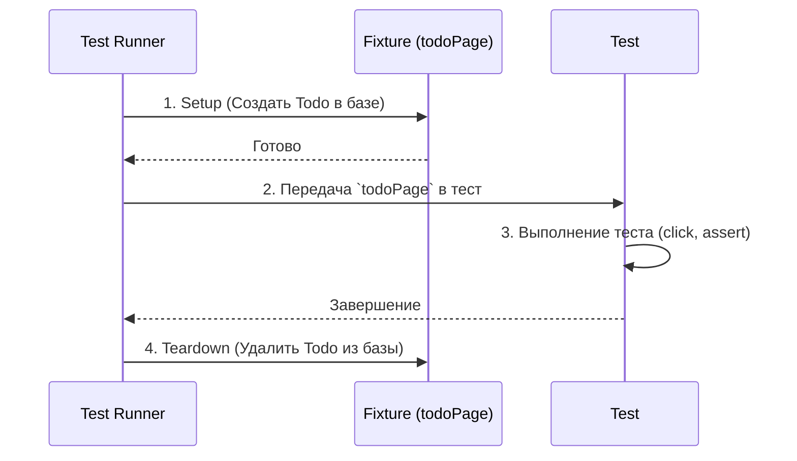

# Fixtures (Тестовые фикстуры)

## Что это и зачем нужно?

Фикстуры (Fixtures) — это заранее подготовленное состояние окружения или данных, необходимое для выполнения теста. 

Мы решаем боль "огромного блока `beforeEach`". Представьте, что для теста корзины вам нужно: 1) запустить браузер, 2) залогинить пользователя, 3) перейти на карточку товара, 4) нажать "Добавить". Если вы пишете это в каждом тесте, ваш код дублируется и выполняется бесконечно долго. Фикстуры позволяют инкапсулировать эту логику настройки (setup) и очистки (teardown).

## Как это работает на практике

Фикстуры особенно популярны в **Playwright** и **PyTest**. В Playwright вы можете создать кастомную фикстуру `loggedInPage` или `cartPage`. Раннер сам поймет, когда её нужно инициализировать, передаст её в тест как аргумент, а после теста автоматически очистит за собой следы (удалит юзера из БД).



### Пример использования (Playwright)

**Антипаттерн:** Дублирование логики в каждом тесте.
```typescript
test('add to cart', async ({ page }) => {
  await login(page, 'user', 'pass'); // Дублируется в 100 тестах
  await page.goto('/product/1');
  // ...тест корзины
});
```

**Правильное решение:** Использование кастомных фикстур Playwright.
```typescript
import { test as base } from '@playwright/test';

// 1. Расширяем базовый test объект новой фикстурой
const test = base.extend<{ userPage: Page }>({
  userPage: async ({ page }, use) => {
    // Setup (выполняется до теста)
    await page.goto('/login');
    await page.fill('#user', 'test');
    await page.fill('#pass', '1234');
    await page.click('button[type="submit"]');
    
    // Передаем готовую страницу в сам тест
    await use(page);
    
    // Teardown (выполняется после теста, даже если он упал)
    await page.evaluate(() => localStorage.clear());
  },
});

// 2. В тесте просто запрашиваем фикстуру 'userPage'
test('корзина работает для авторизованного юзера', async ({ userPage }) => {
  // Нам не нужно логиниться! userPage УЖЕ залогинен.
  await userPage.goto('/product/1');
  await userPage.click('text=В корзину');
  // ... проверки
});
```

## Трейдоффы и границы применимости

1. **Магия и неявность**: Слишком много фикстур, вложенных друг в друга (фикстура `adminPage` зависит от фикстуры `dbConnection`, которая зависит от `logger`), делают код нечитаемым. Новый разработчик смотрит на тест и не понимает, откуда взялись данные.
2. **Утечки состояния (State Leakage)**: Если фикстура неаккуратно производит очистку (Teardown), данные могут перетечь в следующий тест, что приведет к трудноотловимым мигающим (flaky) багам.
3. **Область видимости**: Важно правильно настраивать скоуп фикстур (запускать один раз на все тесты файла — `worker scope`, или перед каждым тестом — `test scope`). Ошибка в скоупе убьет изоляцию тестов.
