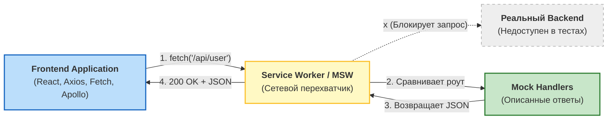

Развязка фронтенда и бэкенда во время тестирования — одна из самых сложных задач. Если фронтенд-тесты стучатся в реальный API, они становятся медленными, нестабильными (flaky) и зависят от состояния базы данных (которое кто-то мог изменить).

Традиционный подход — **мокировать функции HTTP-клиента** (например, `jest.spyOn(axios, 'get')` или мокать `fetch`). Но это связывает тесты с внутренней реализацией: если вы решите переписать приложение с Axios на встроенный `fetch` или использовать GraphQL-клиент, все ваши тесты упадут, хотя поведение приложения не изменилось.

Эту боль элегантно решает **Mock Service Worker (MSW)**. 

## 1. Концепция MSW: Сетевой перехват вместо подмены кода

MSW использует Service Workers (в браузере) и переопределение сетевых модулей (в Node.js для JSDOM/Jest), чтобы перехватывать запросы на **сетевом уровне**. 

Ваше приложение думает, что оно общается с реальным сервером. Оно отправляет настоящий запрос. И только на границе сети MSW ловит его и возвращает замоканный ответ.



## 2. Практический пример: Тестирование профиля

Представим компонент, который загружает профиль пользователя при монтировании.

### Антипаттерн: Мокирование реализации (Axios)
Тест знает слишком много о том, *как именно* компонент получает данные.

```tsx
// ❌ ПЛОХО: Завязка на реализацию
import axios from 'axios';
import { render, screen } from '@testing-library/react';
import UserProfile from './UserProfile';

jest.mock('axios');
const mockedAxios = axios as jest.Mocked<typeof axios>;

test('renders user data', async () => {
  // Мокаем конкретный метод библиотеки
  mockedAxios.get.mockResolvedValueOnce({ data: { name: 'Alice' } });
  
  render(<UserProfile />);
  expect(await screen.findByText('Alice')).toBeInTheDocument();
  expect(mockedAxios.get).toHaveBeenCalledWith('/api/user');
});
// ПРОБЛЕМА: Если мы заменим axios на fetch или React Query, тест упадет!
```

### Как надо: MSW (Тестирование поведения)
Мы описываем обработчики (handlers) как мини-бэкенд. Тесту все равно, как фронтенд делает запрос.

```tsx
// ✅ ХОРОШО: Сетевой перехват
import { render, screen } from '@testing-library/react';
import { rest } from 'msw';
import { setupServer } from 'msw/node';
import UserProfile from './UserProfile';

// Описываем "бэкенд"
const server = setupServer(
  rest.get('/api/user', (req, res, ctx) => {
    return res(ctx.status(200), ctx.json({ name: 'Alice' }));
  })
);

beforeAll(() => server.listen());
afterEach(() => server.resetHandlers());
afterAll(() => server.close());

test('renders user data', async () => {
  render(<UserProfile />);
  // Приложению кажется, что оно сходило на реальный сервер
  expect(await screen.findByText('Alice')).toBeInTheDocument();
});
```

## 3. Скрытые трейдоффы и границы применимости

MSW — это де-факто индустриальный стандарт сегодня, но у него есть свои нюансы.

### 1. Поддержание синхронизации моков и реального API
Когда вы пишете хэндлеры для MSW, вы фиксируете структуру ответа. Если реальный бэкенд изменит контракт (например, переименует `name` в `firstName`), ваши моки продолжат возвращать `name`, тесты будут зелеными, а в продакшене приложение упадет.
**Решение:** Использовать генерацию MSW хэндлеров на основе OpenAPI (Swagger) спецификаций или использовать Contract Testing (Pact).

### 2. Задержка инициализации Service Worker в браузере
Если вы используете MSW не только в Node.js/Jest, но и для разработки в браузере (чтобы не ждать реальный бэкенд), нужно учитывать, что Service Worker инициализируется асинхронно.
**Нюанс:** Приложение может успеть отправить запрос *до* того, как Service Worker возьмет страницу под контроль. Приходится откладывать рендер React (замораживать старт приложения), пока воркер не будет готов (`worker.start().then(() => renderApp())`).

### 3. Оверхед на написание сложной логики
Иногда разработчики настолько увлекаются MSW, что начинают писать внутри хэндлеров мини-базы данных на основе массивов, сложную логику пагинации, сортировки и авторизации. Это превращается в поддержку второго бэкенда.
**Правило:** Моки должны быть максимально тупыми. Для тестов используйте `server.use(...)` прямо в теле теста, чтобы переопределить конкретный ответ под конкретный сценарий, вместо того чтобы городить универсальный умный мок.
