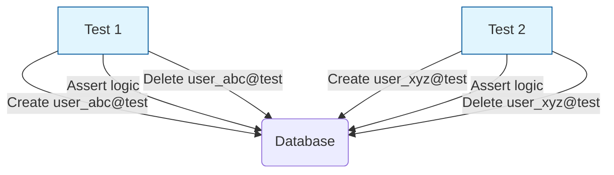

# Test Data Management (Управление тестовыми данными)

## Что это и зачем нужно?

Управление тестовыми данными (TDM) — это стратегия создания, изоляции и очистки данных, необходимых для прохождения тестов (особенно E2E и интеграционных).

Мы решаем боль параллельного выполнения и "грязного стейта". Представьте:
- Тест А: Создает пользователя `admin@test.com` и проверяет его права.
- Тест Б: Удаляет пользователя `admin@test.com` для проверки флоу удаления.
Если они запустятся параллельно (или в неправильном порядке), оба упадут. TDM гарантирует, что каждый тест работает в идеальной "песочнице".

## Как это работает на практике

Есть три главных подхода к TDM:
1. **Глобальный Seed (Database Dump)**: Перед всем тестовым прогоном база накатывается из дампа (Fixtures). Тесты знают, что юзер ID=1 существует.
2. **Динамическая генерация (Unique ID)**: Каждый тест создает свои данные с уникальными идентификаторами (`user_${uuid()}@test.com`).
3. **Изоляция на уровне БД**: Использование транзакций (в интеграционных тестах бэкенда) или отдельных схем БД для каждого тестового воркера.



### Пример использования (Playwright)

**Антипаттерн:** Использование статических, заранее известных данных для мутирующих запросов.
```typescript
// Плохо: если тест упадет посередине, почта 'test@mail.com' останется в базе, 
// и следующий запуск этого теста упадет с ошибкой "Email is already taken".
await page.fill('#email', 'test@mail.com');
```

**Правильное решение:** Генерация уникальных данных и гарантированная очистка.
```typescript
import { test, expect } from '@playwright/test';
import { randomUUID } from 'crypto';

test('пользователь может зарегистрироваться', async ({ page, request }) => {
  const uniqueEmail = `user-${randomUUID()}@example.com`;
  
  // Тест использует уникальные данные, конфликты исключены
  await page.goto('/signup');
  await page.fill('input[name="email"]', uniqueEmail);
  await page.click('button[type="submit"]');
  
  await expect(page.getByText('Успешно')).toBeVisible();

  // Очистка за собой (через API бэкенда, чтобы не тратить время на UI-клики)
  await request.delete(`/api/test-utils/users/${uniqueEmail}`);
});
```

## Трейдоффы и границы применимости

1. **Загрязнение базы (Data Leaks)**: Если тест упадет до шага очистки (или сам процесс Node.js убьется), "мусорные" данные останутся в базе навсегда. Для этого нужны ночные скрипты-чистильщики (Garbage Collection).
2. **Долгий Setup**: Создание пользователя через UI (или даже через API) занимает время. Если тесту корзины нужен пользователь с историей заказов, генерация этих данных может занять больше времени, чем сам тест корзины.
3. **Бэкенд-зависимость**: Фронтендер не всегда может управлять базой данных бэкенда в E2E тестах. Приходится просить бэкендеров написать специальные `test-only` эндпоинты для быстрой генерации/очистки стейта.
