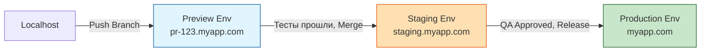

# Test Environments (Тестовые окружения)

## Что это и зачем нужно?

Тестовое окружение — это инфраструктура (сервера, базы данных, сервисы), в которой запускается ваше приложение для тестирования до того, как оно попадет к реальным пользователям.

Мы решаем боль "It works on my machine". Локально разработчик может использовать SQLite и моки Stripe. В продакшене крутится PostgreSQL-кластер и реальный биллинг. Чтобы поймать баги интеграции (например, CORS ошибки или проблемы с балансировщиком), нам нужно окружение, максимально похожее на продакшен.

## Как это работает на практике

Стандартная эволюция окружений:
1. **Local (localhost)** — для разработки.
2. **Preview / Ephemeral (Vercel, Netlify)** — временное окружение, которое поднимается для каждого Pull Request'а (Ветки).
3. **Staging / QA** — единое окружение, которое является точной копией продакшена.
4. **Production** — реальные пользователи.

### Preview (Ephemeral) Environments

Во фронтенде сейчас стандартом де-факто стали Preview-окружения (они же Ephemeral, они же Branch Deployments). 

**Как это работает:**
Когда вы создаете PR (например, меняете цвет кнопки), CI/CD (например, Vercel) автоматически собирает ветку и деплоит её на уникальный URL (вида `https://my-app-pr-42.vercel.app`).
- Дизайнер может открыть ссылку и посмотреть верстку.
- Playwright (E2E тесты) в GitHub Actions получает этот URL и прогоняет тесты именно против этой "одноразовой" версии сайта.
- При мердже (закрытии PR) это окружение уничтожается.

## Трейдоффы и границы применимости

1. **Сложность баз данных**: Деплоить статику фронтенда на уникальный URL легко. Но куда этот фронтенд будет ходить за данными? Если все Preview-ветки стучатся в один общий Staging API, они могут конфликтовать данными. Если поднимать отдельную БД для каждого PR — это дорого и долго. (Решается использованием Neon, PlanetScale или Docker-контейнеров).
2. **Стоимость**: Поддержание точной копии продакшена (Staging) с таким же объемом памяти, реплик и мощностей — это х2 счетчик от AWS (облака). Часто Staging делают "уменьшенной копией", что снижает его эффективность (нагрузочное тестирование на нем не провести).
3. **Третьи сервисы (3rd party)**: Настроить тестовое окружение для аутентификации (Auth0, Firebase) или оплат (Stripe) часто требует создания дублирующих аккаунтов и ключей, что создает хаос в секретах.
