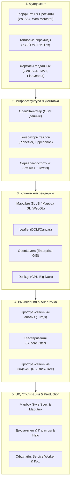

# Карта компетенций Web GIS (Frontend)

> [!info] Навигация
> Родительский раздел: [[Web GIS MOC]]

Веб-картография находится на стыке классического фронтенда, компьютерной графики (WebGL/WebGPU), геоинформатики (GIS) и распределенных сетей доставки контента. Для фронтенд-разработчика понимание этой предметной области открывает доступ к сложным проектам: от сервисов доставки и логистики до систем мониторинга флота, спутниковой аналитики и Digital Twins.

---

## Матрица уровней зрелости (Levels of Competence)

### Уровень 1: Потребитель готовых виджетов (Junior)
- **Что умеет:** Встроить Google Maps, Yandex Maps или Leaflet с помощью готовых React/Vue-оберток.
- **Ограничения:** Добавление 2000 точек на карту намертво подвешивает страницу; стили берутся строго стандартные; непонимание, почему при зуме маркер смещается относительно здания; паника при счетах за вызовы API.

### Уровень 2: Уверенный практик интерактивных карт (Middle)
- **Что умеет:**
  - Работает с **MapLibre GL JS**, понимает разницу между растровыми и векторными тайлами.
  * Управляет слоями данных (`addSource`, `addLayer`), использует фильтры и Mapbox Expressions.
  * Реализует кластеризацию сотен тысяч маркеров через `Supercluster` или встроенный кластеризатор MapLibre.
  * Выполняет базовую пространственную математику на клиенте через `Turf.js` (расчет расстояний, проверка вхождения точки в полигон).
  * Грамотно изолирует инстанс карты от реактивной системы фреймворка, избегая утечек памяти и утечек WebGL-контекста.

### Уровень 3: Web GIS Архитектор (Senior / Lead)
- **Что умеет:**
  - Проектирует экономичную инфраструктуру доставки данных: собирает срезы OSM через **Planetiler** в формат **PMTiles**, хостит на Cloudflare R2 и подключает клиент без единого бэкенд-сервера с нулевыми затратами на исходящий трафик.
  - Создает индивидуальные картографические стили корпоративного уровня в **Maputnik** с продуманным дехламмингом, типографикой и адаптивными порогами видимости слоев.
  - Визуализирует миллионы динамических сущностей (Big Data) с помощью **Deck.gl** / **Luma.gl** с использованием шейдеров и GPU-инстансинга.
  - Проектирует оффлайн-режим карт с синхронизацией дельт и кэшированием бинарных тайлов через Service Worker и IndexedDB.
  - Знает внутренности OGC-стандартов, работу проекций и алгоритмов пространственного индексирования (R-Tree, K-D Tree).
