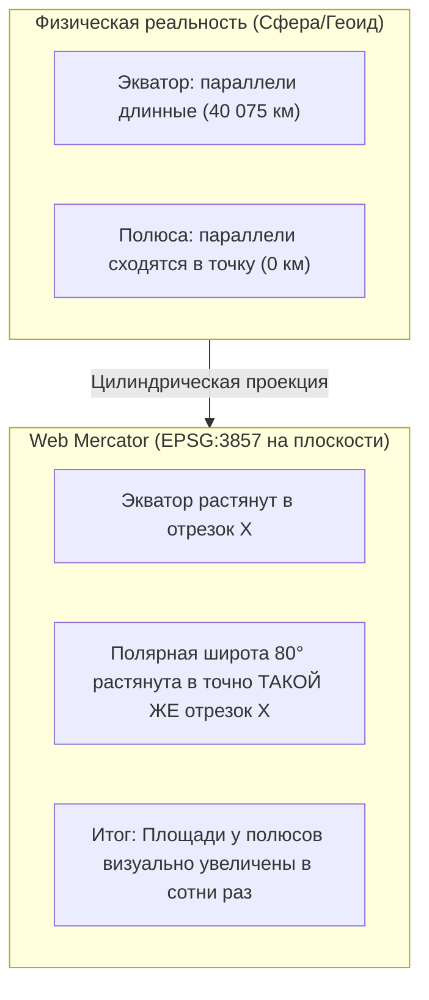

# Искажения проекций и почему северные страны кажутся гигантскими

> [!info] Навигация
> Родительский раздел: [[Web GIS MOC]]

## Картографический парадокс: Гренландия против Африки

Если взглянуть на стандартную плоскую веб-карту (Google Maps, OpenStreetMap или Яндекс), Гренландия выглядит сопоставимой по размерам с Африканским континентом.

В физической реальности:
* Площадь Африки $\approx 30.37$ млн км²
* Площадь Гренландии $\approx 2.16$ млн км²
* **Африка в 14 раз больше Гренландии!**



---

## Почему Web Mercator так устроен?

Проекция Меркатора — **равноугольная (конформная)**.
Это означает:
1. Она строго сохраняет локальные углы: угол между двумя пересекающимися дорогами на перекрестке в Хельсинки или в Найроби на экране будет в точности $90^\circ$.
2. Круг бесконечно малого радиуса на любой широте остается идеальным кругом (это свойство визуализируется **индикатрисой Тиссо**).
3. Север всегда направлен строго вверх, а курс судна или самолета с постоянным азимутом (локсодромия) отображается прямой линией.

Цена этого свойства — **катастрофическое искажение площадей и масштабов при удалении от экватора**.

Масштабный коэффициент искажения по широте ($\phi$) вычисляется как:
$$k = \frac{1}{\cos(\phi)} = \sec(\phi)$$

| Широта ($\phi$) | Локация | Коэффициент увеличения ($k$) | Во сколько раз увеличена площадь ($k^2$) |
| :--- | :--- | :--- | :--- |
| $0^\circ$ | Экватор (Кения, Эквадор) | $1.00$ | **$1.0$ раз (нет искажений)** |
| $45^\circ$ | Юг Франции, Крым | $1.41$ | **$2.0$ раза** |
| $60^\circ$ | Санкт-Петербург, Осло | $2.00$ | **$4.0$ раза** |
| $80^\circ$ | Северная Гренландия, Шпицберген | $5.76$ | **$33.2$ раза** |

---

## Как это ломает логику во Frontend

### 1. Подсчет радиуса зоны доставки (Буфер)
Если вы рисуете радиус доставки пиццы "5 км вокруг ресторана", наивный подход — нарисовать окружность в экранных пикселях или добавить константный $\Delta lat$ и $\Delta lon$.

```typescript
// ❌ ГРУБЫЙ АНТИПАТТЕРН: Евклидово смещение координат
const restaurant = { lat: 60.0, lng: 30.0 }; // Санкт-Петербург
// 1 градус широты ~111 км, но 1 градус долготы на широте 60° равен 111 * cos(60°) = 55.5 км!
// Попытка прибавить одинаковый дельта-градус создаст на экране сплюснутый эллипс, 
// а в реальности охватит вдвое меньшее расстояние по долготе!
```

```typescript
// ✅ ПРАВИЛЬНЫЙ ПОДХОД: Использование геодезических геометрий через Turf.js
import buffer from '@turf/buffer';
import { point } from '@turf/helpers';

const center = point([30.0, 60.0]); // [lng, lat]
// Turf генерирует реальный геодезический полигон с учетом кривизны эллипсоида
const deliveryZone5km = buffer(center, 5, { units: 'kilometers' });
// При отображении в Web Mercator этот полигон визуально будет выглядеть 
// слегка вытянутым по вертикали кругом — и это математически корректно!
```

### 2. Измерение расстояний по прямой (Великий круг vs Прямая на карте)
Кратчайшее расстояние между двумя точками на сфере (ортодромия) в проекции Меркатора отображается **дугой**, изгибающейся к полюсу. Если самолет летит из Лондона в Токио, прямая линия на карте будет более длинным путем, чем выгнутая к северу дуга над Сибирью.

---

## Современное решение проблемы: Режим 3D Глобуса

Начиная с версий **Mapbox GL JS v2** и **MapLibre GL JS v3/v4**, в браузерных движках появился режим честного **3D Globe Projection**:
* При зуме $0-5$ (мировой уровень) движок сгибает сетку координат в честную трехмерную сферу, используя WebGL шейдеры. Гренландия и Африка отображаются в реальных пропорциях.
* При приближении к зуму $>6$ движок плавно и бесшовно интерполирует проекцию в стандартный Web Mercator, чтобы локальные перекрестки и здания оставались привычно плоскими.

```typescript
// Включение режима Globe в MapLibre GL JS v4+
const map = new maplibregl.Map({
  container: 'map',
  style: 'https://demotiles.maplibre.org/style.json',
  center: [0, 20],
  zoom: 1.5
});

// Переключение проекции на лету:
map.setProjection({
  type: 'globe' // Доступно: 'mercator' | 'globe' | 'equalEarth' | 'naturalEarth'
});
```

> [!tip] Вывод
> Всегда разделяйте **визуальное представление** (Web Mercator удобен для прямоугольных тайлов в пикселях) и **пространственные вычисления** (площади, дистанции, пересечения должны вычисляться на геоиде WGS84 через геодезические алгоритмы библиотеки `Turf.js`).
