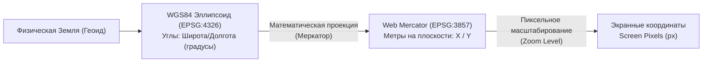

# Системы координат и проекции (WGS84 vs Web Mercator)

> [!info] Навигация
> Родительский раздел: [[Web GIS MOC]]

## Что это такое и какую боль решает

Любая точка на планете существует в трехмерном пространстве реальной физической формы Земли (геоида). Экран смартфона или монитора — это плоская двумерная матрица пикселей.

Чтобы перенести физическую точку на экран, требуется ответить на два вопроса:
1. **Какая система отсчета (Датум):** какую математическую модель эллипсоида мы используем?
2. **Какая проекция:** по какой математической формуле мы разворачиваем криволинейную поверхность эллипсоида на плоский лист?

Если перепутать эти системы координат, метка курьера улетит в океан на расстояние сотен или миллионов метров, а площадь полигона здания будет посчитана с ошибкой в разы.



---

## EPSG:4326 (WGS 84) — Географические координаты

* **Идентификатор:** `EPSG:4326` (WGS 84 — World Geodetic System 1984).
* **Единицы измерения:** Десятичные градусы (°).
  * **Широта (Latitude):** от $-90^\circ$ (Южный полюс) до $+90^\circ$ (Северный полюс). Экватор = $0^\circ$.
  * **Долгота (Longitude):** от $-180^\circ$ (запад) до $+180^\circ$ (восток). Гринвич = $0^\circ$.
* **Где используется:**
  * GPS-чипы телефонов и навигаторов выдают координаты строго в `EPSG:4326`.
  * Формат хранения данных в базах (PostGIS `geometry(Point, 4326)`).
  * Стандартный формат обмена геоданными — спецификация **GeoJSON** по стандарту RFC 7946 требует исключительно WGS84.

---

## EPSG:3857 (Web Mercator / Pseudo-Mercator) — Проекция Веба

* **Идентификаторы:** `EPSG:3857` (также известна под неофициальным кодом `EPSG:900913`, где цифры читаются как *GOOGLE*).
* **Единицы измерения:** Метры на плоскости ($X$ и $Y$).
* **Диапазон значений:** от $-20\,037\,508.34$ до $+20\,037\,508.34$ метров по обеим осям.
* **История появления:** В 2005 году инженеры Google Maps искали способ разбить весь мир на квадратные тайлы одинакового размера пикселей. Классическая проекция Меркатора сохраняет углы (конформность), а если искусственно обрезать крайние полярные широты до $\approx \pm 85.051129^\circ$, то вся карта мира превращается в **идеальный квадрат**.

> [!important] Магическое число $85.051129^\circ$
> При широте $\pm 85.0511287798^\circ$ длина параллели в точности равна длине меридиана в проекции Меркатора. Именно поэтому тайловые пирамиды во всех веб-картах квадратные ($256 \times 256$ или $512 \times 512$). Полярные шапки просто обрезаются.

---

## Ловушка для фронтендера: Lon/Lat против Lat/Lon

Самая распространенная ошибка в веб-картографии — путаница в порядке следования координат.

| Библиотека / Стандарт | Порядок передачи координат | Формат | Пример (Москва) |
| :--- | :--- | :--- | :--- |
| **GeoJSON (RFC 7946)** | **[Долгота, Широта]** (X, Y) | Массив `[lng, lat]` | `[37.6173, 55.7558]` |
| **MapLibre GL JS / Mapbox** | **[Долгота, Широта]** (X, Y) | `[lng, lat]` или `{lng, lat}` | `[37.6173, 55.7558]` |
| **Leaflet** | **[Широта, Долгота]** (Y, X) | `[lat, lng]` или `{lat, lng}` | `[55.7558, 37.6173]` |
| **Google Maps JS API** | **[Широта, Долгота]** (Y, X) | `{lat, lng}` | `{lat: 55.7558, lng: 37.6173}` |
| **Яндекс Карты** | **[Широта, Долгота]** (Y, X) | `[lat, lon]` | `[55.7558, 37.6173]` |

### Почему так произошло?
В математике и компьютерной графике принято указывать горизонтальную ось первой: $(X, Y)$, где $X$ — долгота (горизонталь восток-запад), а $Y$ — широта (вертикаль север-юг). Этой логике следуют **GeoJSON** и **MapLibre**.
Однако в школьной географии и на флоте веками сначала называли широту: *"55 градусов северной широты, 37 градусов восточной долготы"*. Этой традиции последовали ранние библиотеки (Google Maps, Leaflet).

```typescript
// ❌ АНТИПАТТЕРН: Передача координат из GeoJSON напрямую в Leaflet
const geojsonPoint = feature.geometry.coordinates; // [37.6173, 55.7558] (lon, lat)
L.marker(geojsonPoint).addTo(map); // Маркер окажется в Индийском океане!

// ✅ КАК НАДО: Либо инвертировать вручную, либо использовать L.GeoJSON
L.marker([geojsonPoint[1], geojsonPoint[0]]).addTo(map);
// Или через абстракцию:
L.geoJSON(feature).addTo(map);
```

---

## Формула перевода на клиенте (WGS84 ↔ Web Mercator)

Для базовых конверсий не обязательно тащить тяжелую библиотеку `proj4js`. Формулы прямого и обратного преобразования лаконичны:

```typescript
const R = 6378137.0; // Радиус Земли в метрах (WGS84)

/**
 * Перевод градусов WGS84 [lon, lat] в метры Web Mercator [x, y]
 */
export function forwardMercator(lon: number, lat: number): [number, number] {
  const x = R * (lon * Math.PI / 180);
  const y = R * Math.log(Math.tan((Math.PI / 4) + ((lat * Math.PI / 180) / 2)));
  return [x, y];
}

/**
 * Перевод метров Web Mercator [x, y] обратно в градусы [lon, lat]
 */
export function inverseMercator(x: number, y: number): [number, number] {
  const lon = (x / R) * (180 / Math.PI);
  const lat = (2 * Math.atan(Math.exp(y / R)) - (Math.PI / 2)) * (180 / Math.PI);
  return [lon, lat];
}
```

---

## Резюме для выбора

- **Храните данные и обменивайтесь по API:** Всегда в `EPSG:4326` (WGS84, `[lng, lat]`).
- **Считайте площади и расстояния:** Либо с помощью геодезических формул (гаверсинусы / Винсенти в библиотеке `Turf.js`), либо проецируя в локальную метрическую зону UTM (но ни в коем случае не считая теоремой Пифагора прямо по координатам градусов).
- **Отображайте тайлы:** В `EPSG:3857` (Web Mercator), так как 99% всех тайловых серверов в мире нарезаны под эту проекцию.
