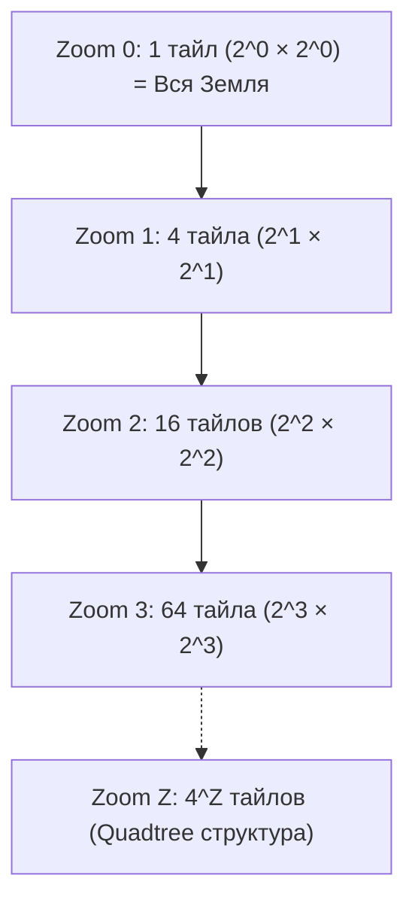

# Тайловая сетка (XYZ, TMS, Quadkeys) и понятие Zoom Levels

> [!info] Навигация
> Родительский раздел: [[Web GIS MOC]]

## Что это такое и какую боль решает

Если бы мы пытались загрузить карту всей Земли с детализацией до отдельного дома в одном векторном или растровом файле, размер файла превысил бы терабайты. Браузер мгновенно бы исчерпал оперативную память и упал.

Решение, предложенное в 2005 году картографами и популяризованное Google Maps — **тайловая пирамида (Tile Pyramid)**.
Мы делим планету на иерархическую сетку маленьких квадратных кусочков (тайлов) размером $256 \times 256$ или $512 \times 512$ пикселей. Браузер запрашивает по сети **только те тайлы, которые в данный момент попадают в видимую область экрана (Viewport)** на текущем уровне приближения (Zoom).



---

## Иерархия масштабов (Zoom Levels)

Количество тайлов по горизонтали и вертикали на зуме $z$ равно $2^z$. Общее количество тайлов на уровне равно $4^z$:

| Zoom ($z$) | Размер сетки (тайлов) | Всего тайлов в мире | Что видно пользователю | Типичный масштаб |
| :--- | :--- | :--- | :--- | :--- |
| **0** | $1 \times 1$ | 1 | Весь мир целиком | 1 : 500 000 000 |
| **3** | $8 \times 8$ | 64 | Континенты и океаны | 1 : 70 000 000 |
| **6** | $64 \times 64$ | 4 096 | Страны и крупные регионы | 1 : 10 000 000 |
| **10** | $1\,024 \times 1\,024$ | $\approx 1$ млн | Крупные города и агломерации | 1 : 500 000 |
| **14** | $16\,384 \times 16\,384$ | $\approx 268$ млн | Районы города, сеть улиц | 1 : 35 000 |
| **17** | $131\,072 \times 131\,072$ | $\approx 17$ млрд | Отдельные дома, контуры зданий | 1 : 4 000 |
| **20** | $1\,048\,576 \times 1\,048\,576$ | $\approx 1.1$ трлн | Деревья, скамейки, тротуары | 1 : 500 |

---

## Схемы адресации тайлов

Клиентская библиотека формирует HTTP URL для скачивания каждого нужного кусочка. Существует три основных схемы именования:

### 1. Стандартная схема XYZ (Slippy Map Tiles / OpenStreetMap / Google)
* **Шаблон URL:** `https://tile.provider.com/{z}/{x}/{y}.png` (или `.pbf` для вектора).
* `z` — уровень зума (0 .. 22).
* `x` — номер столбца с запада на восток (от $0$ до $2^z - 1$).
* `y` — номер строки **с севера на юг** (от $0$ на северном полюсе до $2^z - 1$ на южном).

### 2. Схема TMS (Tile Map Service — стандарт OSGeo)
* **Шаблон URL:** `https://tile.provider.com/{z}/{x}/{y}.png`
* В стандарте TMS ось `y` **инвертирована**: отсчет начинается **с юга и идет на север** (как в классической декартовой системе координат школьной геометрии).
* **Формула перевода:**
  $$y_{tms} = (2^z - 1) - y_{xyz}$$

> [!warning] Симптом ошибки
> Если в MapLibre или Leaflet подключить TMS-источник без флага `tms: true` или `{-y}`, карта будет разбита на квадратные полосы, где Австралия отобразится на месте Гренландии.

### 3. Microsoft Bing Quadkeys
Вместо трех чисел `(z, x, y)` координата тайла кодируется одной строкой в четверичной системе счисления (цифры `0, 1, 2, 3`).
* Берутся биты двоичного представления `x` и `y` и чередуются (интерливинг по Z-порядку / кривой Мортона).
* Длина строки quadkey в точности равна уровню зума.
* *Преимущество:* Соседние в пространстве тайлы имеют близкие строковые префиксы, что позволяет эффективно хранить тайлы в key-value базах (DynamoDB, RocksDB, Redis).

---

## Математика перевода координат на практике

Каждому фронтендеру полезно иметь под рукой функции преобразования между экранным миром тайлов и реальными координатами:

```typescript
/**
 * Преобразование географических координат (WGS84) в координаты тайла XYZ
 */
export function latLonToTile(lat: number, lon: number, zoom: number): { x: number; y: number; z: number } {
  const x = Math.floor(((lon + 180) / 360) * Math.pow(2, zoom));
  const latRad = (lat * Math.PI) / 180;
  const y = Math.floor(
    ((1 - Math.log(Math.tan(latRad) + 1 / Math.cos(latRad)) / Math.PI) / 2) * Math.pow(2, zoom)
  );
  return { x, y, z: zoom };
}

/**
 * Определение географических границ (Bounding Box) тайла XYZ
 */
export function tileToBBox(x: number, y: number, zoom: number): [minLon: number, minLat: number, maxLon: number, maxLat: number] {
  const n = Math.pow(2, zoom);
  
  const minLon = (x / n) * 360 - 180;
  const maxLon = ((x + 1) / n) * 360 - 180;
  
  const latRad = (val: number) => {
    const sinh = Math.PI * (1 - (2 * val) / n);
    return (Math.atan(Math.sinh(sinh)) * 180) / Math.PI;
  };
  
  const maxLat = latRad(y);
  const minLat = latRad(y + 1);
  
  return [minLon, minLat, maxLon, maxLat];
}
```

---

## Практические следствия для Frontend

1. **Размер тайла ($256$ против $512$):**
   - Растровые тайлы исторически были $256 \times 256$ px.
   - Векторные тайлы (MVT) почти всегда используют сетку $512 \times 512$ px с локальной дискретной координатной сеткой внутри тайла (обычно $4096 \times 4096$ экстентов). Это сокращает число HTTP-запросов к серверу в 4 раза по сравнению с 256-пиксельными тайлами.
2. **Пересечение антимеридиана (180° долготы):**
   - При скролле карты через Тихий океан (Камчатка ↔ Аляска) координата $X$ тайла переходит через границу мира. Движок рендеринга виртуально дублирует тайловую сетку ($x < 0$ и $x \ge 2^z$), оборачивая мир по кольцу (`worldCopyJump: true` в Leaflet, `renderWorldCopies: true` в MapLibre).
