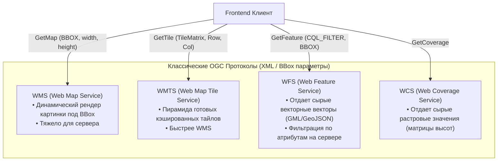

# OGC-стандарты (WMS, WMTS, WFS, WCS)

> [!info] Навигация
> Родительский раздел: [[Web GIS MOC]]

## Что это такое и почему фронтендеру приходится с этим сталкиваться

Если в стартапах и потребительских приложениях (B2C) стандартом де-факто являются легкие векторные тайлы MVT и GeoJSON, то в корпоративном секторе (Enterprise, банки, кадастр, госсектор, логистические монополии, геологоразведка) бал правят стандарты **OGC (Open Geospatial Consortium)**.

Серверная часть таких систем почти всегда построена на **GeoServer**, **ArcGIS Server** или **QGIS Server**. Если вы приходите на проект со словами *"давайте просто отдадим GeoJSON"*, а на бэкенде лежит база кадастра на 200 миллионов полигонов в Oracle Spatial или PostGIS, вам придется интегрироваться со стандартами OGC.



---

## 1. WMS (Web Map Service) — Динамическая картинка на лету

* **Принцип работы:** Клиент не запрашивает тайлы. При каждом сдвиге или изменении размера экрана браузер отправляет один HTTP GET запрос с указанием точного Bounding Box (`BBOX`), ширины (`WIDTH`) и высоты (`HEIGHT`) экрана в пикселях.
* Сервер достает геометрию из базы данных, рендерит изображение (PNG/JPEG) указанного размера и присылает готовый файл клиенту.

```http
GET /geoserver/wms?
  SERVICE=WMS&
  VERSION=1.3.0&
  REQUEST=GetMap&
  LAYERS=cadastre:plots&
  STYLES=&
  CRS=EPSG:3857&
  BBOX=4185000,7510000,4190000,7515000&
  WIDTH=1024&
  HEIGHT=768&
  FORMAT=image/png&
  TRANSPARENT=true
```

### Боль и грабли WMS:
- **Убийственная нагрузка на бэкенд:** Если 100 пользователей одновременно зумят карту, сервер генерирует 100 уникальных тяжелых рендеров. Кэшировать такие запросы на CDN почти невозможно из-за случайных значений в `BBOX`.
- **Задержки интерфейса:** Карта мигает белым при каждом сдвиге, пока генерируется новая картинка.

---

## 2. WMTS (Web Map Tile Service) — Стандартизированные тайлы

WMTS был разработан OGC как ответ на взрывную популярность Slippy Map (XYZ).
* Вместо генерации произвольных картинок сервер нарезает карту на стандартную тайловую пирамиду.
* Запросы предсказуемы и отлично кэшируются на Nginx / Varnish / Cloudflare CDN.
* Отличие от XYZ: наличие манифеста возможностей (`GetCapabilities` в формате XML), который строго описывает доступные уровни матриц (`TileMatrixSet`), проекции и поддерживаемые форматы.

---

## 3. WFS (Web Feature Service) — Векторный доступ

Если WMS отдает "глупую" картинку, по клику на которую нельзя получить данные объекта, то **WFS** отдает сами геометрические объекты вместе с их бизнес-атрибутами.

* Исторический формат выдачи — **GML (Geography Markup Language)** на базе тяжелого XML. В современных серверах (GeoServer) можно передавать параметр `outputFormat=application/json`, получая чистый GeoJSON.
* **Фильтрация на стороне сервера:** WFS поддерживает мощный язык запросов **CQL (Common Query Language)**. Клиент может запросить только те объекты, которые соответствуют условию, экономя мегабайты трафика:

```http
GET /geoserver/wfs?
  SERVICE=WFS&
  VERSION=2.0.0&
  REQUEST=GetFeature&
  TYPENAMES=roads&
  CQL_FILTER=speed_limit > 90 AND surface = 'asphalt'&
  OUTPUTFORMAT=application/json
```

---

## Новая волна: OGC API (Modern Standards)

Классические OGC-протоколы проектировались в эпоху SOAP, XML и RPC-вызовов 2000-х годов. Сейчас OGC активно переписывает все стандарты на современные рельсы RESTful JSON:

- **OGC API - Features** (замена WFS): чистый OpenAPI (Swagger), возврат GeoJSON, стандартные HTTP коды и пагинация.
- **OGC API - Tiles** (замена WMTS): поддержка MVT векторных тайлов и современных проекций.

---

## Какой движок выбрать под OGC?

| Движок | Поддержка OGC WMS / WFS / WMTS |
| :--- | :--- |
| **OpenLayers** | **Идеальная (из коробки).** Лучший инструмент в мире для работы с GeoServer, сложными проекциями, WFS-транзакциями (WFS-T — когда пользователь редактирует геометрию прямо в базу). |
| **Leaflet** | **Хорошая.** WMS и WMTS поддерживаются через плагины (`leaflet.wms`), WFS — через загрузку GeoJSON по `fetch`. |
| **MapLibre GL JS** | **Ограниченная.** Растровый WMS/WMTS можно подключить через обертку растрового источника с шаблоном URL `{bbox-epsg-3857}`, но векторный WFS не является его целевым сценарием. |
