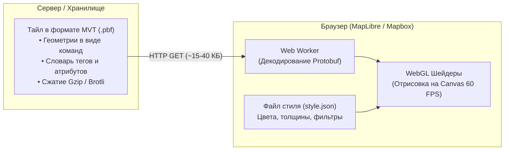

# Векторные тайлы MVT (Mapbox Vector Tiles, Protocol Buffers)

> [!info] Навигация
> Родительский раздел: [[Web GIS MOC]]

## Что это такое и какую боль решает

До появления векторных тайлов веб-картография основывалась на растровых изображениях (PNG/JPG). Сервер рендерил карту на своей стороне и отдавал клиенту готовые картинки.

### Проблемы растрового подхода:
1. **Размытие и потеря четкости:** При зумировании между дискретными уровнями (например, между зумом 12 и 13) растровая картинка растягивалась и мылилась. На экранах Retina 2x/3x требовалось скачивать изображения удвоенного разрешения.
2. **Фиксированный дизайн:** Нельзя изменить цвет одной дороги или скрыть подписи на карте без перерендеринга миллиардов картинок на сервере.
3. **Невозможность вращения:** При повороте карты или наклоне в 3D растровые надписи переворачивались вверх ногами и становились нечитаемыми.

Решение: **Векторные тайлы (MVT)**. Сервер отдает не картинку, а бинарно упакованные сырые координаты линий, дорог и полигонов. Браузер получает эту геометрию и отрисовывает ее на лету с помощью графического чипа (WebGL) со скоростью 60 FPS.



---

## Анатомия формата MVT и Protocol Buffers

Формат MVT стандартизирован компанией Mapbox и основан на бинарном протоколе **Google Protocol Buffers (protobuf)**. Обычно такие файлы имеют расширение `.pbf` или `.mvt`.

### 1. Локальная система координат тайла (Extent)
Внутри MVT нет градусов широты и долготы (`WGS84`) и нет мировых метров (`Web Mercator`).
Вместо этого тайл представляет собой дискретную целочисленную сетку — **Extent** (обычно $4096 \times 4096$ единиц, реже $2048$ или $8192$).
* Координаты всех точек внутри тайла — это целые числа от $0$ до $4096$.
* Если точка лежит на границе или чуть за пределами тайла (буферная зона для бесшовной стыковки полигонов), координаты могут быть слегка отрицательными (например, $-64$) или больше $4096$ (например, $4160$).

### 2. Кодирование геометрии: Командный поток
Геометрия описывается не массивом объектов, а плоским списком 32-битных целых чисел, представляющих команды и относительные смещения (дельта-кодирование со ZigZag-упаковкой):

* **MoveTo(1):** Переместить виртуальное перо в координату `(dx, dy)`.
* **LineTo(2):** Провести линию в координату `(dx, dy)`.
* **ClosePath(7):** Замкнуть текущий полигон.

Каждое смещение `(dx, dy)` считается относительно предыдущей точки. Поскольку соседние вершины дорог или контуров домов отстоят друг от друга всего на несколько единиц сетки, дельты получаются крошечными числами ($1, 2, 0, -3$), которые в Protocol Buffers пакуются в 1 байт вместо 8 байт для `double`.

### 3. Дедупликация строк и тегов (Словари)
Чтобы название улицы *"Ленинский проспект"* не повторялось для каждого из 50 сегментов этой улицы внутри тайла, MVT использует словарную модель:
* В заголовке слоя создаются два плоских массива: `keys` (имена свойств) и `values` (значения свойств).
* Каждая фича содержит только массив целочисленных индексов `tags: [key_idx_0, val_idx_0, key_idx_1, val_idx_1, ...]`.

---

## Почему MVT стал доминирующим стандартом

| Параметр | Растровый тайл (PNG) | Векторный тайл (MVT .pbf) |
| :--- | :--- | :--- |
| **Средний размер** | $50 - 150$ КБ | $15 - 40$ КБ (в 3-5 раз компактнее) |
| **Четкость на Retina** | Мылится или требует `@2x` (+4x вес) | Идеально четкие векторные линии всегда |
| **Смена темы (Dark/Light)** | Скачивать новый комплект растра | Мгновенная смена цвета в WebGL без сети |
| **Поворот и наклон (3D)** | Подписи переворачиваются вверх ногами | Шрифты всегда ориентированы к зрителю |
| **Интерактивность** | Нужен отдельный UTFGrid или запрос к API | Клик по объекту сразу дает доступ к его свойствам |
| **Нагрузка на клиент** | Минимальная (простая отрисовка картинки) | Средняя (декодирование protobuf + WebGL) |

---

## Как инспектировать и отлаживать MVT в браузере

Векторный тайл бинарен, поэтому в Network tab браузера вы увидите набор байтов. Чтобы проверить, какие слои и свойства реально пришли в тайле:

1. **Библиотека `@mapbox/vector-tile`:**
```typescript
import { VectorTile } from '@mapbox/vector-tile';
import Protobuf from 'pbf';

const response = await fetch('https://tiles.example.com/14/9650/5040.pbf');
const buffer = await response.arrayBuffer();

const tile = new VectorTile(new Protobuf(buffer));

// Список слоев внутри тайла (например: 'roads', 'buildings', 'water')
console.log(Object.keys(tile.layers));

const roadsLayer = tile.layers['roads'];
console.log(`Количество объектов в слое: ${roadsLayer.length}`);

// Читаем первую фичу
const feature = roadsLayer.feature(0);
console.log(feature.properties); // { class: "primary", name: "Main Street", lanes: 4 }
console.log(feature.loadGeometry()); // Массив локальных координат [[{x: 1024, y: 512}, ...]]
```

2. **Расширения для Chrome:** *Mapbox Vector Tile Viewer* позволяет прямо в панели разработчика кликнуть на `.pbf` запрос и визуализировать его слои на интерактивной сетке.
