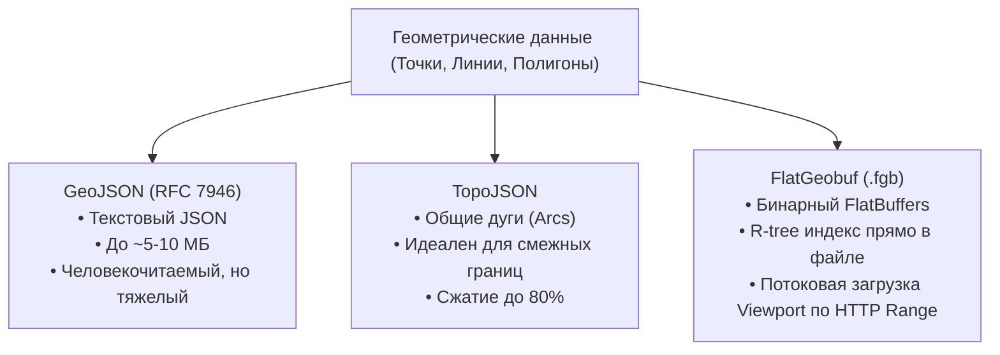
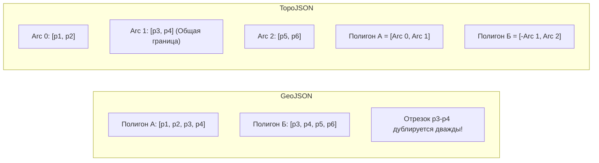

# Векторные форматы (GeoJSON, TopoJSON, FlatGeobuf)

> [!info] Навигация
> Родительский раздел: [[Web GIS MOC]]

## Что это такое и какую боль решает

Когда веб-приложению нужно отобразить не просто фоновую картинку карты, а интерактивные пользовательские данные — полигоны зон доставки, маршруты курьеров, кластеры магазинов или кадастровые участки — встает вопрос сериализации геометрии.

Векторные форматы описывают пространственные объекты математически: как наборы точек, линий и многоугольников с привязанными к ним бизнес-атрибутами (название, ID, статус, цвет).



---

## 1. GeoJSON (RFC 7946) — Универсальный стандарт веба

### Анатомия формата
GeoJSON основан на стандартном JSON. Главная рабочая единица — **Feature** (объект с геометрией и свойствами), объединенная в **FeatureCollection**.

```json
{
  "type": "FeatureCollection",
  "features": [
    {
      "type": "Feature",
      "id": "courier-42",
      "geometry": {
        "type": "Point",
        "coordinates": [37.6173, 55.7558] // [долгота, широта]
      },
      "properties": {
        "name": "Курьер Иван",
        "status": "in_transit",
        "speedKmh": 24.5
      }
    },
    {
      "type": "Feature",
      "geometry": {
        "type": "Polygon",
        "coordinates": [
          [
            [37.60, 55.75],
            [37.62, 55.75],
            [37.62, 55.77],
            [37.60, 55.77],
            [37.60, 55.75] // Первая и последняя точка ОБЯЗАНЫ совпадать (замкнутый контур)
          ]
        ]
      },
      "properties": {
        "zone": "Центральный район",
        "deliveryFee": 150
      }
    }
  ]
}
```

### Скрытые проблемы GeoJSON во фронтенде:
1. **Текстовый оверхед:** Числа с плавающей точкой в виде строк (например, `37.61734891238491`) занимают десятки байт вместо 8 байт бинарного `double`. Файл полигонов районов города легко разрастается до 20–50 МБ.
2. **Блокировка Main Thread:** Метод `JSON.parse()` для файла на 30 МБ замораживает интерфейс браузера на 300–800 мс.
3. **Дублирование границ:** Если две страны или два района граничат друг с другом, линия их общей границы в GeoJSON хранится дважды — по одному разу в каждом полигоне.

---

## 2. TopoJSON — Топологическое сжатие границ

Создан Майком Бостоком (автором D3.js) для устранения избыточности GeoJSON.

### Как это работает:
1. **Топология вместо замкнутых контуров:** Вместо сохранения полных координат каждого полигона TopoJSON нарезает карту на неделимые отрезки — **дуги (Arcs)**.
2. Полигон описывается не координатами, а массивом индексов дуг: `arcs: [[0, 1, -2]]` (отрицательный индекс означает проход по дуге в обратном направлении). Граница между Францией и Испанией хранится в файле ровно **один раз**.
3. **Дельта-квантование (Quantization):** Координаты переводятся из дробных градусов в целые числа с заданным шагом сетки (например, от 0 до 10000), а затем кодируются дифференциально (каждая точка — это смещение `[dx, dy]` относительно предыдущей).



### Где применять:
- Карта мира, регионы, избирательные округа, статистические дашборды (Choropleth maps) в D3.js.
- Библиотека `topojson-client` распаковывает TopoJSON обратно в GeoJSON прямо в браузере за пару миллисекунд.

---

## 3. FlatGeobuf — Революция бинарных векторных данных

**FlatGeobuf (.fgb)** — это современный открытый бинарный формат на базе Google FlatBuffers с поддержкой пространственного индекса (Packed Hilbert R-Tree).

### Архитектурный прорыв FlatGeobuf:
* **Zero-copy десериализация:** В отличие от JSON или Protocol Buffers, FlatBuffers не нужно парсить в объекты JavaScript перед чтением. Данные считываются напрямую из типизированного массива `ArrayBuffer` памяти.
* **HTTP Range Requests + R-Tree:** В заголовке `.fgb` файла расположен пространственный индекс. Клиентская библиотека делает один запрос за заголовком, узнает смещения байтов для объектов, видимых в текущем BBox окна браузера, и докачивает **только эти байты**.
* Файл может весить 2 ГБ и лежать на обычном static-хостинге (S3, Nginx), а браузер скачает ровно 50 КБ данных для своего вьюпорта!

```typescript
import { deserialize } from 'flatgeobuf/lib/mjs/geojson';

// Загрузка только тех фичей, которые попадают в текущий BBox карты:
const response = await fetch('https://cdn.example.com/huge_cadastre.fgb');
const bbox = { minX: 37.5, minY: 55.7, maxX: 37.7, maxY: 55.8 };

// Итератор читает поток по мере поступления нужных чанков:
for await (const feature of deserialize(response.body, bbox)) {
  // Добавляем фичу в источник карты на лету
  map.getSource('my-source').addFeature(feature);
}
```

---

## Сравнительная матрица форматов

| Критерий | GeoJSON | TopoJSON | FlatGeobuf |
| :--- | :--- | :--- | :--- |
| **Тип представления** | Текстовый (JSON) | Текстовый/JSON-объект | Бинарный (FlatBuffers) |
| **Сжатие данных** | Низкое (избыточен) | Очень высокое (до 80%) | Высокое (в 2-3 раза меньше GeoJSON) |
| **Поддержка стриминга** | ❌ Нет (нужно скачать весь JSON) | ❌ Нет | ✅ Да (через HTTP Range Requests) |
| **Встроенный пространственный индекс**| ❌ Нет | ❌ Нет | ✅ Да (Packed Hilbert R-Tree) |
| **Сложность парсинга** | Высокая (`JSON.parse` блокирует тред) | Средняя (декодирование дуг) | Нулевая (Zero-copy доступ к памяти) |
| **Идеальный сценарий** | До 5 000 точек, простое CRUD API | Границы стран/районов, D3.js | Тяжелые полигоны, слои от 10 МБ до 1 ГБ |

> [!tip] Практическое правило
> Для динамических пользовательских точек (100–1000 штук) используйте **GeoJSON** — просто и поддерживается везде. Для тяжелых слоев границ — **TopoJSON**. Для сотен тысяч кадастровых участков, дорог или полигонов без серверного тайл-сервера — используйте **FlatGeobuf**.
