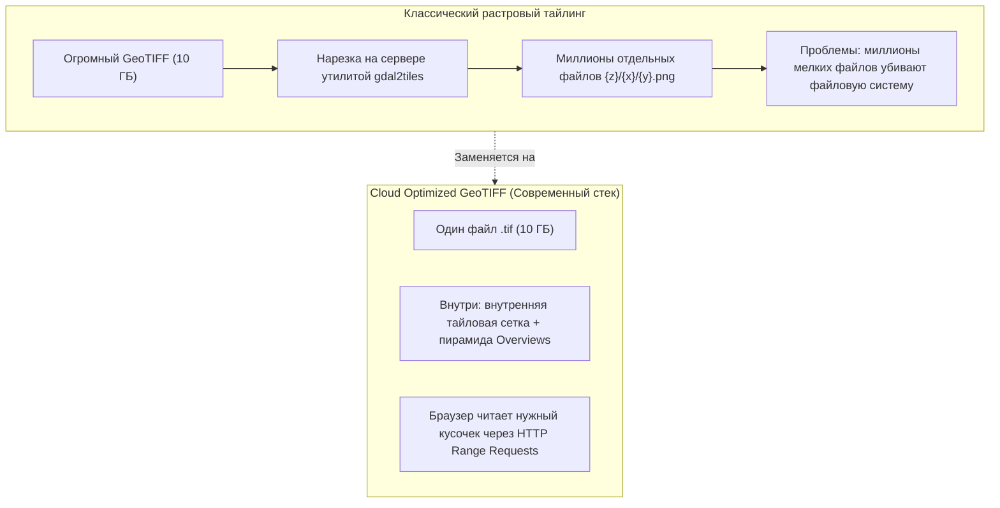
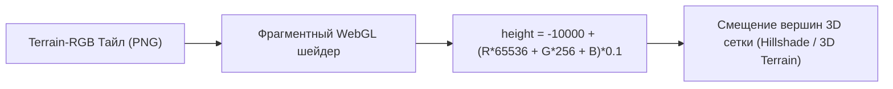

# Растровые тайлы и COG (Cloud Optimized GeoTIFF)

> [!info] Навигация
> Родительский раздел: [[Web GIS MOC]]

## Что это такое и какую боль решает

Хотя векторные тайлы (MVT) доминируют при отображении дорог, домов и границ, существует огромный пласт геоданных, которые принципиально невозможно векторизовать:
1. **Спутниковые и аэрофотоснимки (Ортофотопланы):** Миллиарды реальных пикселей поверхности Земли.
2. **Метеорологические радары:** Облачность, осадки, температура, фронты ветра.
3. **Цифровые модели рельефа (DEM / Terrain):** Сетки высот над уровнем моря.
4. **Сельскохозяйственная и тепловизионная аналитика:** Мультиспектральные снимки NDVI (индекс здоровья растительности).

Для таких данных стандартом являются **растровые тайлы (PNG, WebP)** и их современная облачная эволюция — **COG (Cloud Optimized GeoTIFF)**.



---

## 1. Cloud Optimized GeoTIFF (COG) — Облачный стандарт

Обычный файл GeoTIFF требует загрузки целиком в память, чтобы прочитать его метаданные и пиксели. Файл весом 5 ГБ в браузере открыть невозможно.

**COG** решает эту проблему организацией структуры внутри самого TIFF-файла:
* **Внутреннее тайлирование (Internal Tiling):** Пиксели хранятся не сплошными горизонтальными строками (Stripes), а квадратными блоками (например, $256 \times 256$ или $512 \times 512$ пикселей).
* **Внутренние слои уменьшенного разрешения (Overviews):** Внутри файла уже зашиты уменьшенные в 2, 4, 8, 16 раз копии изображения (готовые уровни зума).
* **Заголовок в начале файла:** Метаданные и карта смещений всех блоков лежат в первых нескольких килобайтах файла.

### Как фронтенд работает с COG:
Благодаря HTTP-заголовкам `Range: bytes=...`, библиотека **`geotiff.js`** скачивает первые пару килобайт файла, парсит метаданные, а затем при панорамировании карты запрашивает только те байты, которые соответствуют пикселям текущего экрана:

```typescript
import { fromUrl } from 'geotiff';

// Чтение напрямую из бакета S3 без специального backend-сервера тайлов!
const tiff = await fromUrl('https://storage.googleapis.com/my-bucket/satellite_imagery.tif');
const image = await tiff.getImage(); // Считывает заголовок

// Запрашиваем окно пикселей для нужного BBox
const [minX, minY, maxX, maxY] = [37.5, 55.7, 37.6, 55.8];
const rasters = await image.readRasters({
  bbox: [minX, minY, maxX, maxY],
  width: 512,
  height: 512
});

// rasters[0] — типизированный Float32Array или Uint8Array с сырыми значениями пикселей
```

---

## 2. Terrain-RGB — Магия передачи высот в растре

Как передать трехмерный рельеф гор в браузер без тяжелых 3D-файлов? Через гениальный хак: **кодирование высоты в цветовые каналы обычного растрового PNG-тайла (Mapbox Terrain-RGB)**.

Каждый пиксель тайла содержит цвет `[R, G, B]`. Формула декодирования высоты $H$ в метрах:
$$H = -10000 + (R \times 256 \times 256 + G \times 256 + B) \times 0.1$$

* Красный канал ($R$) задает грубый шаг ($\approx 6553$ м).
* Зеленый канал ($G$) задает средний шаг ($\approx 25.6$ м).
* Синий канал ($B$) задает точность до $10$ сантиметров ($0.1$ м).
* Смещение $-10000$ позволяет кодировать глубины океанических впадин до $-10$ км.



---

## Когда использовать растровые тайлы в 2026 году

1. **Спутниковые подложки (Satellite Basemap):** Никаких альтернатив растру здесь нет.
2. **Экстремально слабые устройства (Smart TV, устаревшие мобилки, POS-терминалы):** Если на устройстве нет полноценного WebGL-ускорения, растровый Leaflet на базе `` тегов будет работать быстрее и стабильнее, чем MapLibre с тысячами вызовов отрисовки.
3. **Аналитические шейдеры на клиенте:** Когда нужно в реальном времени пересчитать цветовую палитру снимка (например, перекрасить карту температур или выделить зоны затопления по значениям пикселей).
