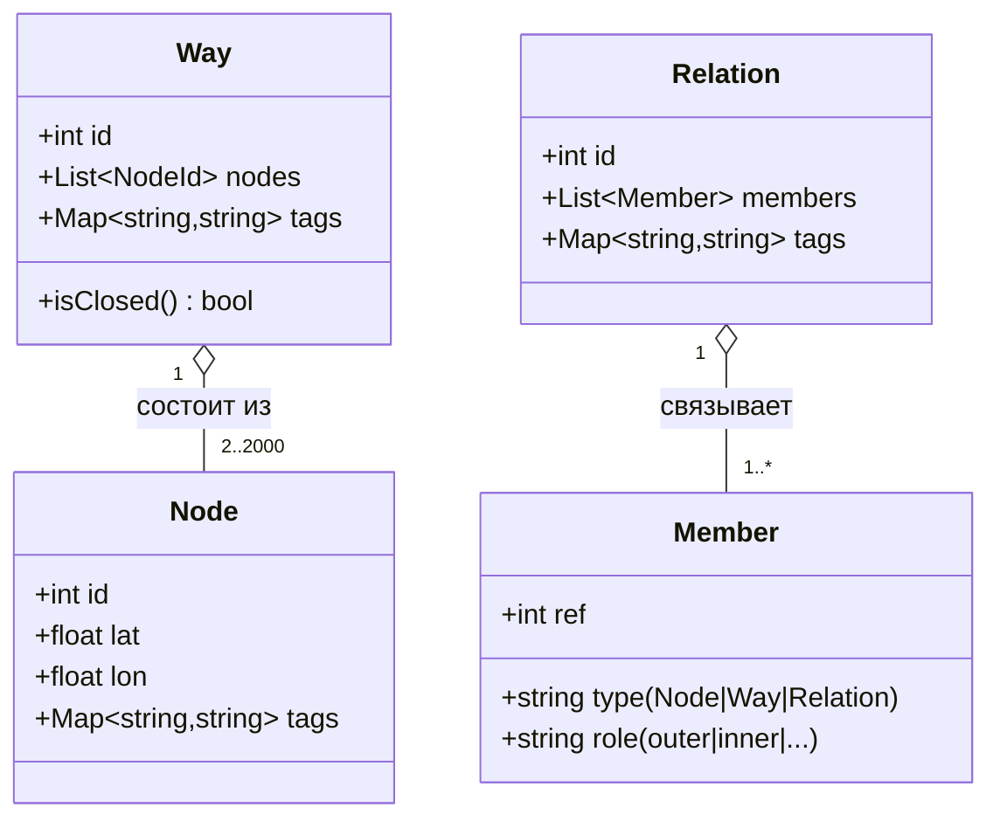

# OpenStreetMap (OSM) — модель данных (Nodes, Ways, Relations, Tags)

> [!info] Навигация
> Родительский раздел: [[Web GIS MOC]]

## Что это такое и какую боль решает

**OpenStreetMap (OSM)** — это Википедия в мире географических данных. Почти все независимые картографические сервисы (Mapbox, MapTiler, Stadia, Grab, Apple Maps частично) используют OSM как первичный сырой источник данных.

Если фронтенд-разработчик не понимает, как устроена модель OSM, он не сможет:
1. Настроить фильтрацию слоев карты (почему одни дороги показываются на зуме 8, а другие только на 14).
2. Выгрузить нужные геометрии через Overpass API (например, *"все аптеки в радиусе 1 км"*).
3. Понять, почему у здания в OSM нет готовой высоты в метрах, но есть тег `building:levels="5"`.



---

## Четыре столпа модели данных OSM

Вся планета в OSM описывается всего четырьмя примитивами:

### 1. Node (Точка / Узел)
Базовый атом геометрии. Содержит точные географические координаты `lat` и `lon`.
* Может быть самостоятельным объектом интереса (**POI** — Point of Interest): светофор, скамейка, магазин, дерево, остановка.
* Либо может быть составной частью ломаной линии (`Way`).

### 2. Way (Линия или Замкнутый контур)
Упорядоченный список ссылок на узлы (от 2 до 2000 точек):
* **Незамкнутая линия (Open Way):** Первая и последняя точки не совпадают. Описывает линейные объекты: дороги (`highway=*`), реки (`waterway=river`), железнодорожные пути (`railway=rail`).
* **Замкнутый контур (Closed Way / Area):** Первая и последняя точки ссылаются на один и тот же `Node`. Описывает площади: контуры домов (`building=yes`), озера (`natural=water`), парки (`leisure=park`).

### 3. Relation (Отношение)
Сложная логическая структура, связывающая произвольное количество точек, линий и других отношений с указанием их роли (`role`).
* **Мультиполигоны (Multipolygon):** Озеро с островом посередине, где на острове есть внутреннее озеро. Внешний контур имеет роль `outer`, внутренние острова — роль `inner`.
* **Маршруты (Route):** Автобусный маршрут №42 объединяет десятки отдельных отрезков улиц в единую сущность.
* **Административные границы:** Граница страны или области, состоящая из тысяч отдельных линий рек, хребтов и заборов.

### 4. Tags (Теги)
Вся семантика в OSM хранится в свободных парах ключ-значение в формате UTF-8 строк (`key=value`). В OSM нет жесткой схемы БД — любой участник может добавить любой тег.
* Классификация дорог: `highway=motorway` (магистраль), `highway=primary` (шоссе), `highway=residential` (жилая улица), `highway=footway` (пешеходная дорожка).
* Этажность и высота: `building=apartments`, `building:levels=16`, `height=52`.
* Адресация (Karlsruhe Schema): `addr:country=RU`, `addr:city=Москва`, `addr:street=Тверская`, `addr:housenumber=7`.

---

## Overpass API: Как фронтендеру забрать данные прямо в браузер

Если вам нужны сырые объекты OSM в формате GeoJSON без поднятия собственного бэкенда, используется **Overpass API** — специализированная поисковая БД только для чтения.

Пример запроса на языке QL для поиска всех кофеен с Wi-Fi вокруг конкретной точки:

```typescript
// Поиск кофеен в радиусе 1000м от центра Москвы
const overpassQuery = `
  [out:json][timeout:25];
  (
    node["amenity"="cafe"]["internet_access"="wlan"](around:1000, 55.7558, 37.6173);
  );
  out body;
`;

const url = `https://overpass-api.de/api/interpreter?data=${encodeURIComponent(overpassQuery)}`;
const response = await fetch(url);
const data = await response.json();

// Библиотека osmtogeojson преобразует сырой ответ OSM в стандартный RFC GeoJSON
import osmtogeojson from 'osmtogeojson';
const geojson = osmtogeojson(data);

map.addSource('cafes', {
  type: 'geojson',
  data: geojson
});
```

---

## Форматы дампов OSM

* **`planet.osm` (XML):** Сырой XML планеты. Весит более 1.5 ТБ в несжатом виде. На практике не используется.
* **`planet.osm.pbf`:** Бинарно сжатый Protocol Buffers дамп всей Земли (~70 ГБ). Еженедельно обновляется.
* **Региональные вырезки (Geofabrik):** Сервис `download.geofabrik.de` бесплатно отдает ежедневные срезы `.osm.pbf` по отдельным континентам, странам и городам (например, срез Москвы весит всего ~150 МБ).
