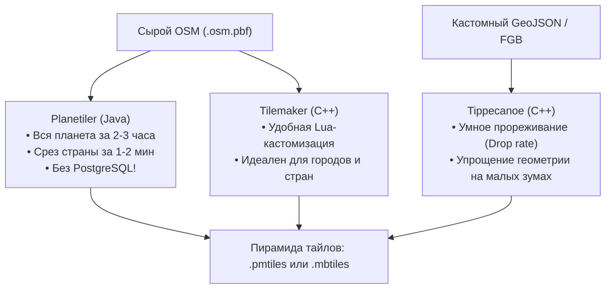

# Генераторы тайлов (Planetiler, Tilemaker, Tippecanoe)

> [!info] Навигация
> Родительский раздел: [[Web GIS MOC]]

## Что это такое и какую боль решает

У вас есть сырой дамп OpenStreetMap (`.osm.pbf`) или большой GeoJSON с сотнями тысяч объектов компании. Как превратить их в тайловую пирамиду векторных тайлов MVT, готовую к раздаче в веб?

Исторически (в эпоху Mapnik и OpenMapTiles v1) этот процесс был мучительным: требовалось поднять связку PostgreSQL + PostGIS, импортировать данные утилитой `osm2pgsql` (это занимало дни), настроить сотни SQL-функций и запустить тяжелый Python-генератор. Для сборки планеты требовался сервер с 256 ГБ RAM и несколько суток вычислений.

Современные генераторы тайлов изменили правила игры: теперь тайлы нарезаются в десятки раз быстрее, часто вообще **без использования баз данных**.



---

## 1. Planetiler — Абсолютный рекордсмен скорости

**Planetiler** (написан Майклом Шривером в 2021 году на Java) произвел революцию в веб-картографии.
* **Как он работает:** Вместо реляционной СУБД он использует собственный низкоуровневый дисковый движок на памяти с отображением файлов в память (memory-mapped files) и агрессивную многопоточность. Он читает `.osm.pbf` в один проход, формирует узлы, строит геометрии и нарезает готовую пирамиду тайлов.
* **Скорость:** Вся планета собирается за **2–3 часа** на 32-ядерном сервере. Срез отдельной страны (например, Германия или Турция) собирается за **3–5 минут** прямо на рабочем ноутбуке!
* **Выходной формат:** На выходе получается единый файл `.pmtiles` или `.mbtiles` со схемой слоев **OpenMapTiles** (стандарт для OSM Liberty и большинства открытых стилей).

### Запуск одной командой через Docker:
```bash
# Генерация тайлов для среза региона (например, monaco или cfo-fed-district)
docker run -e JAVA_TOOL_OPTIONS="-Xmx8g" \
  -v "$(pwd)/data":/data \
  ghcr.io/onthegomap/planetiler:latest \
  --osm-path=/data/region-latest.osm.pbf \
  --output=/data/output.pmtiles
```

---

## 2. Tilemaker — Гибкость и скриптинг на Lua

Если Planetiler оптимизирован под максимальную скорость и стандартную схему OpenMapTiles, то **Tilemaker** — инструмент для ювелирной ручной настройки.
* Написан на C++, не требует установки сторонних сервисов (один бинарник).
* Вся логика преобразования OSM-тегов в слои векторных тайлов пишется на простом языке **Lua**.
* *Сценарий использования:* Вам не нужны все дороги и леса мира — вам нужно извлечь только границы кадастра, велодорожки или высоковольтные линии электропередач с уникальными атрибутами.

```lua
-- Фрагмент process.lua в Tilemaker:
function node_function(node)
  local amenity = node:Find("amenity")
  if amenity == "cafe" then
    node:Layer("cafes", false)
    node:Attribute("name", node:Find("name"))
    node:MinZoom(13) -- показывать только с 13 зума
  end
end
```

---

## 3. Tippecanoe — Король для кастомных GeoJSON данных

Разработан Эриком Фишером в компании Mapbox специально для решения проблемы: *"У меня есть 5 миллионов точек/полигонов в GeoJSON, и браузер зависает"*.

**Tippecanoe решает фундаментальную картографическую задачу — генерализацию:**
* Если на зуме 5 показать 100 000 точек, они сольются в черное пятно и взорвут вес тайла. Tippecanoe рассчитывает плотность и автоматически оставляет на низких зумах только репрезентативную выборку точек (`--drop-densest-as-needed`).
* Упрощает геометрию линий и полигонов (алгоритм Дугласа-Пекера), удаляя мелкие изгибы, неразличимые в масштабе текущего зума.
* Гарантирует, что ни один тайл не превысит заданный лимит веса (например, максимум 500 КБ на тайл).

```bash
# Превращение тяжелого GeoJSON в векторный архив PMTiles с зумами от 0 до 14:
tippecanoe -o delivery_zones.pmtiles \
  -z 14 \
  -Z 4 \
  --drop-densest-as-needed \
  --extend-zooms-if-still-dropping \
  delivery_zones.geojson
```

---

## Сравнение инструментов

| Параметр | Planetiler | Tilemaker | Tippecanoe |
| :--- | :--- | :--- | :--- |
| **Основной вход** | OSM дамп (`.osm.pbf`) | OSM дамп (`.osm.pbf`) | GeoJSON / CSV / FGB |
| **Главный плюс** | Колоссальная скорость | Легкий скриптинг на Lua | Идеальное прореживание и сжатие |
| **Потребление RAM** | Среднее (настраивается `-Xmx`) | Высокое для больших стран | Низкое (потоковая обработка) |
| **Цель** | Базовые подложки карты мира | Специализированные OSM-слои | Ваши собственные бизнес-данные |
