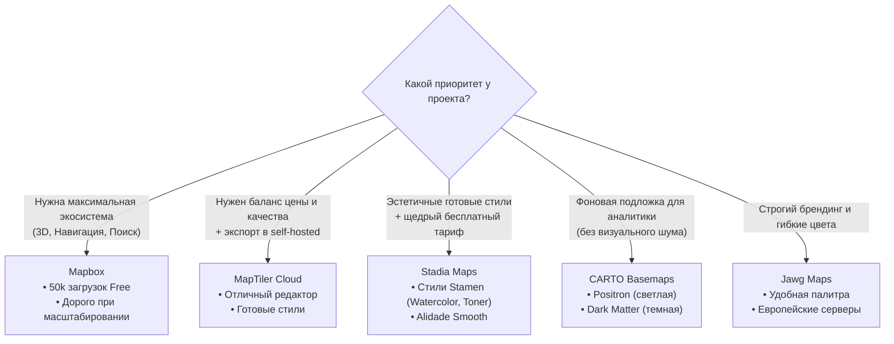

# Коммерческие провайдеры (Mapbox, MapTiler, Stadia, Jawg, Carto)

> [!info] Навигация
> Родительский раздел: [[Web GIS MOC]]

## Что это такое и какую боль решает

Не каждой команде нужно нарезать планету через Planetiler и администрировать бакеты Cloudflare R2. Если до запуска продукта 2 недели, а в команде 1 фронтендер, выбор коммерческого провайдера (SaaS) — самое рациональное инженерное решение (Time-to-Market).

Провайдер берет на себя:
* Ежедневные обновления геометрии дорог и новых домов из OSM.
* Хостинг тайлов, шрифтов (glyphs), спрайтов иконок на глобальном CDN.
* Встроенный геокодинг (поиск адресов) и построение маршрутов (Routing).
* Визуальные браузерные редакторы стилей без необходимости править JSON руками.



---

## 1. Mapbox — Титан индустрии

Mapbox сформировал современные стандарты веба (MVT, Mapbox GL JS, Style Spec).

### Сильные стороны:
* **Инфраструктура мирового уровня:** Минимальные задержки, невероятно плавный 3D-рельеф, спутниковые снимки высокого разрешения.
* **Mapbox Studio:** Самый мощный визуальный редактор картографических стилей в мире с поддержкой компонентов, палитр и сложной логики зумов.
* **Сопутствующие API:** Поиск адресов (Search Box), матрица расстояний, изохроны, оптимизация маршрутов курьеров.

### Подводные камни:
* **Лицензия:** Начиная с версии Mapbox GL JS v2 (декабрь 2020 г.), библиотека закрыла исходный код. Каждая инициализация карты отправляет телеметрию и биллится вендором. Вы не можете использовать SDK Mapbox v2/v3 со своими тайлами без оплаты.
* **Ценовой обрыв:** Бесплатный тариф дает щедрые 50 000 загрузок карты в месяц. Однако при превышении порога стоимость за каждые следующие 1000 загрузок составляет $\$5$, что на объемах в сотни тысяч посещений приводит к счетам в тысячи долларов.

---

## 2. MapTiler Cloud — Дружелюбная альтернатива для MapLibre

Основан разработчиками из Чехии и Швейцарии, является одним из ключевых спонсоров свободного форка **MapLibre GL JS**.

### Преимущества:
* **Совместимость на 100% с Open Source:** Все стили и тайлы работают с открытой библиотекой MapLibre GL JS без трекинга и лицензионных ограничений.
* **Портативность:** Вы можете разрабатывать стиль в MapTiler Cloud, а затем в любой момент экспортировать его и купить дамп `.mbtiles` для развертывания на собственном сервере.

---

## 3. Stadia Maps — Щедрый Free Tier и легендарные стили Stamen

После того как дизайн-студия Stamen Design перестала поддерживать свои культовые стили, компания Stadia Maps взяла на себя их хостинг и перевела в вектор.

* **Легендарные стили:**
  * **Watercolor (Акварель):** Уникальная художественная карта, выглядящая как рисунок красками.
  * **Toner:** Предельно контрастная черно-белая карта, идеальная для монохромных принтов и журнальной графики.
  * **Alidade Smooth:** Прекрасный спокойный стиль для современных SaaS-интерфейсов.
* **Ценовая политика:** Очень мягкая сетка тарифов для стартапов и прозрачный бесплатный лимит.

---

## 4. CARTO Basemaps — Золотой стандарт визуализации данных

CARTO специализируется на пространственной аналитике и гео-дашбордах. Их карты созданы с одной целью: **служить идеальным фоном, не перебивающим данные пользователя**.

### Главные темы:
* **Positron:** Ультра-минималистичная светло-серая карта. Линии дорог тонкие, подписи аккуратные, водоемы приглушенные. Любые цветные маркеры поверх нее читаются мгновенно.
* **Dark Matter:** Темная тема с глубоким серым и угольным оттенком. Идеальна для "неоновых" тепловых карт, светящихся полигонов и ночных интерфейсов.
* **Voyager:** Сбалансированный цветной стиль для туристических и логистических сервисов.

```typescript
// Подключение бесплатного растрового стиля Positron в Leaflet без API-ключа:
L.tileLayer('https://{s}.basemaps.cartocdn.com/light_all/{z}/{x}/{y}{r}.png', {
  attribution: '&copy; <a href="https://carto.com/">CARTO</a>',
  subdomains: 'abcd',
  maxZoom: 20
}).addTo(map);
```

---

## Сравнительная таблица провайдеров

| Провайдер | Бесплатный лимит (Free Tier) | Поддержка MapLibre | Ключевая фишка |
| :--- | :--- | :--- | :--- |
| **Mapbox** | 50 000 Map Loads / мес | ❌ (Только Mapbox SDK v2/v3) | Лучший 3D, спутник и Studio |
| **MapTiler** | 100 000 Tile Requests / мес | ✅ Идеальная (MVT/Raster) | Легкий переезд на self-hosted |
| **Stadia Maps**| 200 000 Credits / мес | ✅ Идеальная | Стили Stamen, мягкие цены |
| **Jawg Maps** | 50 000 Requests / мес | ✅ Идеальная | Кастомизация брендовых цветов |
| **CARTO** | Бесплатно для Open Source | ✅ Через прямое подключение | Эталонный минимализм (Positron) |
