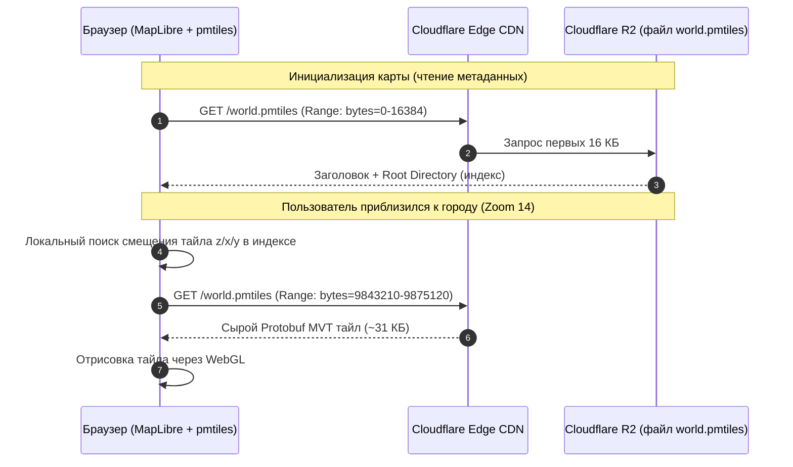

# Современный Serverless стек (PMTiles + HTTP Range Requests + Cloudflare R2)

> [!info] Навигация
> Родительский раздел: [[Web GIS MOC]]

## Что это такое и какую боль решает

Традиционный хостинг тайлов всегда упирался в две проблемы:
1. **Администрирование серверов:** Нужно арендовать VPS, настраивать Nginx, базы данных PostGIS или специальные демоны (TileServer GL), следить за памятью и падениями процессов.
2. **Счета за трафик (Egress):** В облаках вроде AWS S3 каждый гигабайт исходящего трафика стоит $\approx \$0.09$. Если карта активна, миллионы тайлов легко генерируют сотни гигабайт трафика, превращаясь в ежемесячные счета на сотни долларов.

Связка **PMTiles + Cloudflare R2** устраняет обе проблемы:
* **Ноль серверов:** Все тайлы мира запакованы в **один файл** `.pmtiles`, лежащий в обычном объектном хранилище.
* **Бесплатный трафик:** Cloudflare R2 не берет денег за исходящий трафик (Zero Egress Fees). Вы платите только за хранение файла ($0.015 / GB в месяц) и за количество простых запросов. Срез страны или континента обходится буквально в несколько центов или долларов в месяц даже при высокой нагрузке!



---

## Как устроен формат PMTiles (v3)

Автор формата — Брэндон Лю (проект **Protomaps**). Формат стандартизирован и решает проблему размещения миллиардов тайлов в одном файле без файловой фрагментации:

1. **Header (Заголовок, 127 байт):** Хранит тип тайлов (MVT, PNG, WEBP), диапазон зумов (`minZoom`, `maxZoom`), Bounding Box и смещения корневой директории.
2. **Root Directory (Корневой каталог):** Содержит диапазон адресов тайлов (закодированных по кривой Гильберта) и их точные байтовые смещения (`offset` и `length`) внутри файла.
3. **Leaf Directories (Листовые каталоги):** Для высоких зумов (14–16), где количество тайлов огромно, индексы выносятся в компактные листовые блоки. Чтобы найти тайл, браузер делает максимум 1–2 микро-запроса по 2-4 КБ.
4. **Дедупликация идентичных тайлов:** Все пустые океанские тайлы (синие квадраты) физически записываются в файл ровно один раз. Все ссылки на них в каталоге просто указывают на один и тот же байтовый диапазон.

---

## Практическая реализация: от файла до экрана

### Шаг 1: Загрузка файла в Cloudflare R2
Сгенерированный файл (например, `monaco.pmtiles` от Planetiler) загружается в бакет Cloudflare R2 через веб-интерфейс или CLI (`rclone` / `aws s3 cp`).
На бакете включается публичный доступ или привязывается кастомный домен (например, `tiles.mycompany.com`).

> [!important] Обязательная настройка CORS на R2
> Браузер не сможет выполнять Range-запросы без правильных CORS-заголовков. В настройках бакета R2 необходимо указать:
> ```json
> [
>   {
>     "AllowedOrigins": ["*"],
>     "AllowedMethods": ["GET", "HEAD"],
>     "AllowedHeaders": ["Range"],
>     "ExposeHeaders": ["Content-Range", "Accept-Ranges", "Content-Length"]
>   }
> ]
> ```

---

### Шаг 2: Подключение на фронтенде в MapLibre GL JS

Библиотека `pmtiles` регистрирует кастомный протокол в MapLibre, благодаря чему движок прозрачно запрашивает тайлы по схеме `pmtiles://`:

```typescript
import maplibregl from 'maplibre-gl';
import * as pmtiles from 'pmtiles';

// 1. Создаем протокол и регистрируем его в MapLibre
const protocol = new pmtiles.Protocol();
maplibregl.addProtocol('pmtiles', protocol.tile);

// 2. Указываем URL к нашему файлу в R2
const PMTILES_URL = 'https://tiles.mycompany.com/planet.pmtiles';

// 3. Создаем инстанс PMTiles для предзагрузки метаданных
const p = new pmtiles.PMTiles(PMTILES_URL);
protocol.add(p);

// 4. Инициализируем карту
const map = new maplibregl.Map({
  container: 'map',
  style: {
    version: 8,
    glyphs: 'https://demotiles.maplibre.org/font/{fontstack}/{range}.pbf',
    sources: {
      'openmaptiles': {
        type: 'vector',
        url: `pmtiles://${PMTILES_URL}` // Магический протокол!
      }
    },
    layers: [
      {
        id: 'background',
        type: 'background',
        paint: { 'background-color': '#f8f9fa' }
      },
      {
        id: 'water',
        type: 'fill',
        source: 'openmaptiles',
        'source-layer': 'water',
        paint: { 'fill-color': '#cad2d3' }
      },
      {
        id: 'roads',
        type: 'line',
        source: 'openmaptiles',
        'source-layer': 'transportation',
        paint: { 'line-color': '#ffffff', 'line-width': 2 }
      }
    ]
  },
  center: [37.6173, 55.7558],
  zoom: 12
});
```

---

## Экономический расчет: PMTiles + R2 против Mapbox

Представим проект со средней активностью: **500 000 просмотров карты в месяц** (примерно 7.5 миллионов запросов тайлов).

| Статья расходов | Mapbox | MapTiler Cloud | PMTiles + Cloudflare R2 |
| :--- | :--- | :--- | :--- |
| **Стоимость тарифа** | Free tier (50k) далее $\approx \$250-\$400$ | От $\approx \$100-\$250$ | **$0** (нет подписки) |
| **Исходящий трафик** | Включен в тариф | Включен в тариф | **$0** (Free Egress в R2) |
| **Хранение файла (срез ~15 ГБ)**| Включено | Включено | $\approx \$0.22$ / месяц |
| **Class B запросы (чтение Range)**| — | — | $\approx \$2.70$ (по $\$0.36$ за 1 млн запросов) |
| **ИТОГО в месяц:** | **$\approx \$300+$** | **$\approx \$150+$** | **$\approx \$3.00$** |

> [!tip] Архитектурный вывод
> PMTiles + Cloudflare R2 — это бескомпромиссный выбор для стартапов, малого и среднего бизнеса. Вы получаете корпоративную надежность с CDN-кэшированием по всему миру за стоимость чашки кофе.
