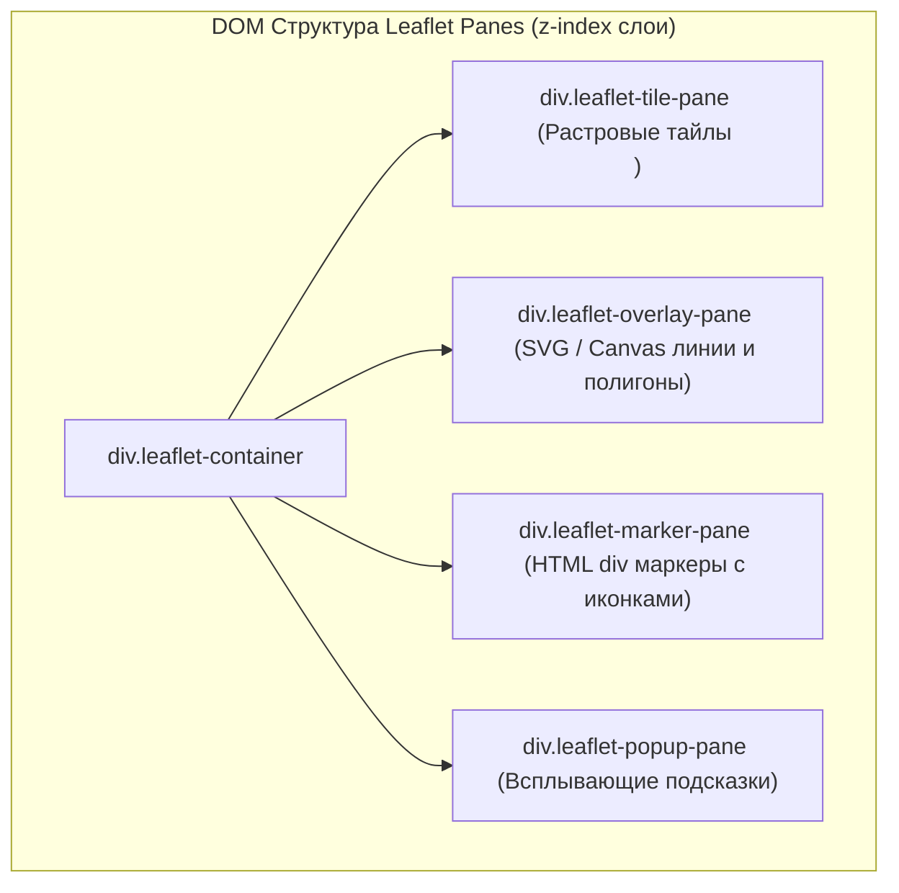

# Leaflet — когда классический DOM и Canvas все еще лучший выбор

> [!info] Навигация
> Родительский раздел: [[Web GIS MOC]]

## Что это такое и почему он жив в 2026 году

Созданный Владимиром Агафонкиным в 2011 году, **Leaflet** остается одной из самых любимых и часто используемых библиотек веб-картографии в мире.

Когда индустрия перешла на тяжелые WebGL-шейдеры и векторные тайлы, многие предрекали Leaflet забвение. Однако в реальных продуктовых задачах простота, надежность и мизерный вес библиотеки ($~42$ КБ против $~250$ КБ у MapLibre) часто перевешивают технологические навороты.



---

## Архитектура: Panes и CSS-трансформации

В отличие от MapLibre, где все пиксели рисуются в единый холст Canvas, Leaflet строит карту как **слоеный пирог из стандартных HTML `<div>` контейнеров (Panes)**:

* **`tilePane` (z-index: 200):** Содержит сетку обычных картинок ``. При панорамировании карты Leaflet просто сдвигает родительский контейнер с помощью CSS `transform: translate3d(x, y, 0)`, задействуя аппаратное ускорение браузера.
* **`overlayPane` (z-index: 400):** Здесь размещаются SVG-элементы (ломаные линии дорог, круги, полигоны).
* **`markerPane` (z-index: 600):** Слой для кастомных HTML-маркеров.
* **`popupPane` (z-index: 700):** Верхний слой для модальных карточек и бабблов.

---

## Когда Leaflet — лучший выбор (Sweet Spots)

### 1. Сложные интерактивные HTML-маркеры (Микро-UI)
В WebGL (MapLibre) отрисовать полноценный HTML-элемент внутри карты сложно (приходится синхронизировать абсолютные координаты HTML-оверлея поверх Canvas на каждый кадр).
В Leaflet каждый маркер — это **полноценный DOM-элемент**:
- Внутрь маркера можно смонтировать полноценный React/Vue-компонент.
- Легко добавить сложные CSS-анимации (пульсирующие кольца, скелетоны, градиенты, Tailwind-классы).
- Идеально для приложений вроде **Airbnb**, где маркер — это интерактивная плашка с ценой, hover-состоянием и превью фотографий квартиры.

### 2. Экстремальный бюджет на размер бандла (PageSpeed & Core Web Vitals)
Если вам нужно встроить карту в мобильный лендинг, форму чекаута или AMP-страницу, добавление 300 КБ MapLibre уронит метрики LCP и TBT. Leaflet подключается мгновенно, весит 42 КБ и начинает отображать карту еще до того, как тяжелые фреймворки завершат гидратацию.

### 3. Планы помещений и поэтажные схемы (Indoor Maps / Non-geographical)
Если у вас есть план торгового центра, завода или игровой карты в виде простой картинки PNG/SVG, в Leaflet это реализуется за 5 строк кода через систему координат `L.CRS.Simple`:

```typescript
// Отображение плана этажа без реальных географических координат
const map = L.map('indoor-map', {
  crs: L.CRS.Simple,
  minZoom: -2
});

const bounds: L.LatLngBoundsLiteral = [[0, 0], [1000, 1000]];
L.imageOverlay('/assets/floor-1.png', bounds).addTo(map);
map.fitBounds(bounds);
```

---

## Где Leaflet ломается: Границы применимости

1. **Более 1500–2000 DOM-маркеров:** Создание тысяч узлов `<div>` убивает процесс рендеринга браузера.
   * *Решение в Leaflet:* Переключить рендеринг векторных слоев на Canvas (`L.canvas()`) или использовать плагин `Leaflet.markercluster`.
2. **Векторные тайлы MVT:** Для поддержки MVT в Leaflet требуются тяжелые костыли (сторонние плагины декодирования Protobuf), что нивелирует весь выигрыш в размере бандла.
3. **Плавный непрерывный зум:** У Leaflet зум дискретный (целочисленный). При масштабировании жестом на тачпаде картинка кратковременно растягивается и "прыгает" на следующий уровень.
4. **Вращение карты и 3D-наклон:** Не поддерживаются архитектурно. Карта всегда ориентирована на север.
