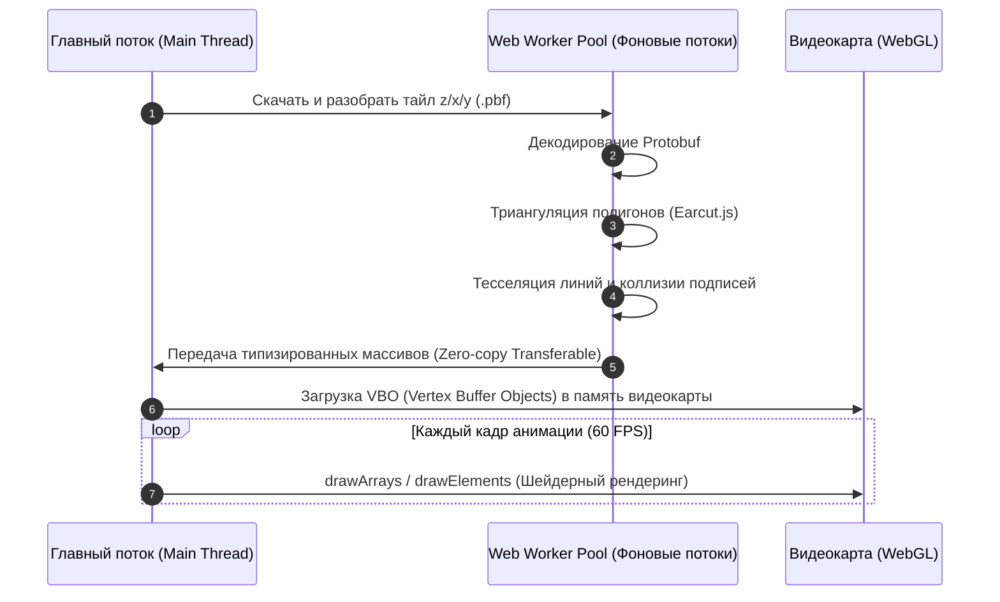
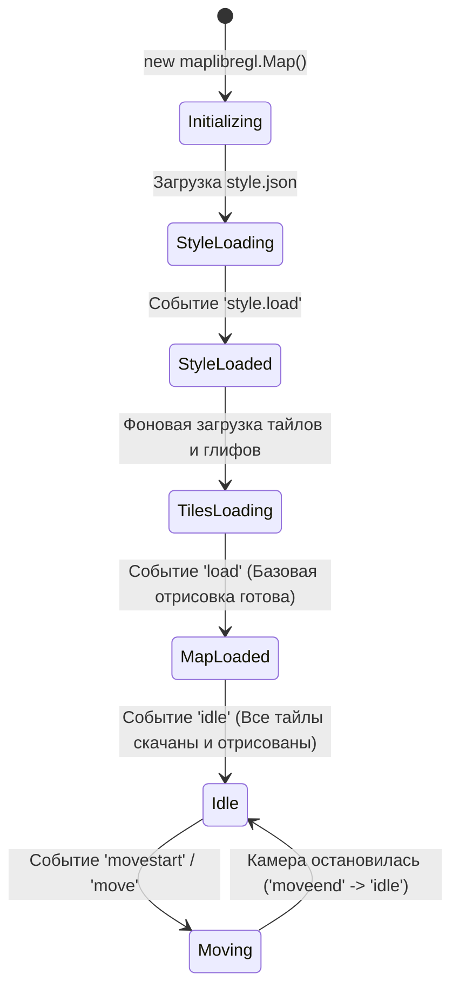

# MapLibre GL JS — архитектура, WebGL-пайплайн и жизненный цикл карты

> [!info] Навигация
> Родительский раздел: [[Web GIS MOC]]

## Что это такое и какую боль решает

**MapLibre GL JS** — высокопроизводительный движок рендеринга векторных карт в веб-браузере. В отличие от библиотек предыдущего поколения (где каждый маркер или тайл был DOM-элементом), MapLibre рисует все элементы карты внутри **одного единственного элемента `<canvas>`** с помощью графического конвейера **WebGL**.

Понимание внутренней архитектуры движка необходимо, чтобы не блокировать интерфейс тяжелыми геометриями, правильно отслеживать моменты загрузки стилей и слоев и избегать падений WebGL-контекста на мобильных устройствах.



---

## Архитектура: Разделение потоков (Main Thread vs Workers)

Главная причина, почему MapLibre работает плавно даже при загрузке тяжелых данных — **вынос математики в Web Workers**:

1. **Главный поток (Main Thread):**
   - Обрабатывает пользовательские жесты (drag, pinch, scroll).
   - Вычисляет матрицу трансформации камеры (положение, наклон pitch, поворот bearing, зум).
   - Принимает вызовы API (`addLayer`, `setFilter`, `flyTo`).
   - Отправляет команды отрисовки в WebGL context.
2. **Пул Web Workers (Worker Pool):**
   - Занимается грязной вычислительной работой:
     - Декодирует бинарный protobuf MVT-тайлов.
     - Выполняет **триангуляцию** полигонов (разбиение сложных контуров домов и озер на треугольники с помощью алгоритма `earcut`).
     - Генерирует вершины обводок линий (тесселяция).
     - Рассчитывает коллизии текста и иконок (дерево R-Tree), чтобы названия улиц не накладывались друг на друга при зуме.
   - Готовые массивы вершин (`Float32Array`) передаются в главный поток через механизм **Transferable Objects** (без копирования памяти, со сменой владельца указателя за 0 мс).

---

## Жизненный цикл карты (Lifecycle & Events)

Фронтенд-разработчики часто совершают фатальную ошибку: пытаются добавить слой данных сразу после вызова `new maplibregl.Map()`. Это приводит к исключению `Error: Style is not done loading`.



### Критически важные события:

| Событие | Когда срабатывает | Что можно делать |
| :--- | :--- | :--- |
| **`style.load`** | Загрузился и распарсился JSON-файл стиля | **Единственное правильное место** для вызова `map.addSource()` и `map.addLayer()` при инициализации. |
| **`load`** | Стиль загружен, и первая порция тайлов уже выведена на экран | Можно скрывать стартовый спиннер загрузки приложения. |
| **`render`** | Отрисован один кадр WebGL | Срабатывает до 60-120 раз в секунду. Ни в коем случае не делать тяжелых вычислений! |
| **`idle`** | Карта закончила анимацию, все видимые тайлы загружены, воркеры заснули | Идеально для снятия скриншотов карты или выполнения ленивых фоновых задач. |
| **`webglcontextlost`**| ОС или браузер отобрали WebGL-контекст (нехватка памяти)| Требуется перезагрузить ресурсы или показать заглушку пользователю. |

---

## Паттерн надежной инициализации и очистки (Production Ready)

```typescript
import maplibregl, { Map } from 'maplibre-gl';
import 'maplibre-gl/dist/maplibre-gl.css';

export class MapController {
  private map: Map | null = null;

  public init(container: HTMLElement, styleUrl: string): void {
    this.map = new maplibregl.Map({
      container,
      style: styleUrl,
      center: [37.6173, 55.7558],
      zoom: 10,
      attributionControl: false // Отключаем дефолтный, чтобы кастомизировать
    });

    // Безопасное добавление слоев только после готовности стиля!
    this.map.on('style.load', () => {
      this.setupCustomLayers();
    });

    // Обработка потери контекста WebGL (часто на мобилках при сворачивании)
    container.addEventListener('webglcontextlost', (e) => {
      e.preventDefault(); // Предотвращает краш браузера
      console.warn('WebGL контекст потерян. Ожидание восстановления...');
    });
  }

  private setupCustomLayers(): void {
    if (!this.map) return;

    this.map.addSource('my-points', {
      type: 'geojson',
      data: { type: 'FeatureCollection', features: [] }
    });

    this.map.addLayer({
      id: 'points-layer',
      type: 'circle',
      source: 'my-points',
      paint: {
        'circle-radius': 6,
        'circle-color': '#0070f3'
      }
    });
  }

  public destroy(): void {
    if (this.map) {
      this.map.remove(); // ОБЯЗАТЕЛЬНО: очищает WebGL контекст, останавливает воркеры и удаляет canvas
      this.map = null;
    }
  }
}
```

> [!important] Правило вызова `map.remove()`
> Если компонент карты в React (`useEffect cleanup`) или Vue (`onBeforeUnmount`) не вызывает `map.remove()`, ссылка на WebGL-контекст останется в памяти браузера. После 8-16 переходов по страницам браузер выдаст ошибку `Too many active WebGL contexts` и полностью откажется рендерить карту.
