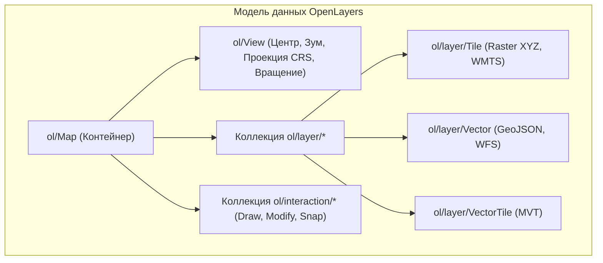

# OpenLayers — швейцарский нож для сложных корпоративных ГИС

> [!info] Навигация
> Родительский раздел: [[Web GIS MOC]]

## Что это такое и какую боль решает

Если Leaflet — это компактный городской хэтчбек, а MapLibre — спортивный болид с WebGL, то **OpenLayers (OL)** — это тяжелый многоцелевой вездеход.

Когда фронтенд-разработчик сталкивается с требованиями:
1. *"Карта должна работать в местной кадастровой системе координат региона (МСК-50 / EPSG:2154) с перепроецированием растра на лету"*;
2. *"Пользователь должен иметь возможность чертить полигоны с прилипанием (Snapping) к границам соседних участков и отправлять WFS-T транзакции в GeoServer"*;
3. *"Нужно одновременно отображать векторные тайлы MVT, старый WMS слой и спутниковый GeoTIFF"*;

— альтернатив OpenLayers в веб-мире практически нет.



---

## Ключевые архитектурные концепции

OpenLayers строго разделяет ответственность между компонентами:

1. **`ol/View` (Вид):** Отвечает за математику проекции. В отличие от других движков, жестко привязанных к Web Mercator, в `View` можно указать **любую систему координат**:
   ```typescript
   import View from 'ol/View';
   import { register } from 'ol/proj/proj4';
   import proj4 from 'proj4';

   // Регистрация локальной проекции (например, Британская сетка British National Grid)
   proj4.defs('EPSG:27700', '+proj=tmerc +lat_0=49 +lon_0=-2 +k=0.9996012717 +x_0=400000 +y_0=-100000 +ellps=airy +datum=OSGB36 +units=m +no_defs');
   register(proj4);

   const view = new View({
     projection: 'EPSG:27700', // Карта будет физически рендериться в этой проекции!
     center: [330000, 500000],
     zoom: 8
   });
   ```
2. **Разделение Layer и Source:**
   - **`Source` (Источник):** Отвечает за получение данных по сети и парсинг формата (`ol/source/TileWMS`, `ol/source/Vector`, `ol/source/VectorTile`).
   - **`Layer` (Слой):** Отвечает исключительно за визуальное отображение и наложение стилей (`ol/layer/Tile`, `ol/layer/Vector`).

---

## Встроенный инструментарий редактирования геометрии (Snapping & Draw)

Реализация интерактивного рисования полигонов в других движках требует подключения тяжелых сторонних плагинов. В OpenLayers модули редактирования встроены в ядро через концепцию **Interactions**:

```typescript
import Map from 'ol/Map';
import VectorSource from 'ol/source/Vector';
import VectorLayer from 'ol/layer/Vector';
import Draw from 'ol/interaction/Draw';
import Snap from 'ol/interaction/Snap';
import Modify from 'ol/interaction/Modify';

const source = new VectorSource();
const vectorLayer = new VectorLayer({ source });

// 1. Интеракция модификации существующих вершин
const modify = new Modify({ source });
map.addInteraction(modify);

// 2. Интеракция рисования новых полигонов
const draw = new Draw({
  source: source,
  type: 'Polygon'
});
map.addInteraction(draw);

// 3. Интеракция прилипания (магнит к существующим точкам и ребрам)
const snap = new Snap({ source });
map.addInteraction(snap); // При приближении курсора вершина "примагничивается"!
```

---

## Трейдоффы: Когда OpenLayers брать НЕ нужно

* **Размер бандла:** Исторически библиотека была монолитной. Хотя современная v8+ поддерживает Tree-shaking модулей ES6, средний размер подключения составляет от $150$ до $200$ КБ.
* **Сложность стилей для MVT:** Для векторных тайлов Mapbox Style Specification (JSON) гораздо естественнее ложится на MapLibre. В OpenLayers для полной поддержки спецификации стилей Mapbox приходится подключать адаптер `ol-mapbox-style`.
* **Порог входа:** Разработчику, привычному к функциональному стилю современного веба, объектно-ориентированная архитектура OpenLayers с десятками классов и слушателей сеттеров покажется многословной.
