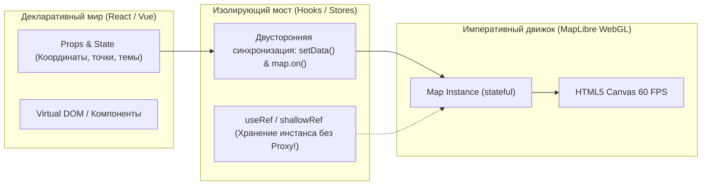

# Интеграция с React, Vue, Svelte (управление инстансом и памятью)

> [!info] Навигация
> Родительский раздел: [[Web GIS MOC]]

## Фундаментальный конфликт парадигм

Интеграция картографического движка в современный компонентный фреймворк — классическая проблема **сопряжения императивного и декларативного кода**:
* **React / Vue / Svelte:** Декларативны. Они стремятся управлять состоянием, виртуальным деревом DOM и жизненным циклом компонентов через ре-рендеры и сигналы.
* **MapLibre / Leaflet / OpenLayers:** Предельно императивны. Инстанс карты — это тяжелый stateful-объект, содержащий собственный цикл рендеринга (WebGL), контекст холста, подписки на жесты мыши и пулы воркеров.

Если попытаться "поженить" их наивно, приложение мгновенно сталкивается с утечками памяти, потерей WebGL-контекстов и лагами UI.



---

## Главные антипаттерны интеграции

### 1. Vue: Оборачивание карты в `ref()` или `reactive()`
```typescript
// ❌ СМЕРТЕЛЬНЫЙ АНТИПАТТЕРН ВО VUE 3:
const map = ref<Map | null>(null);
onMounted(() => {
  map.value = new maplibregl.Map({ ... }); // Proxy обертка ломает внутренности движка!
});
```
* **В чем проблема:** Функция `ref()` и `reactive()` рекурсивно оборачивают объект в JavaScript `Proxy`. У объекта карты MapLibre сотни внутренних методов и скрытых свойств, завязанных на `this` и контексты воркеров. Оборачивание в Proxy разрушает цепочки прототипов, вызывает бесконечные срабатывания реактивности и снижает производительность анимации с 60 до 5 FPS.
* **Как правильно:** Использовать **`shallowRef()`** или обычную переменную модуля:
```typescript
// ✅ ПРАВИЛЬНЫЙ ПОДХОД ВО VUE 3:
import { shallowRef, onMounted, onBeforeUnmount } from 'vue';

const mapInstance = shallowRef<Map | null>(null); // Без глубокого Proxy!
onMounted(() => {
  mapInstance.value = new maplibregl.Map({ container: mapContainer.value, ... });
});
onBeforeUnmount(() => {
  mapInstance.value?.remove();
  mapInstance.value = null;
});
```

---

### 2. React: Помещение инстанса карты в `useState`
```typescript
// ❌ АНТИПАТТЕРН В REACT:
const [map, setMap] = useState<Map | null>(null);
```
* **В чем проблема:** Инстанс карты не должен вызывать повторный рендер всего React-компонента при своем обновлении.
* **Как правильно:** Использовать **`useRef`** для хранения объекта карты:
```typescript
// ✅ ЭТАЛОННЫЙ ХУК ДЛЯ REACT:
import { useEffect, useRef } from 'react';
import maplibregl, { Map } from 'maplibre-gl';

export function useMap(containerRef: React.RefObject<HTMLDivElement>, styleUrl: string) {
  const mapRef = useRef<Map | null>(null);

  useEffect(() => {
    if (!containerRef.current || mapRef.current) return;

    const map = new maplibregl.Map({
      container: containerRef.current,
      style: styleUrl,
      center: [37.6173, 55.7558],
      zoom: 10
    });

    mapRef.current = map;

    return () => {
      map.remove(); // Критически важно: вызывается при unmount!
      mapRef.current = null;
    };
  }, [styleUrl]);

  return mapRef;
}
```

---

## Синхронизация данных: Декларативные слои

Частая задача: с бэкенда пришли новые точки (GeoJSON), компонент обновил props. Как передать данные на карту без пересоздания слоя?

```typescript
// ✅ ПАТТЕРН ДЕЛЬТА-ОБНОВЛЕНИЯ:
useEffect(() => {
  const map = mapRef.current;
  if (!map || !map.isStyleLoaded()) return;

  const source = map.getSource('points-source') as maplibregl.GeoJSONSource;
  if (source) {
    // Метод setData обновляет только внутренние буферы геометрии,
    // не пересоздавая слои рендеринга и не моргая экраном!
    source.setData(props.geojsonData);
  }
}, [props.geojsonData]);
```

---

## Использовать ли готовые библиотеки-обертки?

* **React:** `react-map-gl` (от команды Vis.gl / Uber). Отличная зрелая обертка, но скрывает прямой доступ к MapLibre API за абстракциями компонентов `<Source>` и `<Layer>`.
* **Vue:** `vue-maplibre-gl` или `@geoman-io/vue-maplibre`.
* **Архитектурный совет:** Для простых задач обертки экономят время. Для сложных высоконагруженных продуктов надежнее написать собственный тонкий хук/контроллер (150–200 строк), сохраняя 100% контроль над жизненным циклом карты и вызовами WebGL.
