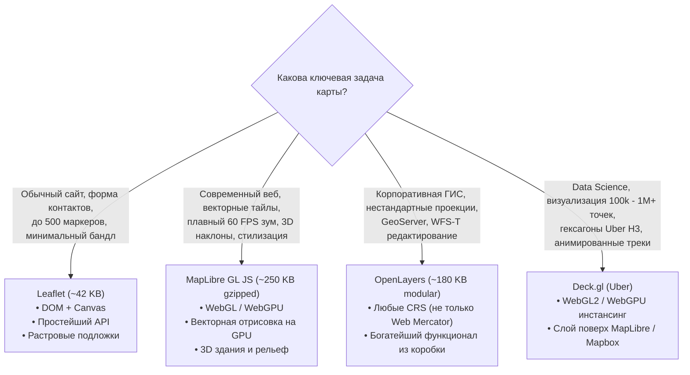

# Сравнение и выбор движка (Leaflet vs MapLibre vs OpenLayers vs Deck.gl)

> [!info] Навигация
> Родительский раздел: [[Web GIS MOC]]

## Что это такое и какую боль решает

Выбор картографического движка — фундаментальное архитектурное решение. Ошибка в выборе приводит к двум крайностям:
1. **Недостаток производительности:** Выбрали Leaflet для дашборда мониторинга таксопарка, и при 3000 автомобилей на карте браузер зависает из-за обилия DOM-узлов.
2. **Ненужный оверхед:** Взяли тяжелый OpenLayers или CesiumJS ради отображения одного адреса офиса в контактах сайта, увеличив размер JS-бандла на сотни килобайт.

---

## Детальный разбор кандидатов

### 1. Leaflet — Легковесная классика
* **Рендерер:** DOM-дерево (`` теги для тайлов, SVG-элементы или Canvas-слой для маркеров и линий).
* **Размер бандла:** $\approx 42$ КБ (minified + gzipped) — рекордсмен по компактности.
* **Плюсы:** Не требует поддержки WebGL, работает даже на древних телевизорах и автомобильных медиасистемах; тысячи плагинов, написанных за 15 лет.
* **Минусы:** Нет поддержки векторных тайлов MVT из коробки (нужны костыли вроде `mapbox-gl-leaflet`); резкий ступенчатый зум (растр растягивается при зумировании колесиком мыши); потолок производительности маркеров — около $1000-2000$ объектов без кластеризации.

---

### 2. MapLibre GL JS — Стандарт де-факто современной индустрии
* **Рендерер:** WebGL (в версии 5+ планируется WebGPU). Вся карта — это один элемент `<canvas>`.
* **История:** Полностью свободный форк (лицензия BSD-3) библиотеки Mapbox GL JS v1, созданный сообществом (при поддержке Meta, Amazon, Microsoft, MapTiler) после закрытия лицензии Mapbox v2.
* **Плюсы:** 
  - Настоящая векторная графика со скоростью 60 кадров в секунду.
  - Плавный, субпиксельный зум (дробные зумы, например, zoom 12.34).
  - Свободное вращение (bearing) и наклон камеры (pitch) до 85°.
  - 3D-экструзия зданий и фотореалистичный теневой рельеф (Hillshade).
* **Минусы:** Требует производительный GPU; бандл весит около 250 КБ gzipped; сложнее стилизовать кастомные HTML-попапы (хотя маркеры поддерживаются).

---

### 3. OpenLayers — Корпоративный титан
* **Рендерер:** Canvas / WebGL (гибридный).
* **Специализация:** Научные, геодезические и корпоративные задачи.
* **Плюсы:**
  - Поддержка **любых проекций** (например, полярных, местных кадастровых систем координат СК-42/МСК-50) с перепроецированием тайлов на лету.
  - Из коробки умеет работать со всеми стандартами OGC: WMS, WMTS, WFS, WFS-T (транзакционное изменение геометрий на сервере).
  - Модульная архитектура: в современных версиях можно импортировать только нужные классы через Tree-shaking.
* **Минусы:** Крутая кривая обучения; очень строгий объектно-ориентированный Java-подобный API (требует много шаблонного кода для простых вещей).

---

### 4. Deck.gl — Визуализация больших данных (Big Data)
* **Создатель:** Uber Open Source.
* **Рендерер:** WebGL2 / WebGPU.
* **Принцип работы:** Deck.gl обычно не используется как самостоятельная карта с улицами и домами. Он монтируется как прозрачный WebGL-холст **поверх** базовой подложки MapLibre или Google Maps.
* **Плюсы:**
  - Способен рендерить **миллион точек** на 60 FPS благодаря GPU-инстансингу и кастомным вершинным шейдерам.
  - Готовые высокоуровневые слои: H3 гексагоны, дуги перемещений, тепловые карты (Heatmap), анимированные 3D-траектории (TripsLayer).
* **Минусы:** Высокий оверхед бандла; сложный математический пайплайн.

---

## Сравнительная таблица характеристик

| Параметр | Leaflet | MapLibre GL JS | OpenLayers | Deck.gl |
| :--- | :--- | :--- | :--- | :--- |
| **Рендерер** | DOM / SVG / Canvas | WebGL | Canvas / WebGL | WebGL2 / WebGPU |
| **Вес бандла (gzip)** | $\approx 42$ КБ | $\approx 250$ КБ | $\approx 150-200$ КБ | $\approx 300+$ КБ |
| **Лимит объектов без лагов**| $\approx 1\,000$ | $\approx 50\,000$ | $\approx 10\,000$ | $\approx 1\,000\,000+$ |
| **Векторные тайлы (MVT)** | ❌ (через плагины) | ✅ Нативно (из коробки) | ✅ Нативно | ❌ (берет из базовой карты) |
| **3D наклон и вращение** | ❌ Нет | ✅ Да (до 85° pitch) | 🟡 Частично | ✅ Полное 3D пространство |
| **Кривая обучения** | 🟢 Низкая (1 день) | 🟡 Средняя (2-3 дня) | 🔴 Высокая | 🔴 Высокая |
| **Популярность в веб** | Очень высокая | Доминирующая | Высокая (Enterprise) | Высокая (Аналитика) |
