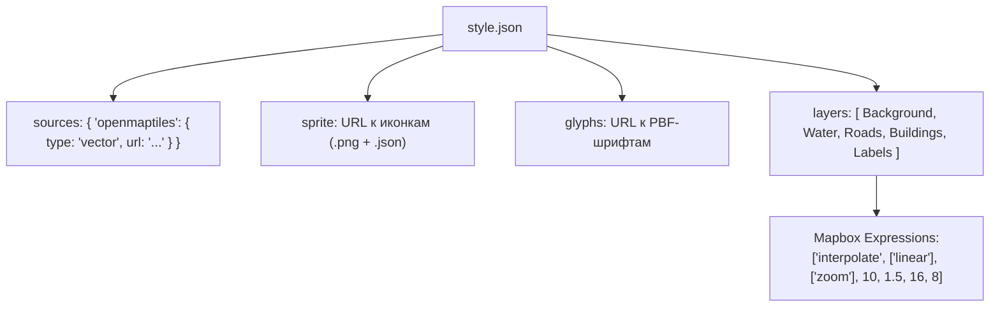

# Mapbox Style Specification — анатомия стиля (Sources, Layers, Expressions)

> [!info] Навигация
> Родительский раздел: [[Web GIS MOC]]

## Что это такое и какую боль решает

Картографический стиль в векторном вебе — это не просто CSS файл. Это полноценный JSON-документ, стандартизированный консорциумом как **Mapbox Style Specification** (поддерживается Mapbox GL, MapLibre GL, OpenLayers и мобильными SDK).

Стиль описывает:
1. **Источники данных (`sources`):** Откуда брать геометрию (векторные тайлы, растровые подложки, GeoJSON, изображения).
2. **Слои рендеринга (`layers`):** В каком порядке и какими шейдерами WebGL рисовать объекты.
3. **Ресурсы (`glyphs`, `sprite`):** Шрифты в формате Signed Distance Field (SDF) и спрайт-атласы иконок.
4. **Выражения (`expressions`):** Встроенный функциональный Lisp-подобный язык вычислений прямо внутри JSON.



---

## Анатомия корневых полей `style.json`

```json
{
  "version": 8,
  "name": "Custom Corporate Light",
  "glyphs": "https://demotiles.maplibre.org/font/{fontstack}/{range}.pbf",
  "sprite": "https://demotiles.maplibre.org/sprites/osm-liberty",
  "sources": {
    "openmaptiles": {
      "type": "vector",
      "url": "pmtiles://https://cdn.example.com/planet.pmtiles"
    }
  },
  "layers": [
    {
      "id": "water",
      "type": "fill",
      "source": "openmaptiles",
      "source-layer": "water",
      "paint": {
        "fill-color": "#cad2d3"
      }
    }
  ]
}
```

---

## Типы слоев (`layer.type`)

Каждый слой в массиве `layers` обрабатывается соответствующим шейдером WebGL:

* **`background`:** Сплошной фоновый цвет суши. Рисуется самым первым под всеми слоями.
* **`fill`:** Заливка плоских 2D полигонов (озера, леса, границы).
* **`line`:** Ломаные линии (дороги, ж/д пути, маршруты). Поддерживает свойства `line-width`, `line-color`, `line-dasharray`, `line-cap` и `line-join`.
* **`symbol`:** Текстовые подписи и иконки. Движок автоматически рассчитывает коллизии и скрывает перекрывающиеся подписи.
* **`fill-extrusion`:** 3D-полигоны с высотой (`fill-extrusion-height`), отбрасывающие тени. Используются для объемных зданий.
* **`raster`:** Растровые тайлы (спутниковые снимки, ортофото).
* **`hillshade`:** Теневой рельеф на основе DEM-тайлов.
* **`heatmap`:** Динамические тепловые карты плотности точек.

---

## Разделение `paint` и `layout` свойств

В спецификации стилей свойства слоев строго разделены на две группы:

1. **`layout` свойства (Свойства макета):**
   - Вычисляются во время разбора тайлов **в фоновых Web Workers**.
   - Определяют видимость, расположение текста, привязку иконок (`visibility`, `line-cap`, `text-field`, `text-size`, `text-anchor`).
   - Изменение свойств `layout` на лету через `map.setLayoutProperty()` требует повторного пересчета геометрии воркером и занимает больше времени.
2. **`paint` свойства (Свойства отрисовки):**
   - Передаются напрямую в **фрагментные шейдеры GPU**.
   - Определяют цвета, прозрачность, размытие (`fill-color`, `line-color`, `circle-radius`, `line-width`).
   - Изменение через `map.setPaintProperty()` применяется мгновенно в следующем кадре анимации без пересчета геометрии.

---

## Mapbox Expressions: Программирование внутри JSON

Спецификация включает мощный DSL выражений в синтаксисе Lisp (префиксная нотация в виде массивов: `[оператор, аргумент1, аргумент2, ...]`).

### 1. Интерполяция толщины дороги по зуму
Дорога не должна быть одной толщины на зуме 5 и на зуме 16. Выражение `interpolate` обеспечивает плавное увеличение ширины линии между зумами:

```json
"line-width": [
  "interpolate",
  ["linear"],
  ["zoom"],
  10, 1.0,    // На зуме 10 ширина = 1px
  14, 4.0,    // На зуме 14 ширина = 4px
  18, 16.0    // На зуме 18 ширина = 16px
]
```

### 2. Динамический цвет по свойству объекта (Match / Case)
```json
"circle-color": [
  "match",
  ["get", "status"],
  "delivered", "#10b981", // Зеленый
  "in_transit", "#3b82f6", // Синий
  "delayed", "#ef4444",   // Красный
  "#9ca3af"               // Дефолтный серый
]
```

> [!tip] Преимущество Expressions
> Выражения компилируются движком в инструкции WebGL шейдера. Окрашивание 50 000 точек в разные цвета происходит на GPU за долю миллисекунды, не нагружая процессор и память главного потока JavaScript.
