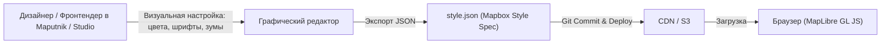

# Визуальные редакторы стилей (Maputnik, Mapbox Studio)

> [!info] Навигация
> Родительский раздел: [[Web GIS MOC]]

## Что это такое и какую боль решает

Файл картографического стиля `style.json` содержит от $50$ до $200+$ слоев и тысячи строк конфигурации. Редактировать такой объем вручную в текстовом редакторе — мучительный и неэффективный процесс:
* Не видно результат изменения цвета или ширины линии в реальном времени.
* Легко ошибиться в синтаксисе Lisp-выражений (Expressions).
* Трудно настраивать пороги зумов (`minzoom` / `maxzoom`) вслепую.

Для проектирования стилей используются специализированные визуальные IDE.



---

## 1. Maputnik — Свободный Open Source редактор

**Maputnik** — бесплатный браузерный аналог Mapbox Studio с открытым исходным кодом.

### Возможности:
* **Полная совместимость со свободным стеком:** Работает с MapLibre GL JS, поддерживает локальные источники тайлов (PMTiles, Martin, TileServer GL) и сторонние сервисы (MapTiler, Stadia, Jawg).
* **Работает прямо в браузере:** Доступен онлайн на `maputnik.github.io/editor` или запускается локально через Docker.
* **Интерфейс:**
  - Дерево слоев с возможностью перетаскивания (drag-and-drop для изменения порядка наложения).
  - Интерактивный билдер выражений (Expressions).
  - Инспектор векторных тайлов (клик по карте подсвечивает, из какого слоя тайла пришел объект и какие теги в нем есть).

### Локальный запуск через Docker:
```bash
docker run -it --rm -p 8888:8888 maputnik/editor
# Откройте в браузере http://localhost:8888
```

---

## 2. Mapbox Studio — Золотой стандарт корпоративного дизайна

Инструмент от компании Mapbox. Является самой продвинутой средой проектирования карт в мире.

### Ключевые преимущества:
* **Концепция компонентов (Components):** Вместо настройки 20 отдельных слоев для автострад, улиц и туннелей вы крутите один ползунок "Road Network" или меняете глобальную палитру бренда, а студия автоматически обновляет цвета всех связанных слоев.
* **Загрузка кастомных шрифтов и иконок:** Студия автоматически генерирует SDF-глифы (`.pbf`) и собирает атласы спрайтов (`.png` + `.json`).
* **3D Terrain Preview:** Удобный просмотр стиля под углом и с включенным 3D-рельефом.

### Трейдофф:
Стили, созданные в Mapbox Studio, используют закрытые источники данных Mapbox (`mapbox://styles/...`). Чтобы использовать созданный дизайн в свободном MapLibre, стиль необходимо скачать, заменить проприетарные источники на OpenMapTiles / PMTiles и заменить пути к шрифтам и спрайтам на открытые аналоги.

---

## Профессиональный пайплайн разработки карты

1. **База:** Возьмите за основу открытый эталонный стиль (например, **OSM Liberty** или **Carto Positron**).
2. **Кастомизация в Maputnik:**
   - Загрузите JSON стиля в Maputnik.
   - Подключите локальный источник тайлов (например, свой `pmtiles` через локальный сервер или ссылку на Cloudflare R2).
   - Настройте фирменные цвета компании, скройте ненужные POI, выставьте правильные шрифты.
3. **Экспорт и версионирование:** Экспортируйте итоговый `style.json` в репозиторий фронтенд-проекта (`src/assets/map-style.json`).
4. **CI/CD:** При сборке бандла файл деплоится на статический CDN.
