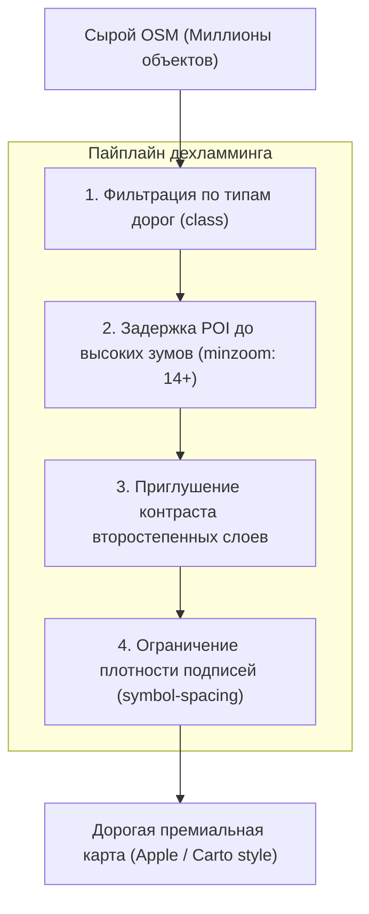

# Дехламминг и визуальная иерархия (как сделать карту дорогой)

> [!info] Навигация
> Родительский раздел: [[Web GIS MOC]]

## Что это такое и какую боль решает

Большинство карт на OpenStreetMap «из коробки» выглядят перегруженными, архаичными и дешевыми. Причина — картографический мусор: попытка показать все данные OSM одновременно. На зуме 10 экран пестрит тысячами мелких тропинок, значков аптек, мусорных баков и заборов, за которыми невозможно разглядеть главное.

**Дехламминг (De-cluttering)** и построение **визуальной иерархии** — это искусство осознанного скрытия второстепенных деталей, чтобы карта выглядела цельно, дорого и подчеркивала бизнес-данные приложения, а не боролась с ними за внимание пользователя.



---

## 1. Фильтрация дорожной сети по уровням зума

Самая грубая ошибка новичков — показывать жилые проезды (`residential`, `service`, `unclassified`) на малых зумах. Это превращает города в серые грязные пятна.

### Золотое правило иерархии дорог:
* **Zoom 0 – 5:** Только государственные границы и океаны. Дороги отсутствуют.
* **Zoom 6 – 8:** Только ключевые международные и федеральные трассы (`motorway`, `trunk`).
* **Zoom 9 – 11:** Региональные и главные городские магистрали (`primary`, `secondary`).
* **Zoom 12 – 13:** Районные улицы (`tertiary`).
* **Zoom 14+:** Второстепенные жилые проезды (`residential`, `living_street`).
* **Zoom 15+:** Пешеходные дорожки, тротуары, сервисные проезды к гаражам (`service`, `footway`, `path`).

```json
// Пример фильтра в слое дорог для style.json:
{
  "id": "road-residential",
  "type": "line",
  "source": "openmaptiles",
  "source-layer": "transportation",
  "minzoom": 13.5, // Скрыто до зума 13.5!
  "filter": ["==", "class", "residential"],
  "paint": {
    "line-color": "#ffffff",
    "line-width": ["interpolate", ["linear"], ["zoom"], 14, 0.5, 18, 4]
  }
}
```

---

## 2. Фильтрация точек интереса (POI)

В OSM отмечено всё: от Эйфелевой башни до лавочки в парке.
* На зумах $0-11$ все иконки POI должны быть **полностью скрыты**.
* На зумах $12-13$ допустимо показывать только транспортные хабы: аэропорты, центральные вокзалы, станции метро.
* Продуктовые магазины, аптеки и рестораны должны появляться строго с зума **$14.5$ или $15$**.
* Скамейки, деревья и урны — не ранее зума **$17$**.

---

## 3. Карты для навигации против карт для аналитики

Характер карты зависит от роли, которую она играет в продукте:

| Характеристика | Навигационная карта (Яндекс.Карты / Google) | Аналитическая подложка (Uber / Airbnb / Дашборды) |
| :--- | :--- | :--- |
| **Цель** | Помочь человеку доехать до адреса | Выделить маркеры и тепловые карты пользователя |
| **Цвета подложки** | Яркие, контрастные, выраженные | Приглушенные, монохромные (Carto Positron) |
| **Плотность POI** | Высокая (поиск любого заведения) | Минимальная (только ориентиры и метро) |
| **Контраст дорог**| Высокий (дороги доминируют над домами) | Низкий (дороги сливаются с фоном суши) |

> [!tip] Совет по восприятию
> Если ваша цель — отобразить 500 квартир для аренды с ценниками, сделайте фоновую карту максимально светлой, бледной и ненавязчивой. Взгляд пользователя должен мгновенно фокусироваться на интерактивных виджетах цен, а не на деталях развязки автомагистрали.
