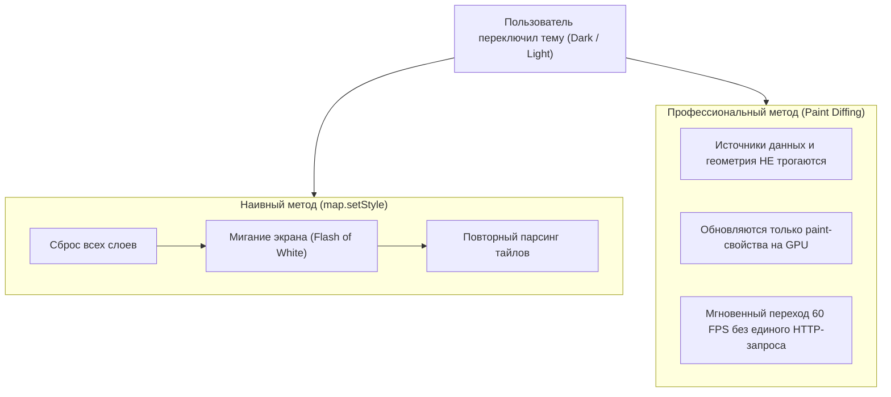

# Динамическая тема (Dark Light mode, смена стиля без перезагрузки тайлов)

> [!info] Навигация
> Родительский раздел: [[Web GIS MOC]]

## Что это такое и какую боль решает

Когда пользователь переключает интерфейс приложения между светлой и темной темой (Dark/Light mode), карта обязана адаптироваться синхронно с остальным интерфейсом.

### Наивный подход и почему он неприемлем в Production:
Большинство разработчиков просто вызывают:
```typescript
// ❌ ГРУБЫЙ АНТИПАТТЕРН:
map.setStyle('https://cdn.example.com/dark-style.json');
```
* **Что происходит под капотом:** Движок полностью уничтожает все источники данных (`sources`), удаляет все кастомные слои бизнес-данных (ваши метки, полигоны зон доставки, треки), очищает память WebGL и начинает загрузку стиля с нуля.
* **Результат:** Карта неприятно мигает белым экраном, пользователь теряет добавленные слои, а по сети повторно скачиваются те же самые тайлы и глифы шрифтов.



---

## Способ 1: Плавная замена Paint-свойств на лету (Zero-flash Palette Swap)

Векторные тайлы содержат чистую геометрию без цвета. Чтобы перекрасить карту, не нужно трогать тайлы — достаточно обновить значения в фрагментных шейдерах через `setPaintProperty`:

```typescript
interface ThemeColors {
  background: string;
  water: string;
  landuse: string;
  roads: string;
  buildings: string;
  text: string;
  textHalo: string;
}

const LIGHT_THEME: ThemeColors = {
  background: '#f8f9fa',
  water: '#cad2d3',
  landuse: '#d8e8c8',
  roads: '#ffffff',
  buildings: '#e9e7e2',
  text: '#2c3e50',
  textHalo: '#ffffff'
};

const DARK_THEME: ThemeColors = {
  background: '#191a1a',
  water: '#0e1626',
  landuse: '#1e2922',
  roads: '#282b2b',
  buildings: '#212323',
  text: '#d1d5db',
  textHalo: '#191a1a'
};

export function applyMapTheme(map: maplibregl.Map, theme: 'light' | 'dark') {
  const colors = theme === 'light' ? LIGHT_THEME : DARK_THEME;

  // Обновление свойств происходит на GPU за 1 кадр!
  map.setPaintProperty('background', 'background-color', colors.background);
  map.setPaintProperty('water', 'fill-color', colors.water);
  map.setPaintProperty('parks', 'fill-color', colors.landuse);
  map.setPaintProperty('roads', 'line-color', colors.roads);
  map.setPaintProperty('buildings', 'fill-color', colors.buildings);
  
  // Подписи и ореолы текста
  map.setPaintProperty('place-labels', 'text-color', colors.text);
  map.setPaintProperty('place-labels', 'text-halo-color', colors.textHalo);
}
```

---

## Способ 2: Использование встроенного алгоритма Diffing (`diff: true`)

В современных версиях MapLibre GL JS метод `setStyle()` поддерживает опцию `{ diff: true }`:

```typescript
map.setStyle(darkStyleJson, {
  diff: true // Движок сравнивает старый и новый JSON и обновляет только изменившиеся свойства!
});
```

* **Как это работает:** MapLibre сравнивает дерево предыдущего стиля с новым. Если источники данных совпадают (тот же URL векторных тайлов), движок сохранит кэш распарсенной геометрии и изменит только правила отрисовки.
* **Внимание:** Пользовательские слои, добавленные императивно через `map.addLayer()`, все равно могут быть удалены, если их не было в новом переданном JSON-объекте.

---

## Резюме архитектора

1. Если нужно **идеально гладкое переключение** без потерь данных и кастомных слоев — управляйте палитрой базовых слоев через `setPaintProperty` или выносите кастомные слои в отдельный менеджер, восстанавливающий их после `diff: true`.
2. Поддерживайте системную тему пользователя через CSS медиа-запрос:
```typescript
const darkModeQuery = window.matchMedia('(prefers-color-scheme: dark)');
darkModeQuery.addEventListener('change', (e) => {
  applyMapTheme(map, e.matches ? 'dark' : 'light');
});
```
